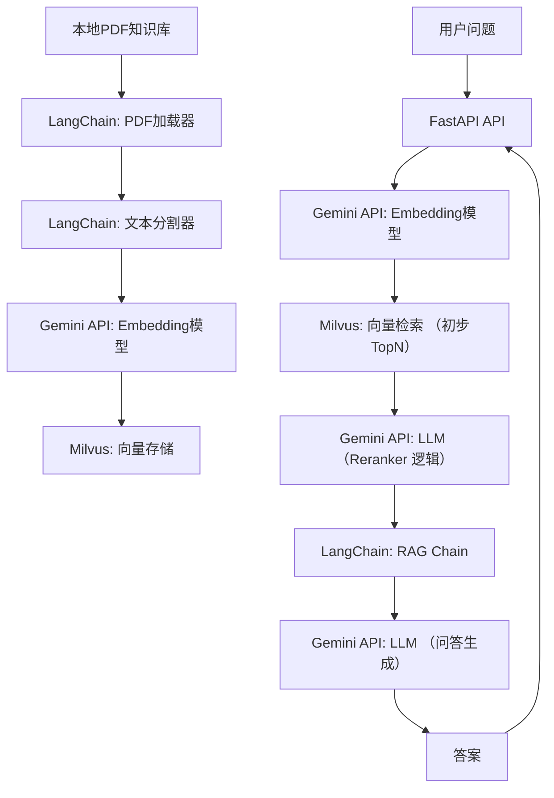

我决定使用LangChain+milvus+ gemini aistudio的api用于reranker和embedding、问答，给我一个详细的技术路线实现方案

### 技术栈概览

*   **数据源:** 本地PDF知识库
*   **文档处理:** LangChain (用于PDF加载和文本分割)
*   **文本嵌入 (Embedding):** Gemini AI Studio API (通过 LangChain 集成)
*   **向量数据库:** Milvus
*   **检索增强生成 (RAG) 编排:** LangChain
*   **重排序 (Reranker):** Gemini AI Studio API (通过 LLM 评估实现，需要特定Prompt工程)
*   **大语言模型 (LLM) 问答:** Gemini AI Studio API (通过 LangChain 集成)
*   **API 接口:** FastAPI (用于对外暴露服务)

### 架构示意图



### 阶段一：环境准备与API配置

1.  **Python 环境:** 推荐使用 Python 3.9+，并创建虚拟环境。
2.  **安装必要库:**
    
    ```bash
    pip install langchain-milvus langchain-google-genai pypdf fastapi uvicorn pymilvus
    # 如果要使用 unstructued 处理更复杂的PDF，可以安装：
    # pip install "unstructured[pdf]"
    ```
3.  **Gemini AI Studio API Key:**
    *   前往 Google AI Studio (或 Google Cloud Vertex AI)，获取你的 API Key。
    *   将 API Key 设置为环境变量 `GOOGLE_API_KEY`，或者在代码中直接传入（不推荐）。
4.  **Milvus 部署:**
    *   **本地 Docker 部署 (推荐用于开发和测试):**
        ```bash
        docker run -d --name milvus_standalone -e MILVUS_ETCD_ENABLE_AUTH=false -p 19530:19530 -p 9091:9091 milvusdb/milvus:v2.4.0
        # 确认 Milvus 运行状态
        docker logs milvus_standalone
        ```
    *   **云端 Milvus (Zilliz Cloud):** 注册 Zilliz Cloud 账号，创建集群，获取连接信息（URI, API Key）。这将提供更稳定的生产级服务。

### 阶段二：数据摄入（Indexing）

这一阶段的目标是将你的PDF知识库处理并存储到 Milvus 中。

1.  **PDF 文档加载与分割 (LangChain):**
    *   使用 `PyPDFLoader` 或 `UnstructuredPDFLoader` 加载 PDF 文件。`UnstructuredPDFLoader` 通常对扫描件或复杂布局的 PDF 处理更好，但需要更多依赖。
    *   使用 `RecursiveCharacterTextSplitter` 对文档进行递归字符分割，确保每个块包含一定量的语义信息。
    ```python
    from langchain_community.document_loaders import PyPDFLoader
    from langchain_text_splitters import RecursiveCharacterTextSplitter
    from langchain_google_genai import GoogleGenerativeAIEmbeddings
    from langchain_community.vectorstores import Milvus
    from pymilvus import connections, utility
    
    # 1. 初始化 Milvus 连接 (本地Docker为例)
    # 如果是Zilliz Cloud，需要替换为你的URI和token
    connections.connect(alias="default", host="localhost", port="19530")
    
    # 2. 初始化 Gemini Embedding 模型
    # 确保 GOOGLE_API_KEY 环境变量已设置
    embeddings = GoogleGenerativeAIEmbeddings(model="models/embedding-001")
    
    def ingest_pdf_to_milvus(pdf_path: str, collection_name: str = "my_knowledge_base"):
        print(f"Loading PDF: {pdf_path}")
        loader = PyPDFLoader(pdf_path)
        documents = loader.load()
    
        print(f"Splitting documents into chunks...")
        text_splitter = RecursiveCharacterTextSplitter(
            chunk_size=1000,
            chunk_overlap=200,
            length_function=len,
            add_start_index=True,
        )
        chunks = text_splitter.split_documents(documents)
        print(f"Created {len(chunks)} chunks.")
    
        # 检查 Milvus collection 是否存在，如果存在则删除（可选，取决于你的需求）
        if utility.has_collection(collection_name):
            print(f"Collection '{collection_name}' already exists. Dropping it...")
            utility.drop_collection(collection_name)
    
        print(f"Creating Milvus collection '{collection_name}' and embedding chunks...")
        # 3. 将 chunks 嵌入并存储到 Milvus
        # Milvus.from_documents 会自动处理 embedding 和插入
        vector_store = Milvus.from_documents(
            documents=chunks,
            embedding=embeddings,
            collection_name=collection_name,
            connection_args={"host": "localhost", "port": "19530"},
            # 如果是Zilliz Cloud:
            # api_key="YOUR_ZILLIZ_CLOUD_API_KEY",
            # uri="YOUR_ZILLIZ_CLOUD_URI",
        )
        print(f"Documents successfully ingested into Milvus collection '{collection_name}'.")
        return vector_store
    
    # 示例调用
    # ingest_pdf_to_milvus("path/to/your/document.pdf")
    ```

### 阶段三：查询与问答（Querying with RAG）

这一阶段是 RAG 的核心，包括用户问题处理、检索、重排序和最终问答。

1.  **初始化 Milvus 检索器:**
    ```python
    from langchain_community.vectorstores import Milvus
    from langchain_google_genai import GoogleGenerativeAIEmbeddings
    from pymilvus import connections
    
    # 确保 Milvus 连接已建立
    connections.connect(alias="default", host="localhost", port="19530")
    
    embeddings = GoogleGenerativeAIEmbeddings(model="models/embedding-001")
    
    # 重新加载或获取 Milvus 向量存储实例
    vector_store = Milvus(
        embedding_function=embeddings,
        collection_name="my_knowledge_base", # 确保与摄入时使用的 collection_name 一致
        connection_args={"host": "localhost", "port": "19530"},
        # Zilliz Cloud 配置同上
    )
    
    # 创建检索器，初步检索 top_k 更多文档，以便 reranker 进行筛选
    # 这里的 k 应该比最终发送给 LLM 的文档数量多，给 reranker 足够的选择空间
    retriever = vector_store.as_retriever(search_kwargs={"k": 20})
    ```

2.  **Reranker 实现 (通过 Gemini LLM):**
    由于 Gemini AI Studio 没有直接的“Reranker”API，我们将通过其强大的 LLM 能力来模拟实现重排序。这需要精心设计的 Prompt。

    ```python
    from langchain_google_genai import ChatGoogleGenerativeAI
    from langchain.prompts import PromptTemplate
    from langchain_core.documents import Document
    
    # 初始化 Gemini LLM (用于 rerank 和最终问答)
    # model="gemini-pro" 是常用选择，也可以根据需求选择其他模型
    llm_for_rerank = ChatGoogleGenerativeAI(model="gemini-pro", temperature=0.1)
    
    # Reranker Prompt Template
    # 我们将要求 Gemini 给每个文档一个相关性分数 (0-10)
    RERANK_PROMPT = """
    你是一个文档相关性评分专家。你的任务是评估提供的文档与给定查询的相关性。
    请根据以下指导对文档进行评分 (0-10分):
    - 0分: 完全不相关，与查询主题无关。
    - 1-3分: 弱相关，包含一些关键词但信息很少或误导。
    - 4-6分: 中等相关，提供一些有用信息，但不是核心内容。
    - 7-9分: 高度相关，直接回答了查询或提供了关键信息。
    - 10分: 完美匹配，文档就是查询的直接答案或包含了所有必要信息。
    
    只输出一个整数分数，不要包含任何其他文字或解释。
    
    查询: {query}
    
    文档:
    {document_content}
    
    评分:
    """
    rerank_prompt_template = PromptTemplate(
        template=RERANK_PROMPT,
        input_variables=["query", "document_content"]
    )
    
    async def rerank_documents(query: str, documents: list[Document]) -> list[Document]:
        scored_documents = []
        for doc in documents:
            # 构建 Reranker Prompt
            prompt = rerank_prompt_template.format(query=query, document_content=doc.page_content)
            try:
                # 调用 Gemini LLM 获取分数
                # 注意：这里是同步调用，在异步API中需要await
                score_str = llm_for_rerank.invoke(prompt).content.strip()
                score = int(score_str)
            except (ValueError, Exception) as e:
                print(f"Error reranking document: {e}. Defaulting score to 0.")
                score = 0 # 评分失败默认0分
    
            scored_documents.append({"document": doc, "score": score})
        
        # 按分数降序排列
        scored_documents.sort(key=lambda x: x["score"], reverse=True)
        
        # 返回前 K 个高分文档 (例如，最终只给LLM提供5个最相关的)
        # 这里的 K 可以根据实际效果调整，避免LLM上下文溢出
        top_k_reranked_docs = [item["document"] for item in scored_documents[:5]] 
        print(f"Reranked documents. Top 5 scores: {[item['score'] for item in scored_documents[:5]]}")
        return top_k_reranked_docs
    ```
    **重要提示:**
    *   **成本与延迟:** 这种基于 LLM 的 Reranker 实现，每个检索到的文档都需要一次 LLM API 调用。这会显著增加 API 成本和查询延迟。
    *   **替代方案:** 在生产环境中，更高效且经济的 reranker 通常是专门训练的小型 reranker 模型（如 BGE-Reranker、Cohere Rerank API），它们的速度和成本效益远超通用 LLM。如果 Gemini LLM 在成本和速度上成为瓶颈，可以考虑这类专用 Reranker。

3.  **构建 RAG Chain (LangChain):**
    ```python
    from langchain.chains import create_retrieval_chain
    from langchain.chains.combine_documents import create_stuff_documents_chain
    from langchain.prompts import ChatPromptTemplate
    
    # 最终问答用的 Gemini LLM (可以使用同一个实例)
    llm_for_qa = ChatGoogleGenerativeAI(model="gemini-pro", temperature=0.7) # 问答可以有更高temperature
    
    # 定义问答 Prompt
    qa_prompt = ChatPromptTemplate.from_messages([
        ("system", "你是一个知识渊博的助手，请根据提供的上下文回答用户的问题。如果上下文中没有提到，请说你不知道。"),
        ("human", "上下文: {context}\n\n问题: {input}")
    ])
    
    # 创建文档链：将检索到的文档和用户问题结合起来，生成给LLM的最终Prompt
    document_chain = create_stuff_documents_chain(llm_for_qa, qa_prompt)
    
    # 创建检索链：将检索器和文档链结合起来
    # 注意：这里是 LangChain 的标准检索链，我们需要在调用前手动插入 rerank 步骤
    # 完整的 RAG 流程将在 FastAPI 中整合
    ```

### 阶段四：构建 FastAPI API

将整个 RAG 系统封装为 RESTful API，供外部调用。

1.  **FastAPI 应用结构:**
    ```python
    # main.py
    from fastapi import FastAPI, HTTPException
    from pydantic import BaseModel
    from typing import List, Dict
    
    # 导入上面定义的函数和类
    # from your_module import ingest_pdf_to_milvus, retriever, rerank_documents, document_chain, llm_for_qa
    # 为了简化示例，我将上述代码块直接嵌入
    
    # --- 假设上面 LangChain/Milvus/Gemini 相关的初始化代码都在这里 ---
    # 连接 Milvus, 初始化 embedding 和 LLM
    # ... (省略重复代码，确保 Milvus connection, embeddings, llm_for_rerank, llm_for_qa, rerank_prompt_template, qa_prompt 都已初始化)
    
    # 初始化 Milvus 检索器 (假设 my_knowledge_base 已存在)
    connections.connect(alias="default", host="localhost", port="19530")
    embeddings = GoogleGenerativeAIEmbeddings(model="models/embedding-001")
    vector_store = Milvus(
        embedding_function=embeddings,
        collection_name="my_knowledge_base",
        connection_args={"host": "localhost", "port": "19530"},
    )
    retriever = vector_store.as_retriever(search_kwargs={"k": 20}) # 初步检索20个
    
    llm_for_rerank = ChatGoogleGenerativeAI(model="gemini-pro", temperature=0.1)
    llm_for_qa = ChatGoogleGenerativeAI(model="gemini-pro", temperature=0.7)
    
    RERANK_PROMPT = """
    你是一个文档相关性评分专家。你的任务是评估提供的文档与给定查询的相关性。
    请根据以下指导对文档进行评分 (0-10分):
    - 0分: 完全不相关，与查询主题无关。
    - 1-3分: 弱相关，包含一些关键词但信息很少或误导。
    - 4-6分: 中等相关，提供一些有用信息，但不是核心内容。
    - 7-9分: 高度相关，直接回答了查询或提供了关键信息。
    - 10分: 完美匹配，文档就是查询的直接答案或包含了所有必要信息。
    
    只输出一个整数分数，不要包含任何其他文字或解释。
    
    查询: {query}
    
    文档:
    {document_content}
    
    评分:
    """
    rerank_prompt_template = PromptTemplate(
        template=RERANK_PROMPT,
        input_variables=["query", "document_content"]
    )
    
    # Reranker 函数
    async def rerank_documents_async(query: str, documents: list[Document]) -> list[Document]:
        scored_documents = []
        for i, doc in enumerate(documents):
            print(f"Reranking document {i+1}/{len(documents)}")
            prompt = rerank_prompt_template.format(query=query, document_content=doc.page_content)
            try:
                score_str = (await llm_for_rerank.ainvoke(prompt)).content.strip() # 使用 ainvoke
                score = int(score_str)
            except (ValueError, Exception) as e:
                print(f"Error reranking document: {e}. Document content: {doc.page_content[:100]}... Defaulting score to 0.")
                score = 0
            scored_documents.append({"document": doc, "score": score})
        
        scored_documents.sort(key=lambda x: x["score"], reverse=True)
        top_k_reranked_docs = [item["document"] for item in scored_documents[:5]] # 选择前5个
        print(f"Reranked documents. Top 5 scores: {[item['score'] for item in scored_documents[:5]]}")
        return top_k_reranked_docs
    
    qa_prompt = ChatPromptTemplate.from_messages([
        ("system", "你是一个知识渊博的助手，请根据提供的上下文回答用户的问题。如果上下文中没有提到，请说你不知道。"),
        ("human", "上下文: {context}\n\n问题: {input}")
    ])
    document_chain = create_stuff_documents_chain(llm_for_qa, qa_prompt)
    
    # --- FastAPI App ---
    app = FastAPI()
    
    class IngestRequest(BaseModel):
        pdf_path: str
        collection_name: str = "my_knowledge_base"
    
    class QueryRequest(BaseModel):
        question: str
        collection_name: str = "my_knowledge_base"
    
    @app.post("/ingest")
    async def ingest_data(request: IngestRequest):
        try:
            # 重新建立 Milvus 向量存储实例，确保与请求的 collection_name 一致
            # 注意：这里假设 Milvus 连接和 embeddings 已经全局初始化或在函数内重新初始化
            current_vector_store = Milvus(
                embedding_function=embeddings,
                collection_name=request.collection_name,
                connection_args={"host": "localhost", "port": "19530"},
            )
            
            # 使用同步的 ingest_pdf_to_milvus，或者将其改为异步
            # 为了简单，这里直接复制逻辑，实际应该封装好
            print(f"Loading PDF: {request.pdf_path}")
            loader = PyPDFLoader(request.pdf_path)
            documents = loader.load()
    
            print(f"Splitting documents into chunks...")
            text_splitter = RecursiveCharacterTextSplitter(
                chunk_size=1000,
                chunk_overlap=200,
                length_function=len,
                add_start_index=True,
            )
            chunks = text_splitter.split_documents(documents)
            print(f"Created {len(chunks)} chunks.")
    
            if utility.has_collection(request.collection_name):
                print(f"Collection '{request.collection_name}' already exists. Dropping it...")
                utility.drop_collection(request.collection_name)
    
            print(f"Creating Milvus collection '{request.collection_name}' and embedding chunks...")
            Milvus.from_documents(
                documents=chunks,
                embedding=embeddings,
                collection_name=request.collection_name,
                connection_args={"host": "localhost", "port": "19530"},
            )
            print(f"Documents successfully ingested into Milvus collection '{request.collection_name}'.")
    
            return {"message": "Data ingested successfully", "collection_name": request.collection_name}
        except Exception as e:
            raise HTTPException(status_code=500, detail=str(e))
    
    @app.post("/query")
    async def query_data(request: QueryRequest):
        try:
            # 获取当前请求对应的 Milvus 检索器
            # 注意：实际生产中可能需要更优雅的 Milvus 连接管理
            current_vector_store = Milvus(
                embedding_function=embeddings,
                collection_name=request.collection_name,
                connection_args={"host": "localhost", "port": "19530"},
            )
            current_retriever = current_vector_store.as_retriever(search_kwargs={"k": 20})
    
            # 1. 初步检索 (Milvus)
            retrieved_docs = await current_retriever.ainvoke(request.question)
            print(f"Initially retrieved {len(retrieved_docs)} documents.")
    
            # 2. Rerank (Gemini LLM)
            reranked_docs = await rerank_documents_async(request.question, retrieved_docs)
            print(f"After reranking, {len(reranked_docs)} documents selected for LLM.")
            
            # 3. 问答生成 (Gemini LLM)
            context_content = "\n\n".join([doc.page_content for doc in reranked_docs])
            response = await document_chain.ainvoke({
                "context": context_content,
                "input": request.question
            })
            
            return {"answer": response.content, "source_documents": [doc.metadata for doc in reranked_docs]}
        except Exception as e:
            import traceback
            traceback.print_exc() # 打印详细错误栈
            raise HTTPException(status_code=500, detail=f"An error occurred: {str(e)}")
    
    # 启动 FastAPI: 在终端运行 `uvicorn main:app --reload`
    ```

### 阶段五：部署与优化

1.  **部署:**
    *   **本地开发:** `uvicorn main:app --reload`
    *   **生产环境:** 使用 Gunicorn 配合 Uvicorn Worker 或 Docker 容器部署 FastAPI 应用。
        *   示例 Dockerfile:
            ```dockerfile
            # Dockerfile
            FROM python:3.10-slim-buster
            WORKDIR /app
            COPY requirements.txt .
            RUN pip install --no-cache-dir -r requirements.txt
            COPY . .
            ENV GOOGLE_API_KEY="your_gemini_api_key_here" # 在生产中通过环境变量或秘密管理工具注入
            CMD ["gunicorn", "main:app", "--workers", "4", "--worker-class", "uvicorn.workers.UvicornWorker", "--bind", "0.0.0.0:8000"]
            ```
2.  **安全性:**
    *   **API Key 管理:** 绝不硬编码 API Key。使用环境变量或秘密管理服务（如 Kubernetes Secrets, AWS Secrets Manager, Google Secret Manager）。
    *   **认证与授权:** 如果是面向多用户的服务，考虑为 FastAPI 添加 API Key 认证或 OAuth2。
3.  **性能优化:**
    *   **Milvus 索引优化:** 根据数据量选择合适的索引类型（如 IVFFlat, HNSW），并调整索引参数以平衡查询速度和准确性。
    *   **Chunking 策略:** 尝试不同的 `chunk_size` 和 `chunk_overlap`，找到最适合你的PDF内容和问答场景的策略。
    *   **Reranker 优化:** 如果 LLM reranker 延迟太高，考虑切换到更快的专用 reranker 模型或服务。
    *   **LLM 模型选择:** 根据成本、速度和回答质量，选择合适的 Gemini 模型（如 `gemini-pro-vision` 处理多模态，`gemini-ultra` 追求最高质量）。
    *   **缓存:** 缓存高频查询的结果。
4.  **监控与日志:**
    *   集成日志库，记录API请求、LLM调用、Milvus查询等信息，便于调试和问题排查。
    *   使用 Prometheus/Grafana 等工具监控 API 性能和 Milvus 运行状况。
5.  **错误处理:** 完善 `try-except` 块，确保 API 在遇到问题时能返回友好的错误信息，而不是直接崩溃。

这个方案提供了一个坚实的基础，你可以根据实际需求在此基础上进行扩展和优化。