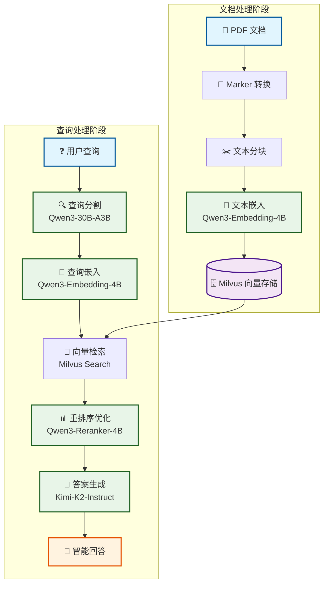

# RAG 检索增强生成系统

一个基于 Milvus 向量数据库和 SiliconFlow API 的智能文档问答系统，支持 PDF 文档的向量化存储、语义检索和智能问答。

## 📖 项目简介

本项目是一个完整的 RAG（Retrieval-Augmented Generation）系统，能够将 PDF 文档转换为可检索的知识库，并通过自然语言查询获得智能回答。系统采用先进的文档处理、向量检索和语言模型技术，为用户提供高质量的问答体验。

### 🔥 核心特性

- **智能文档处理**: 使用 Marker 将 PDF 转换为高质量的 Markdown 格式
- **向量检索**: 基于 Milvus 的高性能向量数据库进行语义检索
- **重排序优化**: 集成重排序模型提升检索结果相关性
- **多模型支持**: 支持嵌入、分割、问答、重排序等多种模型
- **命令行界面**: 简洁易用的命令行操作界面
- **并发处理**: 支持并发文档处理，提高处理效率
- **灵活配置**: 集中化配置管理，支持多种模型和参数调整

## 🏗️ 技术架构



## 🛠️ 技术栈

- **文档处理**: Marker PDF（PDF转Markdown）
- **向量数据库**: Milvus 2.5+
- **API服务**: SiliconFlow（Qwen系列模型）
- **开发框架**: Python 3.12+、FastAPI
- **依赖管理**: uv（现代Python包管理器）

### 使用的模型

| 功能 | 模型 | 用途 |
|------|------|------|
| 文本嵌入 | Qwen/Qwen3-Embedding-4B | 将文本转换为768维向量 |
| 查询分割 | Qwen/Qwen3-30B-A3B | 将复杂查询分解为子问题 |
| 问答生成 | moonshotai/Kimi-K2-Instruct | 基于检索内容生成答案 |
| 结果重排序 | Qwen/Qwen3-Reranker-4B | 优化检索结果相关性 |

## 🚀 快速开始

### 环境要求

- Python 3.12+
- uv 包管理器
- Milvus 2.5+（可使用 Docker 部署）

### 安装步骤

1. **克隆项目**
```bash
git clone <repository-url>
cd RAG
```

2. **安装依赖**
```bash
uv sync
```

3. **配置环境变量**
```bash
export siliconflow_api_key="your_api_key_here"
```


### 基本使用

1. **加载 PDF 文档**
```bash
python main.py --load document.pdf
```

2. **查询文档内容**
```bash
python main.py --query "什么是人工智能？"
```

3. **指定文档查询**
```bash
python main.py --include document.pdf --query "具体技术细节"
```

4. **清理数据库**
```bash
python main.py --clear
```

5. **组合使用**
```bash
python main.py --load doc1.pdf --load doc2.pdf --query "对比两个文档的主要观点" --include doc1.pdf --include doc2.pdf
```

## 📋 命令行参数

| 参数 | 描述 | 示例 |
|------|------|------|
| `--load <pdf_name>` | 加载PDF文档到向量数据库 | `--load research.pdf` |
| `--query <question>` | 查询问题 | `--query "主要内容是什么？"` |
| `--include <pdf_name>` | 指定查询范围的PDF文档 | `--include research.pdf` |
| `--clear` | 清空向量数据库 | `--clear` |
| `--split` | 启用查询分割功能 | `--split` |

## 📁 项目结构

```
RAG/
├── main.py                 # 主程序入口
├── config.py              # 集中配置管理
├── api_client.py          # API客户端工厂
├── pyproject.toml         # 项目配置文件
├── rag_modules/           # RAG核心模块
│   ├── __init__.py
│   ├── clear.py          # 数据清理
│   ├── embedding.py      # 文本嵌入
│   ├── get_database.py   # 数据库连接
│   ├── insert.py         # 数据插入
│   ├── refer.py          # 检索引用
│   ├── reranker.py       # 结果重排序
│   └── search.py         # 语义搜索
├── utils/                 # 工具函数
│   ├── __init__.py
│   ├── chunk.py          # 文本分块
│   ├── colored_logger.py # 彩色日志
│   ├── convert.py        # PDF转换
│   └── query.py          # 查询处理
├── models/               # 本地模型缓存
├── docs/                 # 文档存储
├── database/             # 数据库文件
└── tests/                # 测试文件
```

## ⚙️ 配置说明

### 主要配置项

编辑 `config.py` 文件可以调整以下配置：

```python
# API配置
API_BASE_URL = "https://api.siliconflow.cn/v1"
API_KEY_ENV_VAR = "siliconflow_api_key"

# 数据库配置
DATABASE = DatabaseConfig(
    path="database/milvus_rag.db",
    collection_name="rag_docs",
    dimensions=768,
    chunk_size_limit=2000
)

# 性能配置
MAX_CONCURRENT_WORKERS = 3
TEXTS_PER_WORKER = 100
RELEVANCE_THRESHOLD = 0.2
DEFAULT_SEARCH_LIMIT = 10
```

### 模型配置

可以在 `config.py` 中修改使用的模型：

```python
MODELS = {
    ModelType.EMBEDDING: ModelConfig(
        name="Qwen/Qwen3-Embedding-4B",
        dimensions=768
    ),
    ModelType.CHAT: ModelConfig(
        name="moonshotai/Kimi-K2-Instruct",
        max_tokens=50000,
        temperature=0.6
    )
    # ... 其他模型配置
}
```

## 🔧 高级功能

### 1. 并发文档处理

系统支持并发处理多个文档，提高处理效率：

```python
# 在 config.py 中调整并发设置
MAX_CONCURRENT_WORKERS = 3
TEXTS_PER_WORKER = 100
```

### 2. 查询分割

对于复杂查询，系统可以自动分割为多个子问题：

```bash
python main.py --split --query "分析文档的技术架构和实现方案"
```

### 3. 文档过滤

可以指定特定文档进行查询，提高查询精度：

```bash
python main.py --include doc1.pdf --include doc2.pdf --query "技术对比"
```

### 4. 重排序优化

系统自动使用重排序模型优化检索结果的相关性，无需额外配置。

## 🧪 测试

运行测试套件：

```bash
# 运行所有测试
python -m pytest tests/

# 运行特定测试
python tests/simple.py
```

## 📊 性能优化

### 1. 向量维度优化

根据文档类型调整嵌入维度：

```python
# 技术文档建议使用768维
dimensions = 768

# 通用文档可以使用更低维度以提高速度
dimensions = 512
```

### 2. 分块策略

优化文本分块参数：

```python
chunk_size_limit = 2000  # 根据文档复杂度调整
overlap_ratio = 0.2      # 重叠比例
```

### 3. 检索参数

调整检索相关参数：

```python
DEFAULT_SEARCH_LIMIT = 10    # 检索结果数量
RELEVANCE_THRESHOLD = 0.2    # 相关性阈值
```

## 🔒 安全注意事项

1. **API密钥保护**: 绝不在代码中硬编码API密钥
2. **环境变量**: 使用环境变量管理敏感信息
3. **数据隔离**: 生产环境中确保数据库访问权限控制
4. **输入验证**: 对用户输入进行适当的验证和清理

## 🐛 故障排除

### 常见问题

1. **API密钥错误**
```bash
# 检查环境变量是否设置
echo $siliconflow_api_key
```

2. **Milvus连接失败**
```bash
# 检查Milvus服务状态
docker logs milvus_standalone
```

3. **文档处理失败**
```bash
# 检查PDF文件是否可读
python -c "import pymilvus; print(pymilvus.__version__)"
```

### 日志调试

系统提供详细的彩色日志输出，可以通过日志信息定位问题：

```python
# 在代码中查看详细日志
from utils.colored_logger import get_colored_logger
logger = get_colored_logger(__name__)
logger.info("Debug information")
```

## 🔗 相关链接

- [Milvus 官方文档](https://milvus.io/docs)
- [SiliconFlow API 文档](https://docs.siliconflow.cn/)
- [Marker PDF](https://github.com/VikParuchuri/marker)
- [FastAPI 文档](https://fastapi.tiangolo.com/)
