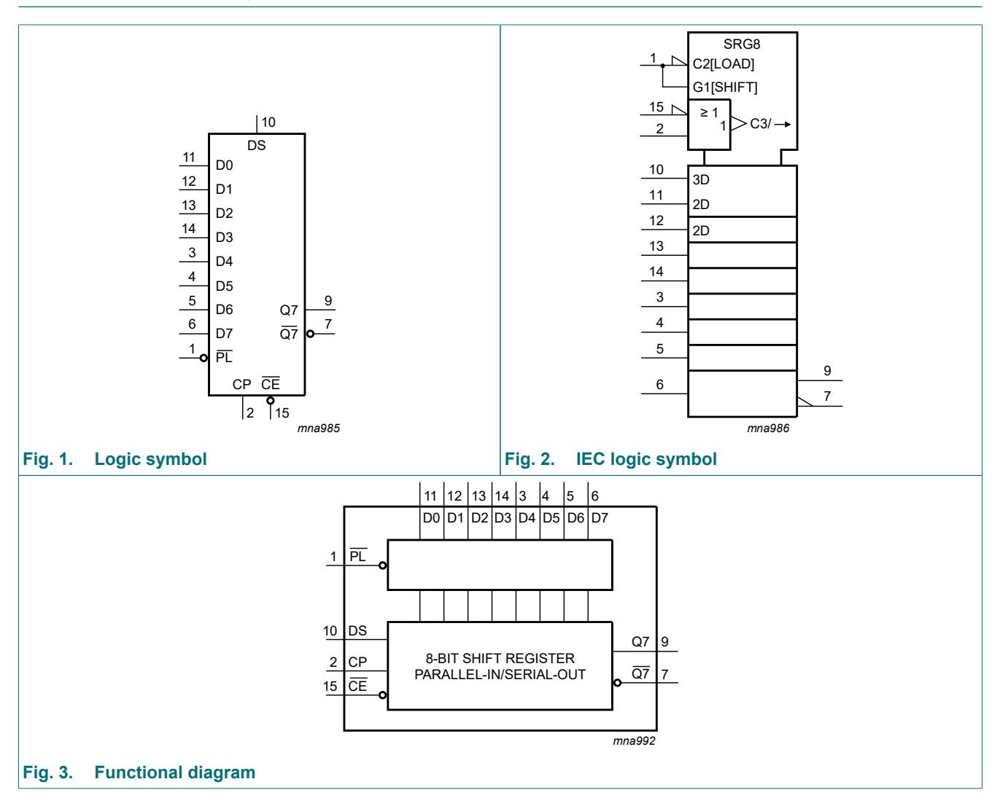
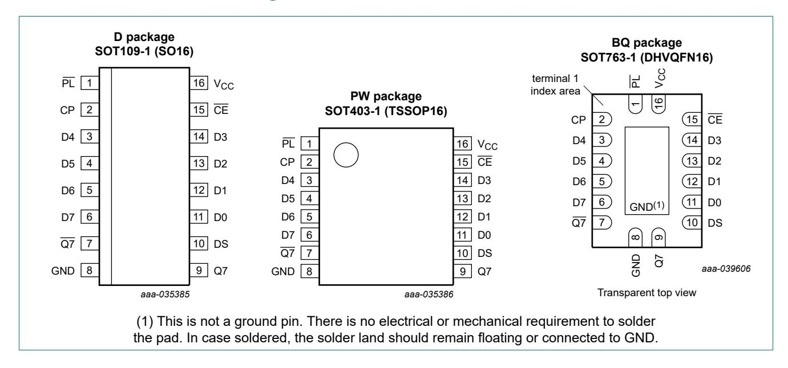
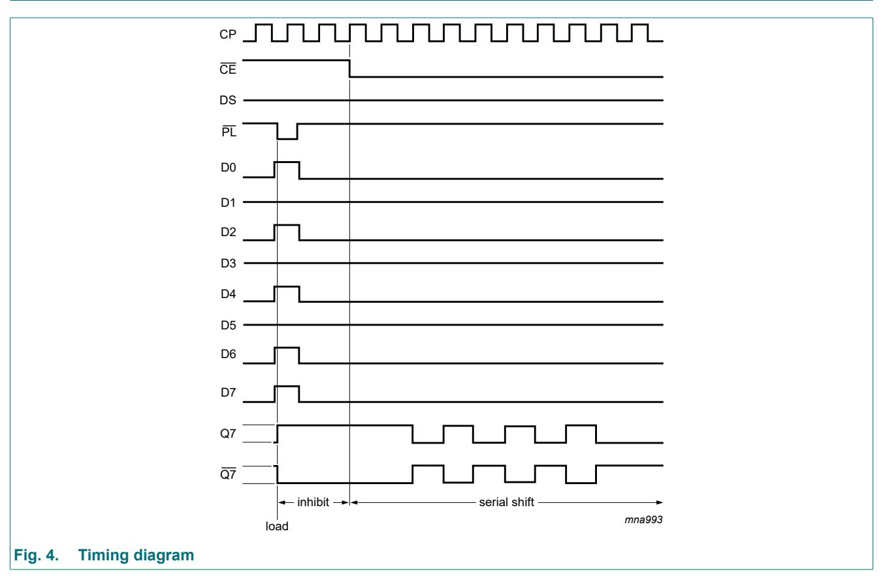
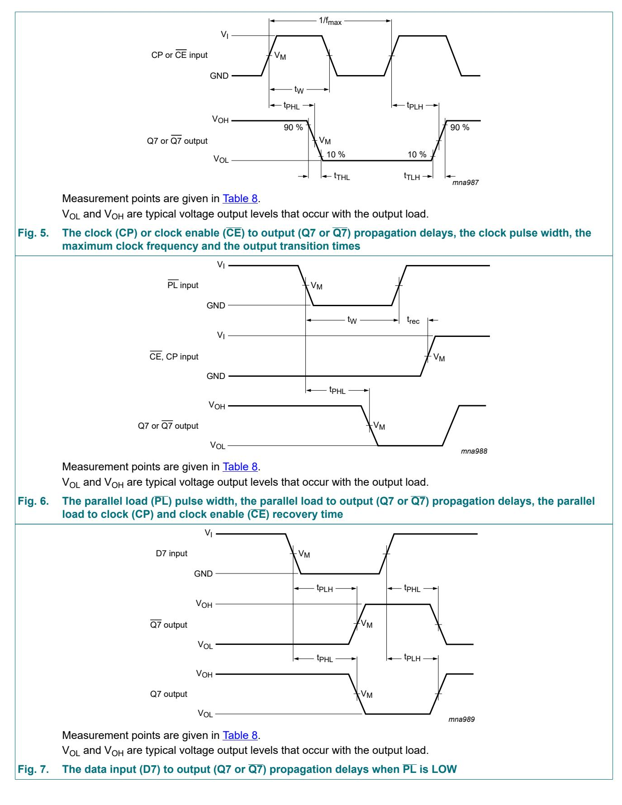
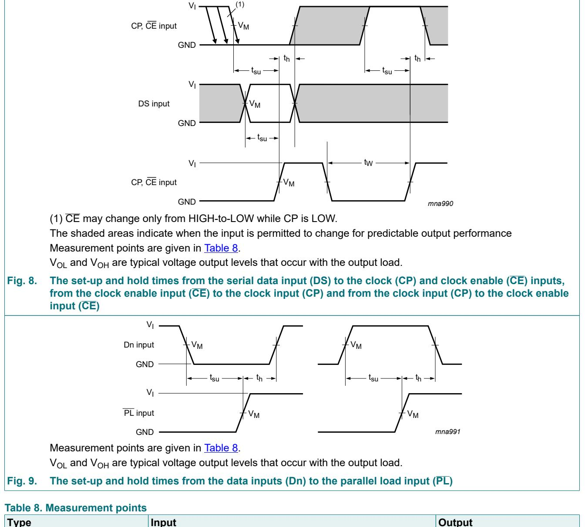
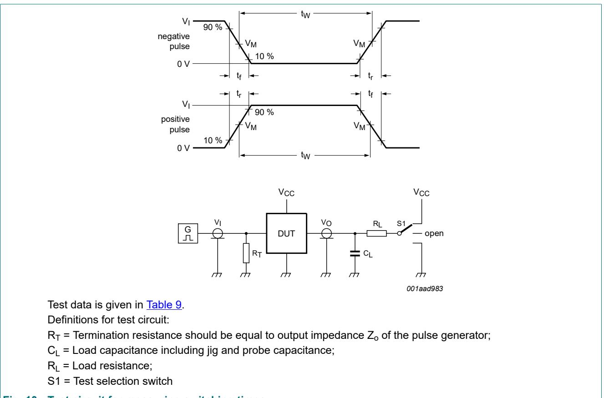
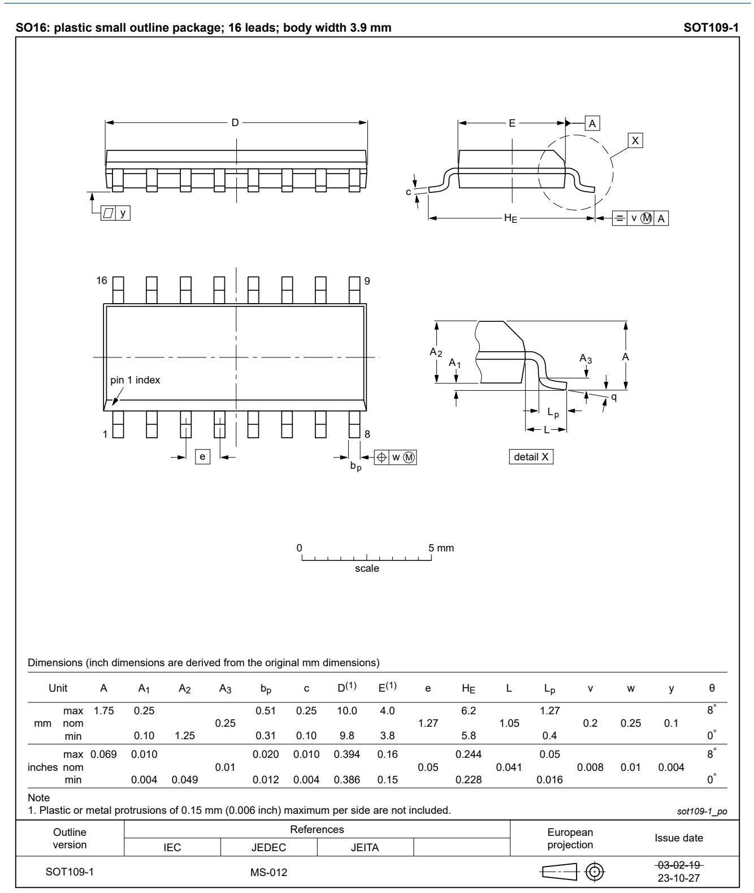
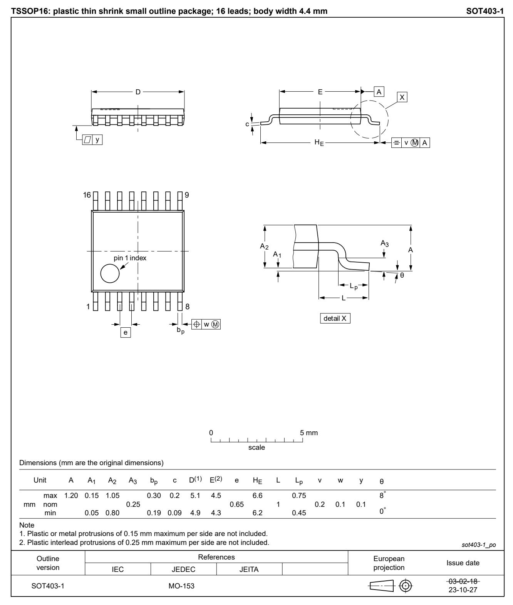
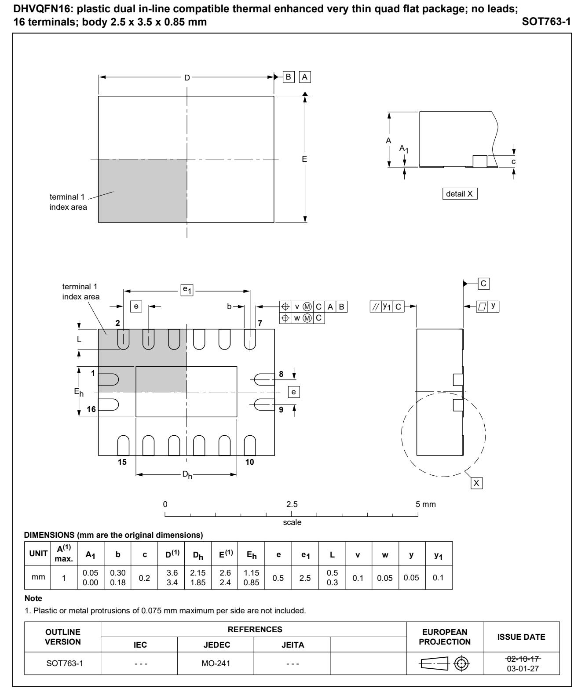

## **1. General description**

The 74HC165; 74HCT165 are 8-bit serial or parallel-in/serial-out shift registers. The device features a serial data input (DS), eight parallel data inputs (D0 to D7) and two complementary serial outputs (Q7 and Q7). When the parallel load input (PL) is LOW the data from D0 to D7 is loaded into the shift register asynchronously. When PL is HIGH data enters the register serially at DS. When the clock enable input (CE) is LOW data is shifted on the LOW-to-HIGH transitions of the CP input. A HIGH on CE will disable the CP input. Inputs are overvoltage tolerant to 15 V. This enables the device to be used in HIGH-to-LOW level shifting applications.

## **2. Features and benefits**

- Wide supply voltage range from 2.0 to 6.0 V
- CMOS low power dissipation
- High noise immunity
- Latch-up performance exceeds 100 mA per JESD 78 Class II Level B
- Asynchronous 8-bit parallel load
- Synchronous serial input
- Input levels:
  - For 74HC165: CMOS level
  - For 74HCT165: TTL level
- Complies with JEDEC standards:
  - JESD8C (2.7 V to 3.6 V)
  - JESD7A (2.0 V to 6.0 V)
- ESD protection:
  - HBM: ANSI/ESDA/JEDEC JS-001 class 2 exceeds 2000 V
  - CDM: ANSI/ESDA/JEDEC JS-002 class C3 exceeds 1000 V
- Multiple package options
- Specified from -40 °C to +85 °C and from -40 °C to +125 °C

### **3. Applications**

• Parallel-to-serial data conversion

## **4. Ordering information**

| Table 1. Ordering information |                   |          |                                                                                                                                      |          |  |  |  |
|-------------------------------|-------------------|----------|--------------------------------------------------------------------------------------------------------------------------------------|----------|--|--|--|
| Type number                   | Package           |          |                                                                                                                                      |          |  |  |  |
|                               | Temperature range | Name     | Description                                                                                                                          | Version  |  |  |  |
| 74HC165D 74HCT165D         | -40 °C to +125 °C | SO16     | plastic small outline package; 16 leads; body width 3.9 mm                                                                        | SOT109-1 |  |  |  |
| 74HC165PW 74HCT165PW       | -40 °C to +125 °C | TSSOP16  | plastic thin shrink small outline package; 16 leads; body width 4.4 mm                                                            | SOT403-1 |  |  |  |
| 74HC165BQ 74HCT165BQ       | -40 °C to +125 °C | DHVQFN16 | plastic dual in-line compatible thermal enhanced very thin quad flat package; no leads; 16 terminals; body 2.5 × 3.5 × 0.85 mm | SOT763-1 |  |  |  |

## **5. Functional diagram**

## **6. Pinning information**

### **6.1. Pinning**

### **6.2. Pin description**

#### **Table 2. Pin description**

| Symbol   | Pin                        | Description                                   |
|----------|----------------------------|-----------------------------------------------|
| PL       | 1                          | asynchronous parallel load input (active LOW) |
| CP       | 2                          | clock input (LOW-to-HIGH edge-triggered)      |
| Q7       | 7                          | complementary output from the last stage      |
| GND      | 8                          | ground (0 V)                                  |
| Q7       | 9                          | serial output from the last stage             |
| DS       | 10                         | serial data input                             |
| D0 to D7 | 11, 12, 13, 14, 3, 4, 5, 6 | parallel data inputs (also referred to as Dn) |
| CE       | 15                         | clock enable input (active LOW)               |
| VCC      | 16                         | positive supply voltage                       |

## **7. Functional description**

#### **Table 3. Function table**

*H = HIGH voltage level; h = HIGH voltage level one set-up time prior to the LOW-to-HIGH clock transition;*

*L = LOW voltage level; l = LOW voltage level one set-up time prior to the LOW-to-HIGH clock transition;*

*q = state of the referenced output one set-up time prior to the LOW-to-HIGH clock transition;*

*X = don't care; ↑ = LOW-to-HIGH clock transition.*

| Operating modes   | Inputs |    |    |    |          | Qn registers |          | Outputs |    |
|-------------------|--------|----|----|----|----------|--------------|----------|---------|----|
|                   | PL     | CE | CP | DS | D0 to D7 | Q0           | Q1 to Q6 | Q7      | Q7 |
| parallel load     | L      | X  | X  | X  | L        | L            | L to L   | L       | H  |
|                   | L      | X  | X  | X  | H        | H            | H to H   | H       | L  |
| serial shift      | H      | L  | ↑  | l  | X        | L            | q0 to q5 | q6      | q6 |
|                   | H      | L  | ↑  | h  | X        | H            | q0 to q5 | q6      | q6 |
|                   | H      | ↑  | L  | l  | X        | L            | q0 to q5 | q6      | q6 |
|                   | H      | ↑  | L  | h  | X        | H            | q0 to q5 | q6      | q6 |
| hold "do nothing" | H      | H  | X  | X  | X        | q0           | q1 to q6 | q7      | q7 |
|                   | H      | X  | H  | X  | X        | q0           | q1 to q6 | q7      | q7 |

## **8. Limiting values**

#### **Table 4. Limiting values**

*In accordance with the Absolute Maximum Rating System (IEC 60134). Voltages are referenced to GND (ground = 0 V)*

|      | Symbol Parameter        | Conditions                                   | Min  | Max  | Unit |
|------|-------------------------|----------------------------------------------|------|------|------|
| VCC  | supply voltage          |                                              | -0.5 | +7   | V    |
| IIK  | input clamping current  | VI < -0.5 V or VI > VCC + 0.5 V [1] | -    | ±20  | mA   |
| IOK  | output clamping current | VO < -0.5 V or VO > VCC + 0.5 V [1]       | -    | ±20  | mA   |
| IO   | output current          | -0.5 V < VO < VCC + 0.5 V                    | -    | ±25  | mA   |
| ICC  | supply current          |                                              | -    | 50   | mA   |
| IGND | ground current          |                                              | -50  | -    | mA   |
| Tstg | storage temperature     |                                              | -65  | +150 | °C   |
| Ptot | total power dissipation | Tamb = -40 °C to +125 °C [2]              | -    | 500  | mW   |

[1] The input and output voltage ratings may be exceeded if the input and output current ratings are observed.

[2] For SOT109-1 (SO16) package: Ptot derates linearly with 12.4 mW/K above 110 °C.

For SOT403-1 (TSSOP16) package: Ptot derates linearly with 8.5 mW/K above 91 °C.

For SOT763-1 (DHVQFN16) package: Ptot derates linearly with 11.2 mW/K above 106 °C.

### **9. Recommended operating conditions**

#### **Table 5. Recommended operating conditions**

*Voltages are referenced to GND (ground = 0 V)*

|       | Symbol Parameter                    | Conditions  | 74HC165 |      | 74HCT165 |     |      | Unit |      |
|-------|-------------------------------------|-------------|---------|------|----------|-----|------|------|------|
|       |                                     |             | Min     | Typ  | Max      | Min | Typ  | Max  |      |
| VCC   | supply voltage                      |             | 2.0     | 5.0  | 6.0      | 4.5 | 5.0  | 5.5  | V    |
| VI    | input voltage                       |             | 0       | -    | VCC      | 0   | -    | VCC  | V    |
| VO    | output voltage                      |             | 0       | -    | VCC      | 0   | -    | VCC  | V    |
| Tamb  | ambient temperature                 |             | -40     | -    | +125     | -40 | -    | +125 | °C   |
| Δt/ΔV | input transition rise and fall rate | VCC = 2.0 V | -       | -    | 625      | -   | -    | -    | ns/V |
|       |                                     | VCC = 4.5 V | -       | 1.67 | 139      | -   | 1.67 | 139  | ns/V |
|       |                                     | VCC = 6.0 V | -       | -    | 83       | -   | -    | -    | ns/V |

## **10. Static characteristics**

#### **Table 6. Static characteristics**

*At recommended operating conditions; voltages are referenced to GND (ground = 0 V).*

|         | Symbol Parameter            | Conditions 25 °C |      | -40 °C to +85 °C |      |      | -40 °C to +125 °C |      | Unit |   |
|---------|-----------------------------|---------------------|------|---------------------|------|------|----------------------|------|------|---|
|         |                             |                     | Min  | Typ                 | Max  | Min  | Max                  | Min  | Max  |   |
| 74HC165 |                             |                     |      |                     |      |      |                      |      |      |   |
| VIH     | HIGH-level input voltage | VCC = 2.0 V         | 1.5  | 1.2                 | -    | 1.5  | -                    | 1.5  | -    | V |
|         |                             | VCC = 4.5 V         | 3.15 | 2.4                 | -    | 3.15 | -                    | 3.15 | -    | V |
|         |                             | VCC = 6.0 V         | 4.2  | 3.2                 | -    | 4.2  | -                    | 4.2  | -    | V |
| VIL     | LOW-level input             | VCC = 2.0 V         | -    | 0.8                 | 0.5  | -    | 0.5                  | -    | 0.5  | V |
|         | voltage                     | VCC = 4.5 V         | -    | 2.1                 | 1.35 | -    | 1.35                 | -    | 1.35 | V |
|         |                             | VCC = 6.0 V         | -    | 2.8                 | 1.8  | -    | 1.8                  | -    | 1.8  | V |

#### **8-bit parallel-in/serial out shift register**

|          | Symbol Parameter             | Conditions                                                                                 |      | 25 °C |      |      | -40 °C to +85 °C |     | -40 °C to +125 °C | Unit |
|----------|------------------------------|--------------------------------------------------------------------------------------------|------|-------|------|------|---------------------|-----|----------------------|------|
|          |                              |                                                                                            | Min  | Typ   | Max  | Min  | Max                 | Min | Max                  |      |
| VOH      | HIGH-level                   | VI = VIH or VIL                                                                         |      |       |      |      |                     |     |                      |      |
|          | output voltage               | IO = -20 μA; VCC = 2.0 V                                                                   | 1.9  | 2.0   | -    | 1.9  | -                   | 1.9 | -                    | V    |
|          |                              | IO = -20 μA; VCC = 4.5 V                                                                   | 4.4  | 4.5   | -    | 4.4  | -                   | 4.4 | -                    | V    |
|          |                              | IO = -20 μA; VCC = 6.0 V                                                                   | 5.9  | 6.0   | -    | 5.9  | -                   | 5.9 | -                    | V    |
|          |                              | IO = -4.0 mA; VCC = 4.5 V                                                                  | 3.98 | 4.32  | -    | 3.84 | -                   | 3.7 | -                    | V    |
|          |                              | IO = -5.2 mA; VCC = 6.0 V                                                                  | 5.48 | 5.81  | -    | 5.34 | -                   | 5.2 | -                    | V    |
| VOL      | LOW-level                    | VI = VIH or VIL                                                                         |      |       |      |      |                     |     |                      |      |
|          | output voltage               | IO = 20 μA; VCC = 2.0 V                                                                    | -    | 0     | 0.1  | -    | 0.1                 | -   | 0.1                  | V    |
|          |                              | IO = 20 μA; VCC = 4.5 V                                                                    | -    | 0     | 0.1  | -    | 0.1                 | -   | 0.1                  | V    |
|          |                              | IO = 20 μA; VCC = 6.0 V                                                                    | -    | 0     | 0.1  | -    | 0.1                 | -   | 0.1                  | V    |
|          |                              | IO = 4.0 mA; VCC = 4.5 V                                                                   | -    | 0.15  | 0.26 | -    | 0.33                | -   | 0.4                  | V    |
|          |                              | IO = 5.2 mA; VCC = 6.0 V                                                                   | -    | 0.16  | 0.26 | -    | 0.33                | -   | 0.4                  | V    |
| II       | input leakage current     | VI = VCC or GND; VCC = 6.0 V                                                            | -    | -     | ±0.1 | -    | ±1                  | -   | ±1                   | μA   |
| ICC      | supply current               | VI = VCC or GND; IO = 0 A; VCC = 6.0 V                                               | -    | -     | 8.0  | -    | 80                  | -   | 160                  | μA   |
| CI       | input capacitance         |                                                                                            | -    | 3.5   | -    | -    | -                   | -   | -                    | pF   |
| 74HCT165 |                              |                                                                                            |      |       |      |      |                     |     |                      |      |
| VIH      | HIGH-level input voltage  | VCC = 4.5 V to 5.5 V                                                                       | 2.0  | 1.6   | -    | 2.0  | -                   | 2.0 | -                    | V    |
| VIL      | LOW-level input voltage   | VCC = 4.5 V to 5.5 V                                                                       | -    | 1.2   | 0.8  | -    | 0.8                 | -   | 0.8                  | V    |
| VOH      | HIGH-level                   | VI = VIH or VIL; VCC = 4.5 V                                                            |      |       |      |      |                     |     |                      |      |
|          | output voltage               | IO = -20 μA                                                                                | 4.4  | 4.5   | -    | 4.4  | -                   | 4.4 | -                    | V    |
|          |                              | IO = -4.0 mA                                                                               | 3.98 | 4.32  | -    | 3.84 | -                   | 3.7 | -                    | V    |
| VOL      | LOW-level                    | VI = VIH or VIL                                                                         |      |       |      |      |                     |     |                      |      |
|          | output voltage               | IO = 20 μA; VCC = 4.5 V                                                                    | -    | 0     | 0.1  | -    | 0.1                 | -   | 0.1                  | V    |
|          |                              | IO = 5.2 mA; VCC = 6.0 V                                                                   | -    | 0.16  | 0.26 | -    | 0.33                | -   | 0.4                  | V    |
| II       | input leakage current     | VI = VCC or GND; VCC = 6.0 V                                                            | -    | -     | ±0.1 | -    | ±1                  | -   | ±1                   | μA   |
| ICC      | supply current               | VI = VCC or GND; IO = 0 A; VCC = 6.0 V                                               | -    | -     | 8.0  | -    | 80                  | -   | 160                  | μA   |
| ΔICC     | additional supply current | per input pin; VI = VCC - 2.1 V; other inputs at VCC or GND; VCC = 4.5 V to 5.5 V |      |       |      |      |                     |     |                      |      |
|          |                              | Dn and DS inputs                                                                           | -    | 35    | 126  | -    | 157.5               | -   | 171.5                | μA   |
|          |                              | CP, CE, and PL inputs                                                                      | -    | 65    | 234  | -    | 292.5               | -   | 318.5                | μA   |
| CI       | input capacitance         |                                                                                            | -    | 3.5   | -    | -    | -                   | -   | -                    | pF   |

# **11. Dynamic characteristics**

### **Table 7. Dynamic characteristics**

*At recommended operating conditions; voltages are referenced to GND (ground = 0 V); CL = 50 pF unless otherwise specified; for test circuit, see* [Fig. 10](#page-11-0)

|         | Symbol Parameter | Conditions                          | 25 °C |     |     |     | -40 °C to +85 °C | -40 °C to +125 °C |     | Unit |
|---------|------------------|-------------------------------------|-------|-----|-----|-----|---------------------|----------------------|-----|------|
|         |                  |                                     | Min   | Typ | Max | Min | Max                 | Min                  | Max |      |
| 74HC165 |                  |                                     |       |     |     |     |                     |                      |     |      |
| tpd     | propagation      | CP or CE to Q7, Q7; see Fig. 5 [1]  |       |     |     |     |                     |                      |     |      |
|         | delay            | VCC = 2.0 V                         | -     | 52  | 165 | -   | 205                 | -                    | 250 | ns   |
|         |                  | VCC = 4.5 V                         | -     | 19  | 33  | -   | 41                  | -                    | 50  | ns   |
|         |                  | VCC = 6.0 V                         | -     | 15  | 28  | -   | 35                  | -                    | 43  | ns   |
|         |                  | VCC = 5.0 V; CL = 15 pF             | -     | 16  | -   | -   | -                   | -                    | -   | ns   |
|         |                  | PL to Q7, Q7; see Fig. 6            |       |     |     |     |                     |                      |     |      |
|         |                  | VCC = 2.0 V                         | -     | 50  | 165 | -   | 205                 | -                    | 250 | ns   |
|         |                  | VCC = 4.5 V                         | -     | 18  | 33  | -   | 41                  | -                    | 50  | ns   |
|         |                  | VCC = 6.0 V                         | -     | 14  | 28  | -   | 35                  | -                    | 43  | ns   |
|         |                  | VCC = 5.0 V; CL = 15 pF             | -     | 15  | -   | -   | -                   | -                    | -   | ns   |
|         |                  | D7 to Q7, Q7; see Fig. 7            |       |     |     |     |                     |                      |     |      |
|         |                  | VCC = 2.0 V                         | -     | 36  | 120 | -   | 150                 | -                    | 180 | ns   |
|         |                  | VCC = 4.5 V                         | -     | 13  | 24  | -   | 30                  | -                    | 36  | ns   |
|         |                  | VCC = 6.0 V                         | -     | 10  | 20  | -   | 26                  | -                    | 31  | ns   |
|         |                  | VCC = 5.0 V; CL = 15 pF             | -     | 11  | -   | -   | -                   | -                    | -   | ns   |
| tt      | transition time  | Q7, Q7 output; see Fig. 5 [2]    |       |     |     |     |                     |                      |     |      |
|         |                  | VCC = 2.0 V                         | -     | 19  | 75  | -   | 95                  | -                    | 110 | ns   |
|         |                  | VCC = 4.5 V                         | -     | 7   | 15  | -   | 19                  | -                    | 22  | ns   |
|         |                  | VCC = 6.0 V                         | -     | 6   | 13  | -   | 16                  | -                    | 19  | ns   |
| tW      | pulse width      | CP input HIGH or LOW; see Fig. 5 |       |     |     |     |                     |                      |     |      |
|         |                  | VCC = 2.0 V                         | 80    | 17  | -   | 100 | -                   | 120                  | -   | ns   |
|         |                  | VCC = 4.5 V                         | 16    | 6   | -   | 20  | -                   | 24                   | -   | ns   |
|         |                  | VCC = 6.0 V                         | 14    | 5   | -   | 17  | -                   | 20                   | -   | ns   |
|         |                  | PL input LOW; see Fig. 6            |       |     |     |     |                     |                      |     |      |
|         |                  | VCC = 2.0 V                         | 80    | 14  | -   | 100 | -                   | 120                  | -   | ns   |
|         |                  | VCC = 4.5 V                         | 16    | 5   | -   | 20  | -                   | 24                   | -   | ns   |
|         |                  | VCC = 6.0 V                         | 14    | 4   | -   | 17  | -                   | 20                   | -   | ns   |
| trec    | recovery time    | PL to CP, CE; see Fig. 6            |       |     |     |     |                     |                      |     |      |
|         |                  | VCC = 2.0 V                         | 100   | 22  | -   | 125 | -                   | 150                  | -   | ns   |
|         |                  | VCC = 4.5 V                         | 20    | 8   | -   | 25  | -                   | 30                   | -   | ns   |
|         |                  | VCC = 6.0 V                         | 17    | 6   | -   | 21  | -                   | 26                   | -   | ns   |

#### **8-bit parallel-in/serial out shift register**

|          | Symbol Parameter                    | Conditions                               |     | 25 °C |     | -40 °C to +85 °C |     | -40 °C to +125 °C |     | Unit |
|----------|-------------------------------------|------------------------------------------|-----|-------|-----|---------------------|-----|----------------------|-----|------|
|          |                                     |                                          | Min | Typ   | Max | Min                 | Max | Min                  | Max |      |
| tsu      | set-up time                         | DS to CP, CE; see Fig. 8                 |     |       |     |                     |     |                      |     |      |
|          |                                     | VCC = 2.0 V                              | 80  | 11    | -   | 100                 | -   | 120                  | -   | ns   |
|          |                                     | VCC = 4.5 V                              | 16  | 4     | -   | 20                  | -   | 24                   | -   | ns   |
|          |                                     | VCC = 6.0 V                              | 14  | 3     | -   | 17                  | -   | 20                   | -   | ns   |
|          |                                     | CE to CP and CP to CE; see Fig. 8     |     |       |     |                     |     |                      |     |      |
|          |                                     | VCC = 2.0 V                              | 80  | 17    | -   | 100                 | -   | 120                  | -   | ns   |
|          |                                     | VCC = 4.5 V                              | 16  | 6     | -   | 20                  | -   | 24                   | -   | ns   |
|          |                                     | VCC = 6.0 V                              | 14  | 5     | -   | 17                  | -   | 20                   | -   | ns   |
|          |                                     | Dn to PL; see Fig. 9                     |     |       |     |                     |     |                      |     |      |
|          |                                     | VCC = 2.0 V                              | 80  | 22    | -   | 100                 | -   | 120                  | -   | ns   |
|          |                                     | VCC = 4.5 V                              | 16  | 8     | -   | 20                  | -   | 24                   | -   | ns   |
|          |                                     | VCC = 6.0 V                              | 14  | 6     | -   | 17                  | -   | 20                   | -   | ns   |
| th       | hold time                           | DS to CP, CE and Dn to PL; see Fig. 8 |     |       |     |                     |     |                      |     |      |
|          |                                     | VCC = 2.0 V                              | 5   | 2     | -   | 5                   | -   | 5                    | -   | ns   |
|          |                                     | VCC = 4.5 V                              | 5   | 2     | -   | 5                   | -   | 5                    | -   | ns   |
|          |                                     | VCC = 6.0 V                              | 5   | 2     | -   | 5                   | -   | 5                    | -   | ns   |
|          |                                     | CE to CP and CP to CE; see Fig. 8     |     |       |     |                     |     |                      |     |      |
|          |                                     | VCC = 2.0 V                              | 5   | -17   | -   | 5                   | -   | 5                    | -   | ns   |
|          |                                     | VCC = 4.5 V                              | 5   | -6    | -   | 5                   | -   | 5                    | -   | ns   |
|          |                                     | VCC = 6.0 V                              | 5   | -5    | -   | 5                   | -   | 5                    | -   | ns   |
| fmax     | maximum                             | CP input; see Fig. 5                     |     |       |     |                     |     |                      |     |      |
|          | frequency                           | VCC = 2.0 V                              | 6   | 17    | -   | 5                   | -   | 4                    | -   | MHz  |
|          |                                     | VCC = 4.5 V                              | 30  | 51    | -   | 24                  | -   | 20                   | -   | MHz  |
|          |                                     | VCC = 6.0 V                              | 35  | 61    | -   | 28                  | -   | 24                   | -   | MHz  |
|          |                                     | VCC = 5.0 V; CL = 15 pF                  | -   | 56    | -   | -                   | -   | -                    | -   | MHz  |
| CPD      | power dissipation capacitance | per package; VI = GND to VCC [3]   | -   | 35    | -   | -                   | -   | -                    | -   | pF   |
| 74HCT165 |                                     |                                          |     |       |     |                     |     |                      |     |      |
| tpd      | propagation                         | CE, CP to Q7, Q7; see Fig. 5 [1]      |     |       |     |                     |     |                      |     |      |
|          | delay                               | VCC = 4.5 V                              | -   | 17    | 34  | -                   | 43  | -                    | 51  | ns   |
|          |                                     | VCC = 5.0 V; CL = 15 pF                  | -   | 14    | -   | -                   | -   | -                    | -   | ns   |
|          |                                     | PL to Q7, Q7; see Fig. 6                 |     |       |     |                     |     |                      |     |      |
|          |                                     | VCC = 4.5 V                              | -   | 20    | 40  | -                   | 50  | -                    | 60  | ns   |
|          |                                     | VCC = 5.0 V; CL = 15 pF                  | -   | 17    | -   | -                   | -   | -                    | -   | ns   |
|          |                                     | D7 to Q7, Q7; see Fig. 7                 |     |       |     |                     |     |                      |     |      |
|          |                                     | VCC = 4.5 V                              | -   | 14    | 28  | -                   | 35  | -                    | 42  | ns   |
|          |                                     | VCC = 5.0 V; CL = 15 pF                  | -   | 11    | -   | -                   | -   | -                    | -   | ns   |

### **8-bit parallel-in/serial out shift register**

|        | Symbol Parameter                    | Conditions                                        |     | 25 °C |     | -40 °C to +85 °C |     | -40 °C to +125 °C |     | Unit |
|--------|-------------------------------------|---------------------------------------------------|-----|-------|-----|---------------------|-----|----------------------|-----|------|
|        |                                     |                                                   | Min | Typ   | Max | Min                 | Max | Min                  | Max |      |
| t t | transition time                     | Q7, Q7 output; see Fig. 5 [2]                  |     |       |     |                     |     |                      |     |      |
|        |                                     | VCC = 4.5 V                                       | -   | 7     | 15  | -                   | 19  | -                    | 22  | ns   |
| tW     | pulse width                         | CP input; see Fig. 5                              |     |       |     |                     |     |                      |     |      |
|        |                                     | VCC = 4.5 V                                       | 16  | 6     | -   | 20                  | -   | 24                   | -   | ns   |
|        |                                     | PL input; see Fig. 6                              |     |       |     |                     |     |                      |     |      |
|        |                                     | VCC = 4.5 V                                       | 20  | 9     | -   | 25                  | -   | 30                   | -   | ns   |
| trec   | recovery time                       | PL to CP, CE; see Fig. 6                          |     |       |     |                     |     |                      |     |      |
|        |                                     | VCC = 4.5 V                                       | 20  | 8     | -   | 25                  | -   | 30                   | -   | ns   |
| tsu    | set-up time                         | DS to CP, CE; see Fig. 8                          |     |       |     |                     |     |                      |     |      |
|        |                                     | VCC = 4.5 V                                       | 20  | 2     | -   | 25                  | -   | 30                   | -   | ns   |
|        |                                     | CE to CP and CP to CE; see Fig. 8              |     |       |     |                     |     |                      |     |      |
|        |                                     | VCC = 4.5 V                                       | 20  | 7     | -   | 25                  | -   | 30                   | -   | ns   |
|        |                                     | Dn to PL; see Fig. 9                              |     |       |     |                     |     |                      |     |      |
|        |                                     | VCC = 4.5 V                                       | 20  | 10    | -   | 25                  | -   | 30                   | -   | ns   |
| th     | hold time                           | DS to CP, CE and Dn to PL; see Fig. 8          |     |       |     |                     |     |                      |     |      |
|        |                                     | VCC = 4.5 V                                       | 7   | -1    | -   | 9                   | -   | 11                   | -   | ns   |
|        |                                     | CE to CP and CP to CE; see Fig. 8              |     |       |     |                     |     |                      |     |      |
|        |                                     | VCC = 4.5 V                                       | 0   | -7    | -   | 0                   | -   | 0                    | -   | ns   |
| fmax   | maximum                             | CP input; see Fig. 5                              |     |       |     |                     |     |                      |     |      |
|        | frequency                           | VCC = 4.5 V                                       | 26  | 44    | -   | 21                  | -   | 17                   | -   | MHz  |
|        |                                     | VCC = 5.0 V; CL = 15 pF                           | -   | 48    | -   | -                   | -   | -                    | -   | MHz  |
| CPD    | power dissipation capacitance | per package; [3] VI = GND to VCC - 1.5 V | -   | 35    | -   | -                   | -   | -                    | -   | pF   |

[1] tpd is the same as tPHL and tPLH.

[2] tt is the same as tTHL and tTLH.

[3] CPD is used to determine the dynamic power dissipation (PD in μW).

PD = CPD × VCC 2 × fi + Σ (CL × VCC 2 × fo) where:

fi = input frequency in MHz;

fo = output frequency in MHz;

Σ (CL × VCC 2 × fo) = sum of outputs;

CL = output load capacitance in pF;

VCC = supply voltage in V.

### **8-bit parallel-in/serial out shift register**

### **11.1. Waveforms and test circuit**

### **8-bit parallel-in/serial out shift register**

| Type     | Input | Output |        |
|----------|-------|--------|--------|
|          | VI    | VM     | VM     |
| 74HC165  | VCC   | 0.5VCC | 0.5VCC |
| 74HCT165 | 3 V   | 1.3 V  | 1.3 V  |

### **8-bit parallel-in/serial out shift register**

#### **Fig. 10. Test circuit for measuring switching times**

#### **Table 9. Test data**

| Type     | Input |            | Load         | S1 position |            |
|----------|-------|------------|--------------|-------------|------------|
|          | VI    | tr , tf | CL           | RL          | tPHL, tPLH |
| 74HC165  | VCC   | 6 ns       | 15 pF, 50 pF | 1 kΩ        | open       |
| 74HCT165 | 3 V   | 6 ns       | 15 pF, 50 pF | 1 kΩ        | open       |

## **12. Package outline**

**Fig. 11. Package outline SOT109-1 (SO16)**

### **8-bit parallel-in/serial out shift register**

**Fig. 12. Package outline SOT403-1 (TSSOP16)**

### **8-bit parallel-in/serial out shift register**

**Fig. 13. Package outline SOT763-1 (DHVQFN16)**

## **13. Abbreviations**

| Table 10. Abbreviations |                                           |
|-------------------------|-------------------------------------------|
| Acronym                 | Description                               |
| ANSI                    | American National Standards Institute     |
| CDM                     | Charged Device Model                      |
| CMOS                    | Complementary Metal-Oxide Semiconductor   |
| DUT                     | Device Under Test                         |
| ESD                     | ElectroStatic Discharge                   |
| ESDA                    | ElectroStatic Discharge Association       |
| HBM                     | Human Body Model                          |
| JEDEC                   | Joint Electron Device Engineering Council |
| TTL                     | Transistor-Transistor Logic               |

## **14. Revision history**

| Table 11. Revision history |                                                                                                                                                                                                                                                                                                                               |                                                                                                                                                                                                               |               |                                                                                 |  |  |  |
|----------------------------|-------------------------------------------------------------------------------------------------------------------------------------------------------------------------------------------------------------------------------------------------------------------------------------------------------------------------------|---------------------------------------------------------------------------------------------------------------------------------------------------------------------------------------------------------------|---------------|---------------------------------------------------------------------------------|--|--|--|
| Document ID                | Release date                                                                                                                                                                                                                                                                                                                  | Data sheet status                                                                                                                                                                                             | Change notice | Supersedes                                                                      |  |  |  |
| 74HC_HCT165 v.8            | 20240530                                                                                                                                                                                                                                                                                                                      | Product data sheet                                                                                                                                                                                            | -             | 74HC_HCT165 v.7                                                                 |  |  |  |
| Modifications:             | • and MO-153. •                                                                                                                                                                                                                                                                                                         | Section 2: ESD specification updated according to the latest JEDEC standard.                                                                                                                                  |               | Fig. 11, Fig. 12: Aligned SO and TSSOP package outline drawings to JEDEC MS-012 |  |  |  |
| 74HC_HCT165 v.7            | 20210901                                                                                                                                                                                                                                                                                                                      | Product data sheet - 74HC_HCT165 v.6                                                                                                                                                                    |               |                                                                                 |  |  |  |
| Modifications:             | • Section 2 updated. • Type numbers 74HC165DB and 74HCT165DB (SOT338-1/SSOP16) removed.                                                                                                                                                                                                                              |                                                                                                                                                                                                               |               |                                                                                 |  |  |  |
| 74HC_HCT165 v.6            | 20200423                                                                                                                                                                                                                                                                                                                      | Product data sheet                                                                                                                                                                                            | -             | 74HC_HCT165 v.5                                                                 |  |  |  |
| Modifications:             | •                                                                                                                                                                                                                                                                                                                             | Table 4: Derating values for Ptot total power dissipation updated.                                                                                                                                            |               |                                                                                 |  |  |  |
| 74HC_HCT165 v.5            | 20170821                                                                                                                                                                                                                                                                                                                      | Product data sheet                                                                                                                                                                                            | -             | 74HC_HCT165 v.4                                                                 |  |  |  |
| Modifications:             | • • guidelines of Nexperia. •                                                                                                                                                                                                                                                                                        | Table 7: Hold time for 74HC165 has been updated. The format of this data sheet has been redesigned to comply with the identity Legal texts have been adapted to the new company name where appropriate. |               |                                                                                 |  |  |  |
| 74HC_HCT165 v.4            | 20151228                                                                                                                                                                                                                                                                                                                      | Product data sheet                                                                                                                                                                                            | -             | 74HC_HCT165 v.3                                                                 |  |  |  |
| Modifications:             | •                                                                                                                                                                                                                                                                                                                             | Type numbers 74HC165N and 74HCT165N (SOT38-4) removed.                                                                                                                                                        |               |                                                                                 |  |  |  |
| 74HC_HCT165 v.3            | 20080314                                                                                                                                                                                                                                                                                                                      | Product data sheet                                                                                                                                                                                            | -             | 74HC_HCT165_CNV v.2                                                             |  |  |  |
| Modifications:             | • The format of this data sheet has been redesigned to comply with the new identity guidelines of NXP Semiconductors. • Legal texts have been adapted to the new company name where appropriate. • Package SOT763-1 (DHVQFN16) added to Section 4 and Section 12. • Family data added, see Section 10 |                                                                                                                                                                                                               |               |                                                                                 |  |  |  |
| 74HC_HCT165_CNV v.2        | December 1990                                                                                                                                                                                                                                                                                                              | Product specification                                                                                                                                                                                         | -             | -                                                                               |  |  |  |

# **15. Legal information**

#### **Data sheet status**

| Document status [1][2]         | Product status [3] | Definition                                                                                  |
|-----------------------------------|-----------------------|---------------------------------------------------------------------------------------------|
| Objective [short] data sheet   | Development           | This document contains data from the objective specification for product development. |
| Preliminary [short] data sheet | Qualification         | This document contains data from the preliminary specification.                          |
| Product [short] data sheet     | Production            | This document contains the product specification.                                        |

[1] Please consult the most recently issued document before initiating or completing a design.

- [2] The term 'short data sheet' is explained in section "Definitions".
- [3] The product status of device(s) described in this document may have changed since this document was published and may differ in case of multiple devices. The latest product status information is available on the internet at [https://www.nexperia.com.](https://www.nexperia.com)

#### **Definitions**

**Draft** — The document is a draft version only. The content is still under internal review and subject to formal approval, which may result in modifications or additions. Nexperia does not give any representations or warranties as to the accuracy or completeness of information included herein and shall have no liability for the consequences of use of such information.

**Short data sheet** — A short data sheet is an extract from a full data sheet with the same product type number(s) and title. A short data sheet is intended for quick reference only and should not be relied upon to contain detailed and full information. For detailed and full information see the relevant full data sheet, which is available on request via the local Nexperia sales office. In case of any inconsistency or conflict with the short data sheet, the full data sheet shall prevail.

**Product specification** — The information and data provided in a Product data sheet shall define the specification of the product as agreed between Nexperia and its customer, unless Nexperia and customer have explicitly agreed otherwise in writing. In no event however, shall an agreement be valid in which the Nexperia product is deemed to offer functions and qualities beyond those described in the Product data sheet.

#### **Disclaimers**

**Limited warranty and liability** — Information in this document is believed to be accurate and reliable. However, Nexperia does not give any representations or warranties, expressed or implied, as to the accuracy or completeness of such information and shall have no liability for the consequences of use of such information. Nexperia takes no responsibility for the content in this document if provided by an information source outside of Nexperia.

In no event shall Nexperia be liable for any indirect, incidental, punitive, special or consequential damages (including - without limitation - lost profits, lost savings, business interruption, costs related to the removal or replacement of any products or rework charges) whether or not such damages are based on tort (including negligence), warranty, breach of contract or any other legal theory.

Notwithstanding any damages that customer might incur for any reason whatsoever, Nexperia's aggregate and cumulative liability towards customer for the products described herein shall be limited in accordance with the Terms and conditions of commercial sale of Nexperia.

**Right to make changes** — Nexperia reserves the right to make changes to information published in this document, including without limitation specifications and product descriptions, at any time and without notice. This document supersedes and replaces all information supplied prior to the publication hereof.

**Suitability for use** — Nexperia products are not designed, authorized or warranted to be suitable for use in life support, life-critical or safety-critical systems or equipment, nor in applications where failure or malfunction of an Nexperia product can reasonably be expected to result in personal

#### **8-bit parallel-in/serial out shift register**

injury, death or severe property or environmental damage. Nexperia and its suppliers accept no liability for inclusion and/or use of Nexperia products in such equipment or applications and therefore such inclusion and/or use is at the customer's own risk.

**Quick reference data** — The Quick reference data is an extract of the product data given in the Limiting values and Characteristics sections of this document, and as such is not complete, exhaustive or legally binding.

**Applications** — Applications that are described herein for any of these products are for illustrative purposes only. Nexperia makes no representation or warranty that such applications will be suitable for the specified use without further testing or modification.

Customers are responsible for the design and operation of their applications and products using Nexperia products, and Nexperia accepts no liability for any assistance with applications or customer product design. It is customer's sole responsibility to determine whether the Nexperia product is suitable and fit for the customer's applications and products planned, as well as for the planned application and use of customer's third party customer(s). Customers should provide appropriate design and operating safeguards to minimize the risks associated with their applications and products.

Nexperia does not accept any liability related to any default, damage, costs or problem which is based on any weakness or default in the customer's applications or products, or the application or use by customer's third party customer(s). Customer is responsible for doing all necessary testing for the customer's applications and products using Nexperia products in order to avoid a default of the applications and the products or of the application or use by customer's third party customer(s). Nexperia does not accept any liability in this respect.

**Limiting values** — Stress above one or more limiting values (as defined in the Absolute Maximum Ratings System of IEC 60134) will cause permanent damage to the device. Limiting values are stress ratings only and (proper) operation of the device at these or any other conditions above those given in the Recommended operating conditions section (if present) or the Characteristics sections of this document is not warranted. Constant or repeated exposure to limiting values will permanently and irreversibly affect the quality and reliability of the device.

**Terms and conditions of commercial sale** — Nexperia products are sold subject to the general terms and conditions of commercial sale, as published at [http://www.nexperia.com/profile/terms,](http://www.nexperia.com/profile/terms) unless otherwise agreed in a valid written individual agreement. In case an individual agreement is concluded only the terms and conditions of the respective agreement shall apply. Nexperia hereby expressly objects to applying the customer's general terms and conditions with regard to the purchase of Nexperia products by customer.

**No offer to sell or license** — Nothing in this document may be interpreted or construed as an offer to sell products that is open for acceptance or the grant, conveyance or implication of any license under any copyrights, patents or other industrial or intellectual property rights.

**Export control** — This document as well as the item(s) described herein may be subject to export control regulations. Export might require a prior authorization from competent authorities.

**Non-automotive qualified products** — Unless this data sheet expressly states that this specific Nexperia product is automotive qualified, the product is not suitable for automotive use. It is neither qualified nor tested in accordance with automotive testing or application requirements. Nexperia accepts no liability for inclusion and/or use of non-automotive qualified products in automotive equipment or applications.

In the event that customer uses the product for design-in and use in automotive applications to automotive specifications and standards, customer (a) shall use the product without Nexperia's warranty of the product for such automotive applications, use and specifications, and (b) whenever customer uses the product for automotive applications beyond Nexperia's specifications such use shall be solely at customer's own risk, and (c) customer fully indemnifies Nexperia for any liability, damages or failed product claims resulting from customer design and use of the product for automotive applications beyond Nexperia's standard warranty and Nexperia's product specifications.

**Translations** — A non-English (translated) version of a document is for reference only. The English version shall prevail in case of any discrepancy between the translated and English versions.

#### **Trademarks**

Notice: All referenced brands, product names, service names and trademarks are the property of their respective owners.

## **Contents**

| 1. General description1               |  |
|---------------------------------------|--|
| 2. Features and benefits 1            |  |
| 3. Applications 1                     |  |
| 4. Ordering information2              |  |
| 5. Functional diagram2                |  |
| 6. Pinning information3               |  |
| 6.1. Pinning3                         |  |
| 6.2. Pin description3                 |  |
| 7. Functional description 4           |  |
| 8. Limiting values 5                  |  |
| 9. Recommended operating conditions5  |  |
| 10. Static characteristics5           |  |
| 11. Dynamic characteristics7       |  |
| 11.1. Waveforms and test circuit10 |  |
| 12. Package outline 13                |  |
| 13. Abbreviations16                   |  |
| 14. Revision history16                |  |
| 15. Legal information17               |  |
|                                       |  |

#### © **Nexperia B.V. 2024. All rights reserved**

For more information, please visit: http://www.nexperia.com

For sales office addresses, please send an email to: salesaddresses@nexperia.com **Date of release: 30 May 2024**