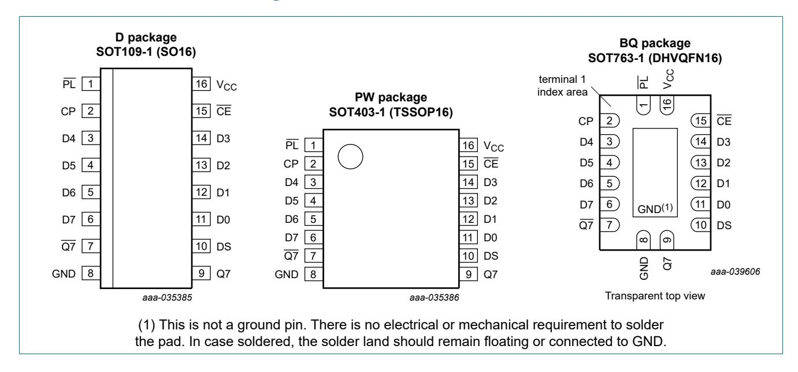
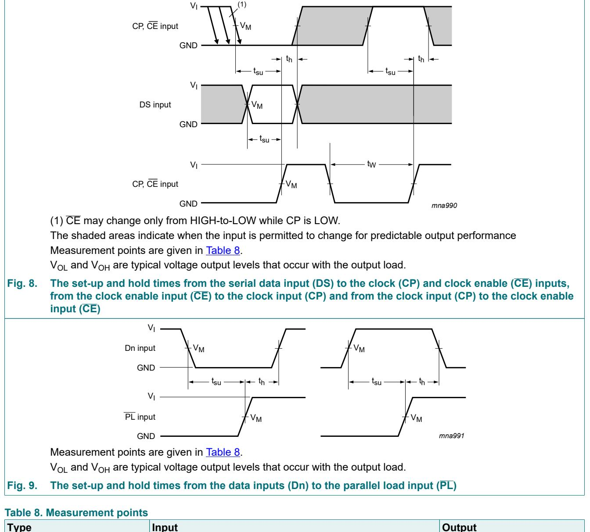
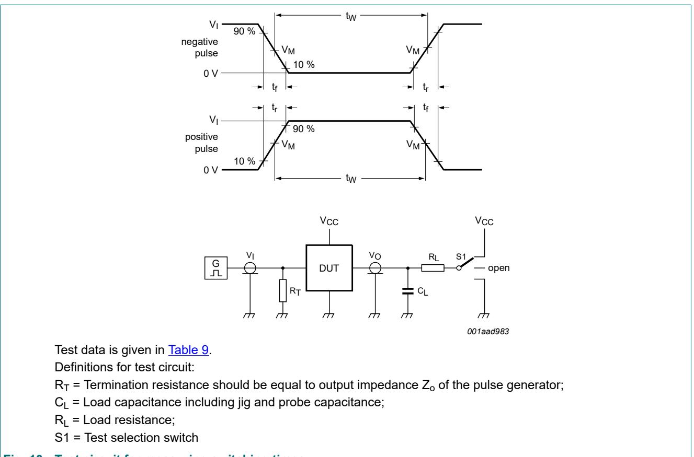

以下是关于74HC165D移位寄存器的详细解答：

### 1. 74HC165D引脚配置（Pin Configuration）
- **引脚图**：参考文档第2页的图6（Functional diagram）和第10页的波形图（Figure 3）。  
    
    

- **详细引脚描述**（第3页表2）：  
  | 引脚符号 | 引脚编号 | 功能描述                               |
  |----------|----------|----------------------------------------|
  | PL       | 1        | 异步并行加载输入（低电平有效）         |
  | CP       | 2        | 时钟输入（低到高电平边沿触发）         |
  | D3-D7    | 3-6      | 并行数据输入（D0-D7中的部分引脚）      |
  | Q7       | 7        | 最后一级的反相输出                     |
  | GND      | 8        | 地（0V）                               |
  | Q7       | 9        | 最后一级的串行输出                     |
  | DS       | 10       | 串行数据输入                           |
  | D0-D2    | 11-14    | 并行数据输入（D0-D7中的剩余引脚）      |
  | CE       | 15       | 时钟使能输入（低电平有效）             |
  | VCC      | 16       | 正电源电压                             |

---

### 2. 并行数据输入引脚（Parallel Data Input）
- **引脚编号**：D0-D7对应 **11, 12, 13, 14, 3, 4, 5, 6**（第3页表2）。  
- **功能**：当PL为低电平时，D0-D7的数据异步加载到寄存器中。

---

### 3. 串行输出与时钟控制引脚（Serial Output & Clock Control）
- **串行输出**：  
  - **Q7**（引脚9）：主串行输出。  
  - **Q7**（引脚7）：互补串行输出（反相）。  
- **时钟控制**：  
  - **CP**（引脚2）：时钟输入，上升沿触发数据移位。  
  - **CE**（引脚15）：时钟使能（低电平时允许时钟触发）。  

---

### 4. 使能（CE）和加载（PL）引脚功能
- **PL（引脚1）**：  
  - 低电平时，将并行输入D0-D7异步加载到寄存器。  
  - 高电平时，允许数据通过DS引脚串行输入（第3页功能表）。  
- **CE（引脚15）**：  
  - 低电平时，允许CP时钟触发移位操作。  
  - 高电平时，禁用时钟输入（第1页描述）。  

---

### 功能示意图与波形
- **功能框图**：第1页图6展示了内部逻辑结构。  
    
- **时序波形**：第10-11页的波形图说明了并行加载和串行移位的时序关系。  
    

如需进一步细节，可参考文档中的功能表（第3页表3）和电气参数部分。
