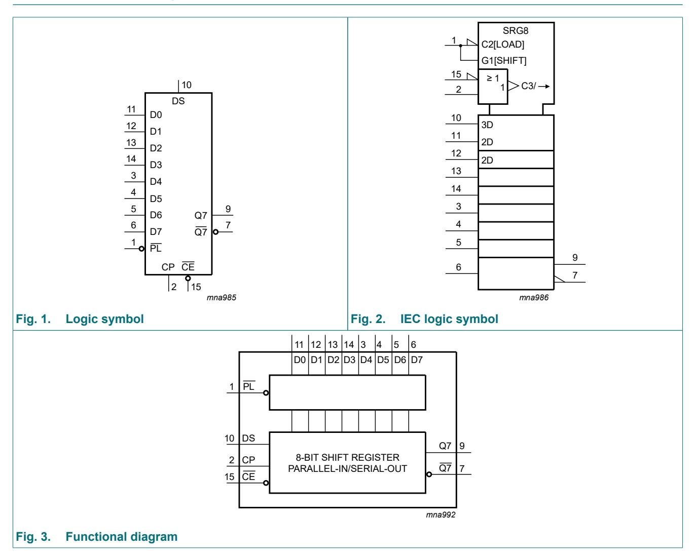

以下是关于74HC165D移位寄存器的详细解答：

---

### **1. 74HC165D的引脚配置**
74HC165D是一个16引脚的集成电路，引脚功能如下（参考第1页和第2页内容）：

- **并行数据输入**：D0至D7（8个引脚）  
- **串行数据输入**：DS（用于串行数据加载）  
- **时钟输入**：CP（移位时钟信号）  
- **时钟使能**：CE（低电平有效，启用时钟）  
- **并行加载控制**：PL（低电平时异步加载并行数据）  
- **串行输出**：Q7（主输出）和Q7（互补输出）  
- **电源与地**：VCC（电源正极）、GND（地）  

引脚图可参考文档中的功能图：  
  
  

---

### **2. 各引脚功能详解**
| 引脚名称 | 功能描述 |
|----------|----------|
| D0-D7    | 并行数据输入，用于异步加载数据（PL为低电平时有效） |
| DS       | 串行数据输入，当PL为高电平时，数据通过DS逐位移入 |
| CP       | 时钟输入，上升沿触发数据移位（CE为低电平时有效） |
| CE       | 时钟使能，低电平允许CP工作，高电平禁用时钟 |
| PL       | 并行加载控制，低电平时将D0-D7的数据加载到寄存器 |
| Q7       | 串行数据输出（主输出） |
| Q7       | 互补串行输出（反相输出） |
| VCC/GND  | 电源（2.0V-6.0V）和地 |

（参考第1页“General description”和第2页“Pin description”）

---

### **3. 输入与输出引脚如何协同工作**
74HC165D的工作模式分为两种：
1. **并行加载模式**（PL为低电平）：  
   - D0-D7的数据异步加载到寄存器中，无需时钟信号。  
2. **串行移位模式**（PL为高电平）：  
   - 数据通过DS引脚在CP时钟的上升沿逐位移入，从Q7和Q7输出。  
   - CE为低电平时，时钟有效；CE为高电平时，时钟被禁用。  

**示例时序**：  
- 先拉低PL加载并行数据，再拉高PL并通过CP时钟移位输出。  

（参考第1页和第5页功能描述）

---

### **4. 时钟（CP）和加载（PL）引脚的作用**
- **PL引脚**：  
  - 低电平：强制寄存器立即加载D0-D7的并行数据（异步操作）。  
  - 高电平：允许串行移位模式。  

- **CP引脚**：  
  - 在CE为低电平时，每个上升沿将数据从DS移入寄存器，同时Q7输出移位后的数据。  
  - 频率范围：2.0V时为4 MHz，6.0V时可达24 MHz（见第5页动态特性表）。  

**关键时序参数**：  
- PL低电平脉宽最小14 ns（6.0V时，第5页表7）。  
- CP上升沿到Q7输出的传播延迟最大28 ns（6.0V时）。  

---

### **5. 封装信息**
74HC165D提供多种封装选项（第1页和第12页）：  
- **SO16**（SOT109-1）：3.9 mm宽体封装  
- **TSSOP16**（SOT403-1）：4.4 mm薄型封装  
- **DHVQFN16**（SOT763-1）：2.5×3.5 mm无引线封装  

封装图示：  
  
  

---

如需进一步细节，请参考文档中的电气特性（第5-6页）和时序图（第9-11页）。
