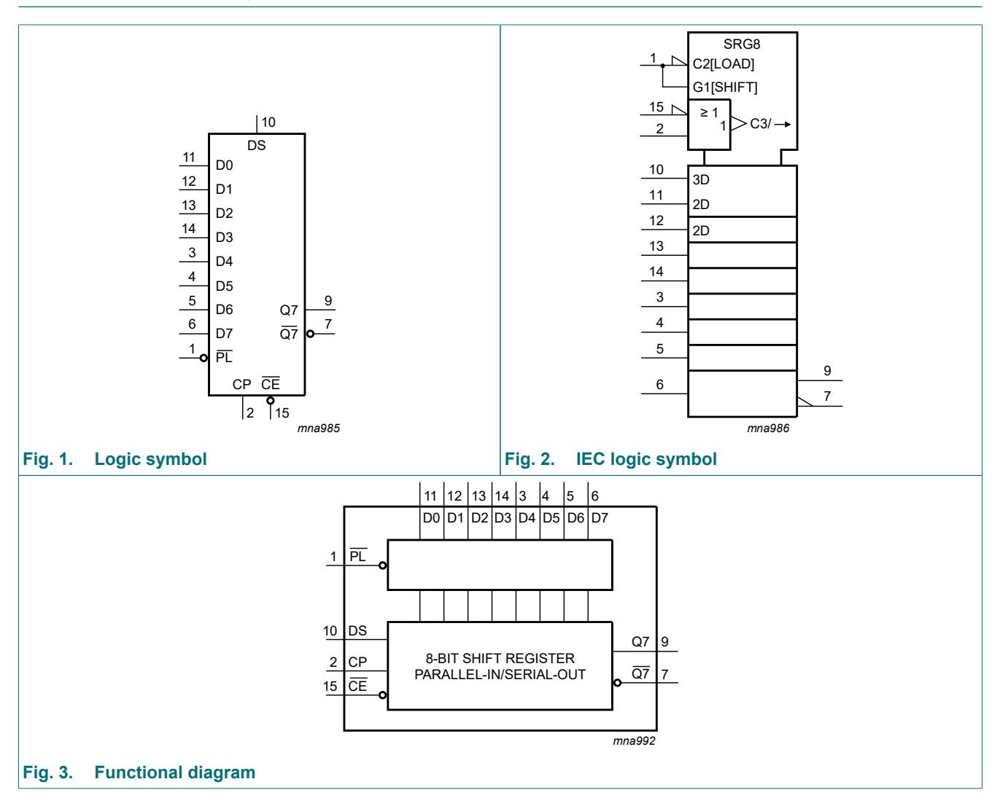
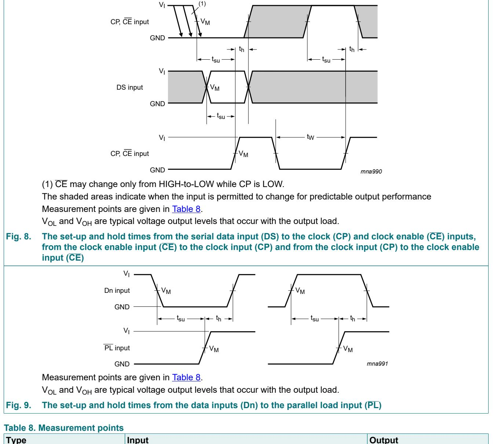
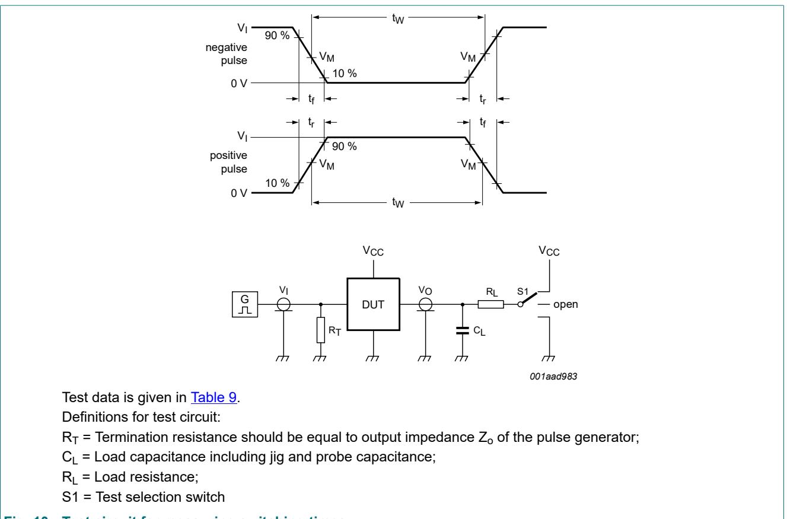
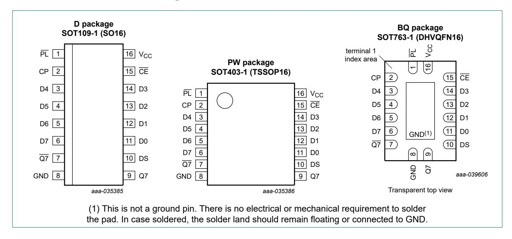

# Query Response - 2025-08-03 17:44:00

## Query
how to use 74HC165D

## Used PDFs
74HC165D

## Answer
# 74HC165D 详细使用指南

## 1. 74HC165D的功能

74HC165D是一款8位并行输入/串行输出移位寄存器（页1）。主要功能包括：
- 异步并行加载8位数据（通过D0-D7引脚）
- 同步串行数据输入（通过DS引脚）
- 提供两个互补串行输出（Q7和Q7）
- 支持并行到串行的数据转换（页1, 应用部分）

## 2. 关键引脚及其功能

根据文档中的引脚描述（页2-页6），主要引脚功能如下：

| 引脚名称 | 功能描述 |
|---------|----------|
| PL      | 并行加载输入（低电平有效），当为低电平时从D0-D7异步加载数据 |
| CP      | 时钟脉冲输入，数据在低到高电平转换时移位 |
| CE      | 时钟使能输入（低电平有效），高电平时禁用CP输入 |
| DS      | 串行数据输入 |
| D0-D7   | 并行数据输入（8位） |
| Q7      | 串行数据输出（正相） |
| Q7      | 串行数据输出（反相） |
| VCC/GND | 电源(2.0-6.0V)和地 |

## 3. 连接微控制器实现并行到串行转换

连接步骤如下（页1,页10-11）：
1. 将8个输入信号连接到D0-D7
2. 连接微控制器的3个GPIO：
   - 一个GPIO连接到PL（并行加载控制）
   - 一个GPIO连接到CP（时钟）
   - 一个GPIO连接到CE（时钟使能）
3. 将Q7或Q7连接到微控制器的输入引脚用于读取串行数据
4. VCC接2.0-6.0V电源（根据系统电压选择）

参考电路图： 

## 4. 配置读取8个输入开关

操作流程（页1,页10）：
1. 将8个开关分别连接到D0-D7，另一端接VCC或GND（根据需要）
2. 置PL为低电平，异步加载开关状态到寄存器
3. 置PL为高电平，准备串行输出
4. 置CE为低电平，使能时钟
5. 在CP引脚产生8个时钟脉冲（低到高跳变），同时在每个脉冲后从Q7读取一位数据
6. 8个脉冲后，所有开关状态被串行读出
7. 置CE为高电平，禁用时钟

时序参考：

## 5. 使用注意事项

- 电源电压范围：2.0V-6.0V（页1特性部分）
- 输入电平：
  - 74HC165：CMOS电平
  - 74HCT165：TTL电平（页1）
- 工作温度范围：-40°C至+125°C（页1订购信息）
- 具有高噪声免疫性和ESD保护（页1特性部分）

## 6. 封装选项

74HC165D提供多种封装（页1）：
- SO16（SOT109-1）：3.9mm体宽
- TSSOP16（SOT403-1）：4.4mm体宽 
- DHVQFN16（SOT763-1）：2.5×3.5×0.85mm

封装图：

---
*Generated by RAG System*
