# **STM32F103x8 STM32F103xB**

**Datasheet** - **production data**

# Medium-density performance line ARM-based 32-bit MCU with 64 or 128 KB Flash, USB, CAN, 7 timers, 2 ADCs, 9 com. interfaces

# **Features**

- ARM 32-bit Cortex™-M3 CPU Core
  - 72 MHz maximum frequency, 1.25 DMIPS/MHz (Dhrystone 2.1) performance at 0 wait state memory access
  - Single-cycle multiplication and hardware division
- Memories
  - 64 or 128 Kbytes of Flash memory
  - 20 Kbytes of SRAM
- Clock, reset and supply management
  - 2.0 to 3.6 V application supply and I/Os
  - POR, PDR, and programmable voltage detector (PVD)
  - 4-to-16 MHz crystal oscillator
  - Internal 8 MHz factory-trimmed RC
  - Internal 40 kHz RC
  - PLL for CPU clock
  - 32 kHz oscillator for RTC with calibration
- Low power
  - Sleep, Stop and Standby modes
  - VBAT supply for RTC and backup registers
- 2 x 12-bit, 1 µs A/D converters (up to 16 channels)
  - Conversion range: 0 to 3.6 V
  - Dual-sample and hold capability
  - Temperature sensor
- DMA
  - 7-channel DMA controller
  - Peripherals supported: timers, ADC, SPIs, I 2Cs and USARTs
- Up to 80 fast I/O ports
  - 26/37/51/80 I/Os, all mappable on 16 external interrupt vectors and almost all 5 V-tolerant

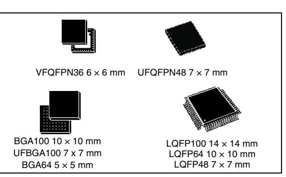

- Debug mode
  - Serial wire debug (SWD) & JTAG interfaces
- 7 timers
  - Three 16-bit timers, each with up to 4 IC/OC/PWM or pulse counter and quadrature (incremental) encoder input
  - 16-bit, motor control PWM timer with deadtime generation and emergency stop
  - 2 watchdog timers (Independent and Window)
  - SysTick timer 24-bit downcounter
- Up to 9 communication interfaces
  - Up to 2 x I2C interfaces (SMBus/PMBus)
  - Up to 3 USARTs (ISO 7816 interface, LIN, IrDA capability, modem control)
  - Up to 2 SPIs (18 Mbit/s)
  - CAN interface (2.0B Active)
  - USB 2.0 full-speed interface
- CRC calculation unit, 96-bit unique ID
- Packages are ECOPACK®

#### **Table 1. Device summary**

| Reference   | Part number                                          |
|-------------|------------------------------------------------------|
| STM32F103x8 | STM32F103C8, STM32F103R8 STM32F103V8, STM32F103T8 |
| STM32F103xB | STM32F103RB STM32F103VB, STM32F103CB, STM32F103TB |

This is information on a product in full production.

# **Contents**

| 1 |               |        | Introduction 9                                                     |  |  |  |  |  |  |  |
|---|---------------|--------|--------------------------------------------------------------------|--|--|--|--|--|--|--|
| 2 | Description 9 |        |                                                                    |  |  |  |  |  |  |  |
|   | 2.1           |        | Device overview 10                                                 |  |  |  |  |  |  |  |
|   | 2.2           |        | Full compatibility throughout the family 13                        |  |  |  |  |  |  |  |
|   | 2.3           |        | Overview 14                                                        |  |  |  |  |  |  |  |
|   |               | 2.3.1  | ARM® Cortex™-M3 core with embedded Flash and SRAM 14               |  |  |  |  |  |  |  |
|   |               | 2.3.2  | Embedded Flash memory 14                                           |  |  |  |  |  |  |  |
|   |               | 2.3.3  | CRC (cyclic redundancy check) calculation unit 14                  |  |  |  |  |  |  |  |
|   |               | 2.3.4  | Embedded SRAM 14                                                   |  |  |  |  |  |  |  |
|   |               | 2.3.5  | Nested vectored interrupt controller (NVIC) 14                     |  |  |  |  |  |  |  |
|   |               | 2.3.6  | External interrupt/event controller (EXTI) 15                      |  |  |  |  |  |  |  |
|   |               | 2.3.7  | Clocks and startup 15                                              |  |  |  |  |  |  |  |
|   |               | 2.3.8  | Boot modes 15                                                      |  |  |  |  |  |  |  |
|   |               | 2.3.9  | Power supply schemes 15                                            |  |  |  |  |  |  |  |
|   |               | 2.3.10 | Power supply supervisor 15                                         |  |  |  |  |  |  |  |
|   |               | 2.3.11 | Voltage regulator 16                                               |  |  |  |  |  |  |  |
|   |               | 2.3.12 | Low-power modes 16                                                 |  |  |  |  |  |  |  |
|   |               | 2.3.13 | DMA 17                                                             |  |  |  |  |  |  |  |
|   |               | 2.3.14 | RTC (real-time clock) and backup registers 17                      |  |  |  |  |  |  |  |
|   |               | 2.3.15 | Timers and watchdogs 17                                            |  |  |  |  |  |  |  |
|   |               | 2.3.16 | I²C bus 19                                                         |  |  |  |  |  |  |  |
|   |               | 2.3.17 | Universal synchronous/asynchronous receiver transmitter (USART) 19 |  |  |  |  |  |  |  |
|   |               | 2.3.18 | Serial peripheral interface (SPI) 19                               |  |  |  |  |  |  |  |
|   |               | 2.3.19 | Controller area network (CAN) 19                                   |  |  |  |  |  |  |  |
|   |               | 2.3.20 | Universal serial bus (USB) 19                                      |  |  |  |  |  |  |  |
|   |               | 2.3.21 | GPIOs (general-purpose inputs/outputs) 20                          |  |  |  |  |  |  |  |
|   |               | 2.3.22 | ADC (analog-to-digital converter) 20                               |  |  |  |  |  |  |  |
|   |               | 2.3.23 | Temperature sensor 20                                              |  |  |  |  |  |  |  |
|   |               | 2.3.24 | Serial wire JTAG debug port (SWJ-DP) 20                            |  |  |  |  |  |  |  |
| 3 |               |        | Pinouts and pin description 21                                     |  |  |  |  |  |  |  |
| 4 |               |        | Memory mapping 34                                                  |  |  |  |  |  |  |  |

2/[105](#page-104-0) DocID13587 Rev 16

| 5 | Electrical characteristics 35 |                             |                                                           |  |  |  |  |  |  |  |
|---|-------------------------------|-----------------------------|-----------------------------------------------------------|--|--|--|--|--|--|--|
|   | 5.1                           |                             | Parameter conditions 35                                   |  |  |  |  |  |  |  |
|   |                               | 5.1.1                       | Minimum and maximum values 35                             |  |  |  |  |  |  |  |
|   |                               | 5.1.2                       | Typical values 35                                         |  |  |  |  |  |  |  |
|   |                               | 5.1.3                       | Typical curves 35                                         |  |  |  |  |  |  |  |
|   |                               | 5.1.4                       | Loading capacitor 35                                      |  |  |  |  |  |  |  |
|   |                               | 5.1.5                       | Pin input voltage 35                                      |  |  |  |  |  |  |  |
|   |                               | 5.1.6                       | Power supply scheme 36                                    |  |  |  |  |  |  |  |
|   |                               | 5.1.7                       | Current consumption measurement 37                        |  |  |  |  |  |  |  |
|   | 5.2                           | Absolute maximum ratings 37 |                                                           |  |  |  |  |  |  |  |
|   | 5.3                           | Operating conditions 38     |                                                           |  |  |  |  |  |  |  |
|   |                               | 5.3.1                       | General operating conditions 38                           |  |  |  |  |  |  |  |
|   |                               | 5.3.2                       | Operating conditions at power-up / power-down 39          |  |  |  |  |  |  |  |
|   |                               | 5.3.3                       | Embedded reset and power control block characteristics 40 |  |  |  |  |  |  |  |
|   |                               | 5.3.4                       | Embedded reference voltage 41                             |  |  |  |  |  |  |  |
|   |                               | 5.3.5                       | Supply current characteristics 41                         |  |  |  |  |  |  |  |
|   |                               | 5.3.6                       | External clock source characteristics 51                  |  |  |  |  |  |  |  |
|   |                               | 5.3.7                       | Internal clock source characteristics 55                  |  |  |  |  |  |  |  |
|   |                               | 5.3.8                       | PLL characteristics 57                                    |  |  |  |  |  |  |  |
|   |                               | 5.3.9                       | Memory characteristics 57                                 |  |  |  |  |  |  |  |
|   |                               | 5.3.10                      | EMC characteristics 58                                    |  |  |  |  |  |  |  |
|   |                               | 5.3.11                      | Absolute maximum ratings (electrical sensitivity) 60      |  |  |  |  |  |  |  |
|   |                               | 5.3.12                      | I/O current injection characteristics 61                  |  |  |  |  |  |  |  |
|   |                               | 5.3.13                      | I/O port characteristics 62                               |  |  |  |  |  |  |  |
|   |                               | 5.3.14                      | NRST pin characteristics 68                               |  |  |  |  |  |  |  |
|   |                               | 5.3.15                      | TIM timer characteristics 69                              |  |  |  |  |  |  |  |
|   |                               | 5.3.16                      | Communications interfaces 70                              |  |  |  |  |  |  |  |
|   |                               | 5.3.17                      | CAN (controller area network) interface 75                |  |  |  |  |  |  |  |
|   |                               | 5.3.18                      | 12-bit ADC characteristics 76                             |  |  |  |  |  |  |  |
|   |                               | 5.3.19                      | Temperature sensor characteristics 80                     |  |  |  |  |  |  |  |
| 6 |                               |                             | Package characteristics 81                                |  |  |  |  |  |  |  |
|   | 6.1                           |                             | Package mechanical data 81                                |  |  |  |  |  |  |  |
|   | 6.2                           |                             | Thermal characteristics 93                                |  |  |  |  |  |  |  |
|   |                               | 6.2.1                       | Reference document 93                                     |  |  |  |  |  |  |  |
|   |                               | 6.2.2                       | Selecting the product temperature range 94                |  |  |  |  |  |  |  |

| 7 | Ordering information scheme 96 |  |
|---|--------------------------------|--|
| 8 | Revision history . 97       |  |

# **List of tables**

| Table 1.  | Device summary 1                                                              |  |
|-----------|-------------------------------------------------------------------------------|--|
| Table 2.  | STM32F103xx medium-density device features and peripheral counts 10           |  |
| Table 3.  | STM32F103xx family 13                                                         |  |
| Table 4.  | Timer feature comparison. 17                                                  |  |
| Table 5.  | Medium-density STM32F103xx pin definitions 28                                 |  |
| Table 6.  | Voltage characteristics 37                                                    |  |
| Table 7.  | Current characteristics 38                                                    |  |
| Table 8.  | Thermal characteristics. 38                                                   |  |
| Table 9.  | General operating conditions 38                                               |  |
| Table 10. | Operating conditions at power-up / power-down 39                              |  |
| Table 11. | Embedded reset and power control block characteristics. 40                    |  |
| Table 12. | Embedded internal reference voltage. 41                                       |  |
| Table 13. | Maximum current consumption in Run mode, code with data processing            |  |
|           | running from Flash 42                                                         |  |
| Table 14. | Maximum current consumption in Run mode, code with data processing            |  |
|           | running from RAM. 42                                                          |  |
| Table 15. | Maximum current consumption in Sleep mode, code running from Flash or RAM. 44 |  |
| Table 16. | Typical and maximum current consumptions in Stop and Standby modes 45         |  |
| Table 17. | Typical current consumption in Run mode, code with data processing            |  |
|           | running from Flash 48                                                         |  |
| Table 18. | Typical current consumption in Sleep mode, code running from Flash or         |  |
|           | RAM 49                                                                        |  |
| Table 19. | Peripheral current consumption 50                                             |  |
| Table 20. | High-speed external user clock characteristics. 51                            |  |
| Table 21. | Low-speed external user clock characteristics 51                              |  |
| Table 22. | HSE 4-16 MHz oscillator characteristics 53                                    |  |
| Table 23. | LSE oscillator characteristics (fLSE = 32.768 kHz) 54                         |  |
| Table 24. | HSI oscillator characteristics. 55                                            |  |
| Table 25. | LSI oscillator characteristics 56                                             |  |
| Table 26. | Low-power mode wakeup timings 57                                              |  |
| Table 27. | PLL characteristics 57                                                        |  |
| Table 28. | Flash memory characteristics 57                                               |  |
| Table 29. | Flash memory endurance and data retention 58                                  |  |
| Table 30. | EMS characteristics 59                                                        |  |
| Table 31. | EMI characteristics 59                                                        |  |
| Table 32. | ESD absolute maximum ratings 60                                               |  |
| Table 33. | Electrical sensitivities 60                                                   |  |
| Table 34. | I/O current injection susceptibility 61                                       |  |
| Table 35. | I/O static characteristics 62                                                 |  |
| Table 36. | Output voltage characteristics 66                                             |  |
| Table 37. | I/O AC characteristics 67                                                     |  |
| Table 38. | NRST pin characteristics 68                                                   |  |
| Table 39. | TIMx characteristics 69                                                       |  |
| Table 40. | I2C characteristics. 70                                                       |  |
| Table 41. | SCL frequency (fPCLK1= 36 MHz.,VDD_I2C = 3.3 V) 71                            |  |
| Table 42. | SPI characteristics 72                                                        |  |
| Table 43. | USB startup time. 74                                                          |  |
| Table 44. | USB DC electrical characteristics 75                                          |  |
|           |                                                                               |  |

| Table 45. Table 46. | USB: Full-speed electrical characteristics. 75 ADC characteristics 76               |
|------------------------|----------------------------------------------------------------------------------------|
| Table 47.              | RAIN max for fADC = 14 MHz. 77                                                         |
| Table 48.              | ADC accuracy - limited test conditions 77                                              |
| Table 49.              | ADC accuracy 78                                                                        |
| Table 50.              | TS characteristics 80                                                                  |
| Table 51.              | VFQFPN36 6 x 6 mm, 0.5 mm pitch, package mechanical data 82                            |
| Table 52.              | UFQFPN48 7 x 7 mm, 0.5 mm pitch, package mechanical data 83                            |
| Table 53.              | LFBGA100 - 10 x 10 mm low profile fine pitch ball grid array package                   |
|                        | mechanical data 85                                                                     |
| Table 54.              | LQPF100, 14 x 14 mm 100-pin low-profile quad flat package mechanical data. 87          |
| Table 55.              | UFBGA100 - ultra fine pitch ball grid array, 7 x 7 mm, 0.50 mm pitch, package          |
|                        | mechanical data 88                                                                     |
| Table 56.              | LQFP64, 10 x 10 mm, 64-pin low-profile quad flat package mechanical data 89            |
| Table 57.              | TFBGA64 - 8 x 8 active ball array, 5 x 5 mm, 0.5 mm pitch, package mechanical data. 90 |
| Table 58.              | LQFP48, 7 x 7 mm, 48-pin low-profile quad flat package mechanical data 92              |
| Table 59.              | Package thermal characteristics. 93                                                    |
| Table 60.              | Ordering information scheme 96                                                         |
| Table 61.              | Document revision history 97                                                           |

# **List of figures**

| Figure 1.  | STM32F103xx performance line block diagram 11                                    |  |
|------------|----------------------------------------------------------------------------------|--|
| Figure 2.  | Clock tree 12                                                                    |  |
| Figure 3.  | STM32F103xx performance line LFBGA100 ballout 21                                 |  |
| Figure 4.  | STM32F103xx performance line LQFP100 pinout 22                                   |  |
| Figure 5.  | STM32F103xx performance line UFBGA100 pinout 23                                  |  |
| Figure 6.  | STM32F103xx performance line LQFP64 pinout 24                                    |  |
| Figure 7.  | STM32F103xx performance line TFBGA64 ballout 25                                  |  |
| Figure 8.  | STM32F103xx performance line LQFP48 pinout 26                                    |  |
| Figure 9.  | STM32F103xx performance line UFQFPN48 pinout 26                                  |  |
| Figure 10. | STM32F103xx performance line VFQFPN36 pinout 27                                  |  |
| Figure 11. | Memory map. 34                                                                   |  |
| Figure 12. | Pin loading conditions. 36                                                       |  |
| Figure 13. | Pin input voltage 36                                                             |  |
| Figure 14. | Power supply scheme. 36                                                          |  |
| Figure 15. | Current consumption measurement scheme 37                                        |  |
| Figure 16. | Typical current consumption in Run mode versus frequency (at 3.6 V) -            |  |
|            | code with data processing running from RAM, peripherals enabled. 43              |  |
| Figure 17. | Typical current consumption in Run mode versus frequency (at 3.6 V) -            |  |
|            | code with data processing running from RAM, peripherals disabled 43              |  |
| Figure 18. | Typical current consumption on VBAT with RTC on versus temperature at different  |  |
|            | VBAT values 45                                                                   |  |
| Figure 19. | Typical current consumption in Stop mode with regulator in Run mode versus       |  |
|            | temperature at VDD = 3.3 V and 3.6 V 46                                          |  |
| Figure 20. | Typical current consumption in Stop mode with regulator in Low-power mode versus |  |
|            | temperature at VDD = 3.3 V and 3.6 V 46                                          |  |
| Figure 21. | Typical current consumption in Standby mode versus temperature at                |  |
|            | VDD = 3.3 V and 3.6 V 47                                                         |  |
| Figure 22. | High-speed external clock source AC timing diagram 52                            |  |
| Figure 23. | Low-speed external clock source AC timing diagram. 52                            |  |
| Figure 24. | Typical application with an 8 MHz crystal 53                                     |  |
| Figure 25. | Typical application with a 32.768 kHz crystal 55                                 |  |
| Figure 26. | Standard I/O input characteristics - CMOS port 64                                |  |
| Figure 27. | Standard I/O input characteristics - TTL port 64                                 |  |
| Figure 28. | 5 V tolerant I/O input characteristics - CMOS port 65                            |  |
| Figure 29. | 5 V tolerant I/O input characteristics - TTL port 65                             |  |
| Figure 30. | I/O AC characteristics definition 68                                             |  |
| Figure 31. | Recommended NRST pin protection 69                                               |  |
| Figure 32. | I2C bus AC waveforms and measurement circuit . 71                             |  |
| Figure 33. | SPI timing diagram - slave mode and CPHA = 0 73                                  |  |
| Figure 34. | SPI timing diagram - slave mode and CPHA = 1(1) 73                               |  |
| Figure 35. | SPI timing diagram - master mode(1) 74                                           |  |
| Figure 36. | USB timings: definition of data signal rise and fall time 75                     |  |
| Figure 37. | ADC accuracy characteristics. 78                                                 |  |
| Figure 38. | Typical connection diagram using the ADC 79                                      |  |
| Figure 39. | Power supply and reference decoupling (VREF+ not connected to VDDA). 79          |  |
| Figure 40. | Power supply and reference decoupling (VREF+ connected to VDDA). 80              |  |
| Figure 41. | VFQFPN36 6 x 6 mm, 0.5 mm pitch, package outline(1) 82                           |  |
| Figure 42. | VFQFPN36 recommended footprint (dimensions in mm)(1)(2). 82                      |  |

| Figure 43. Figure 44. Figure 45. | UFQFPN48 7 x 7 mm, 0.5 mm pitch, package outline 83 UFQFPN48 recommended footprint 84 LFBGA100 - 10 x 10 mm low profile fine pitch ball grid array package |  |
|----------------------------------------|------------------------------------------------------------------------------------------------------------------------------------------------------------------|--|
|                                        | outline 85                                                                                                                                                       |  |
| Figure 46.                             | Recommended PCB design rules (0.80/0.75 mm pitch BGA) 86                                                                                                         |  |
| Figure 47.                             | LQFP100, 14 x 14 mm 100-pin low-profile quad flat package outline 87                                                                                             |  |
| Figure 48.                             | LQFP100 recommended footprint(1) 87                                                                                                                              |  |
| Figure 49.                             | UFBGA100 - ultra fine pitch ball grid array, 7 x 7 mm, 0.50 mm pitch,                                                                                            |  |
|                                        | package outline. 88                                                                                                                                              |  |
| Figure 50.                             | LQFP64, 10 x 10 mm, 64-pin low-profile quad flat package outline 89                                                                                              |  |
| Figure 51.                             | LQFP64 recommended footprint(1). 89                                                                                                                              |  |
| Figure 52.                             | TFBGA64 - 8 x 8 active ball array, 5 x 5 mm, 0.5 mm pitch, package outline 90                                                                                    |  |
| Figure 53.                             | Recommended PCB design rules for pads (0.5 mm pitch BGA) 91                                                                                                      |  |
| Figure 54.                             | LQFP48, 7 x 7 mm, 48-pin low-profile quad flat package outline 92                                                                                                |  |
| Figure 55.                             | LQFP48 recommended footprint(1). 92                                                                                                                              |  |
| Figure 56.                             | LQFP100 PD max vs. TA 95                                                                                                                                         |  |

# **1 Introduction**

This datasheet provides the ordering information and mechanical device characteristics of the STM32F103x8 and STM32F103xB medium-density performance line microcontrollers. For more details on the whole STMicroelectronics STM32F103xx family, please refer to *[Section 2.2: Full compatibility throughout the family](#page-12-0)*.

The medium-density STM32F103xx datasheet should be read in conjunction with the low-, medium- and high-density STM32F10xxx reference manual*.* The reference and Flash programming manuals are both available from the STMicroelectronics website www.st.com.

For information on the Cortex™-M3 core please refer to the Cortex™-M3 Technical Reference Manual, available from the www.arm.com website at the following address: http://infocenter.arm.com/help/index.jsp?topic=/com.arm.doc.ddi0337e/.

# **2 Description**

The STM32F103xx medium-density performance line family incorporates the highperformance ARM Cortex™-M3 32-bit RISC core operating at a 72 MHz frequency, highspeed embedded memories (Flash memory up to 128 Kbytes and SRAM up to 20 Kbytes), and an extensive range of enhanced I/Os and peripherals connected to two APB buses. All devices offer two 12-bit ADCs, three general purpose 16-bit timers plus one PWM timer, as well as standard and advanced communication interfaces: up to two I2Cs and SPIs, three USARTs, an USB and a CAN.

The devices operate from a 2.0 to 3.6 V power supply. They are available in both the –40 to +85 °C temperature range and the –40 to +105 °C extended temperature range. A comprehensive set of power-saving mode allows the design of low-power applications.

The STM32F103xx medium-density performance line family includes devices in six different package types: from 36 pins to 100 pins. Depending on the device chosen, different sets of peripherals are included, the description below gives an overview of the complete range of peripherals proposed in this family.

These features make the STM32F103xx medium-density performance line microcontroller family suitable for a wide range of applications such as motor drives, application control, medical and handheld equipment, PC and gaming peripherals, GPS platforms, industrial applications, PLCs, inverters, printers, scanners, alarm systems, video intercoms, and HVACs.

# **2.1 Device overview**

|                        |                         |        |             |                     |             | STM32F103Rx STM32F103Vx                          |                                                                    |    |                                   |  |
|------------------------|-------------------------|--------|-------------|---------------------|-------------|-----------------------------------------------------|--------------------------------------------------------------------|----|-----------------------------------|--|
|                        | Peripheral              |        | STM32F103Tx |                     | STM32F103Cx |                                                     |                                                                    |    |                                   |  |
|                        | Flash - Kbytes          | 64     | 128         | 64                  | 128         | 64                                                  | 128                                                                | 64 | 128                               |  |
|                        | SRAM - Kbytes           |        | 20          |                     | 20          | 20                                                  |                                                                    | 20 |                                   |  |
| Timers                 | General-purpose         | 3      |             |                     | 3           |                                                     | 3                                                                  |    | 3                                 |  |
|                        | Advanced-control        | 1      |             | 1                   |             | 1                                                   |                                                                    |    | 1                                 |  |
|                        | SPI                     |        | 1           |                     | 2           |                                                     | 2                                                                  |    | 2                                 |  |
| Communication          | 2C I                 |        | 1           |                     | 2           |                                                     | 2                                                                  | 2  |                                   |  |
|                        | USART                   | 2      |             | 3                   |             | 3                                                   |                                                                    | 3  |                                   |  |
|                        | USB                     | 1      |             | 1                   |             | 1                                                   |                                                                    | 1  |                                   |  |
|                        | CAN                     | 1      |             | 1                   |             | 1                                                   |                                                                    | 1  |                                   |  |
| GPIOs                  |                         |        | 26          |                     | 37          | 51                                                  |                                                                    | 80 |                                   |  |
|                        | 12-bit synchronized ADC |        | 2           |                     | 2           | 2                                                   |                                                                    | 2  |                                   |  |
|                        | Number of channels      |        | 10 channels |                     | 10 channels |                                                     | 16 channels(1)                                                     |    | 16 channels                       |  |
|                        | CPU frequency           | 72 MHz |             |                     |             |                                                     |                                                                    |    |                                   |  |
|                        | Operating voltage       |        |             |                     |             | 2.0 to 3.6 V                                        |                                                                    |    |                                   |  |
| Operating temperatures |                         |        |             |                     |             | Junction temperature: -40 to + 125 °C (see Table 9) | Ambient temperatures: -40 to +85 °C / -40 to +105 °C (see Table 9) |    |                                   |  |
| Packages               |                         |        | VFQFPN36    | LQFP48, UFQFPN48 |             | LQFP64, TFBGA64                                  |                                                                    |    | LQFP100, LFBGA100, UFBGA100 |  |

#### **Table 2. STM32F103xx medium-density device features and peripheral counts**

1. On the TFBGA64 package only 15 channels are available (one analog input pin has been replaced by 'Vref+').

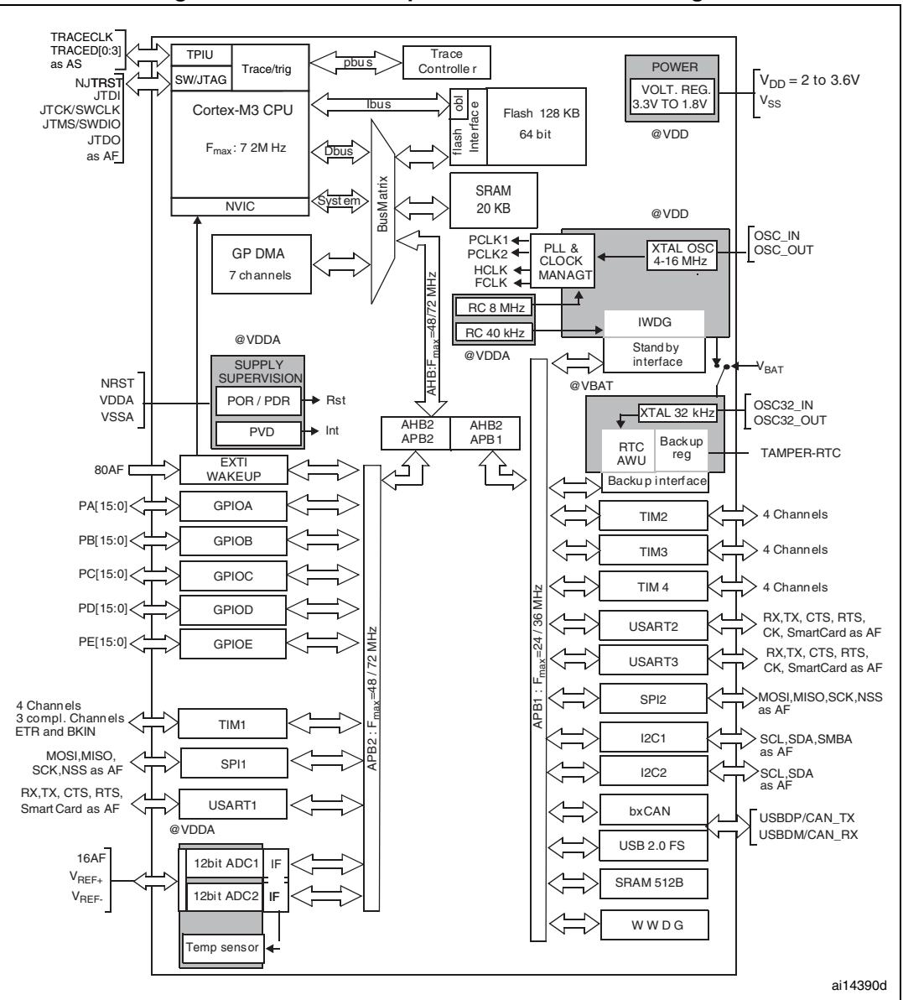

**Figure 1. STM32F103xx performance line block diagram**

1. TA = –40 °C to +105 °C (junction temperature up to 125 °C).

2. AF = alternate function on I/O port pin.

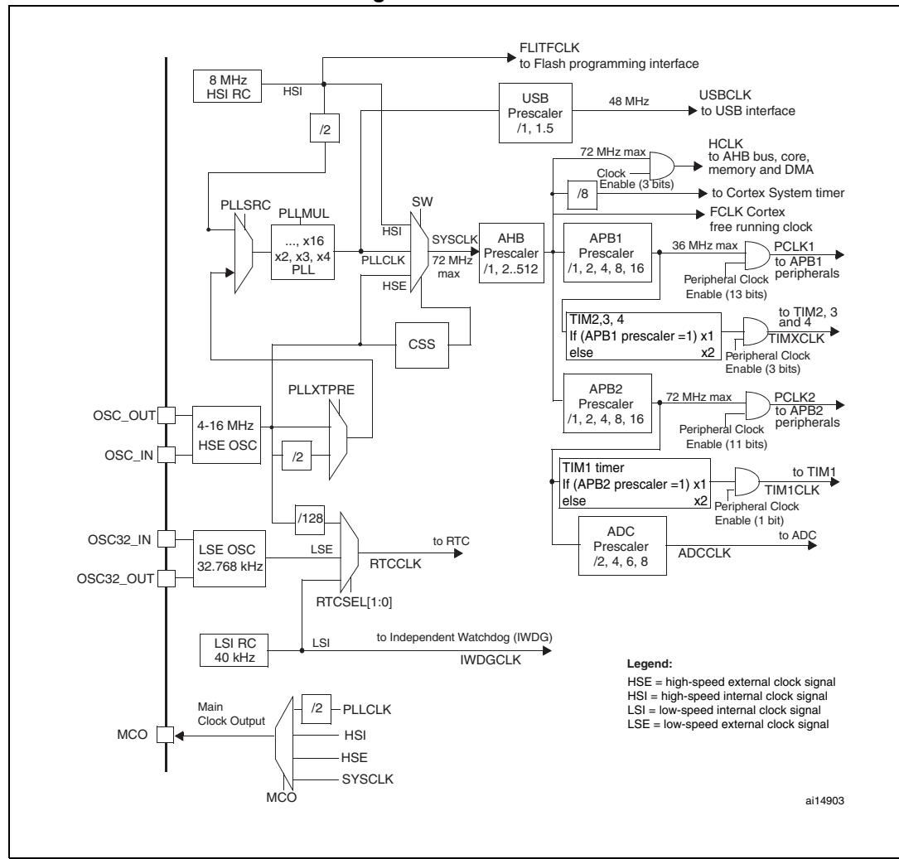

**Figure 2. Clock tree**

1. When the HSI is used as a PLL clock input, the maximum system clock frequency that can be achieved is 64 MHz.

- 2. For the USB function to be available, both HSE and PLL must be enabled, with USBCLK running at 48 MHz.
- 3. To have an ADC conversion time of 1 µs, APB2 must be at 14 MHz, 28 MHz or 56 MHz.

# **2.2 Full compatibility throughout the family**

The STM32F103xx is a complete family whose members are fully pin-to-pin, software and feature compatible. In the reference manual, the STM32F103x4 and STM32F103x6 are identified as low-density devices, the STM32F103x8 and STM32F103xB are referred to as medium-density devices, and the STM32F103xC, STM32F103xD and STM32F103xE are referred to as high-density devices.

Low- and high-density devices are an extension of the STM32F103x8/B devices, they are specified in the STM32F103x4/6 and STM32F103xC/D/E datasheets, respectively. Lowdensity devices feature lower Flash memory and RAM capacities, less timers and peripherals. High-density devices have higher Flash memory and RAM capacities, and additional peripherals like SDIO, FSMC, I2S and DAC, while remaining fully compatible with the other members of the STM32F103xx family.

The STM32F103x4, STM32F103x6, STM32F103xC, STM32F103xD and STM32F103xE are a drop-in replacement for STM32F103x8/B medium-density devices, allowing the user to try different memory densities and providing a greater degree of freedom during the development cycle.

Moreover, the STM32F103xx performance line family is fully compatible with all existing STM32F101xx access line and STM32F102xx USB access line devices.

|        |                                                           | Low-density devices |                                                                      | Medium-density devices | High-density devices                                                |                                                                                     |                 |  |  |
|--------|-----------------------------------------------------------|---------------------|----------------------------------------------------------------------|------------------------|---------------------------------------------------------------------|-------------------------------------------------------------------------------------|-----------------|--|--|
| Pinout | 16 KB 32 KB Flash(1) Flash                       |                     | 64 KB Flash                                                       | 128 KB Flash        | 256 KB Flash                                                     | 384 KB Flash                                                                     | 512 KB Flash |  |  |
|        |                                                           |                     | 6 KB RAM 10 KB RAM 20 KB RAM 20 KB RAM 48 KB RAM 64 KB RAM 64 KB RAM |                        |                                                                     |                                                                                     |                 |  |  |
| 144    |                                                           |                     |                                                                      |                        | 5 × USARTs                                                          |                                                                                     |                 |  |  |
| 100    |                                                           |                     |                                                                      |                        | 4 × 16-bit timers, 2 × basic timers 3 × SPIs, 2 × I2Ss, 2 × I2Cs |                                                                                     |                 |  |  |
| 64     | 2 × USARTs 2 × 16-bit timers 1 × SPI, 1 × I2C, USB, |                     | 3 × USARTs 3 × 16-bit timers 2 × SPIs, 2 × I2Cs, USB,          |                        |                                                                     | USB, CAN, 2 × PWM timers 3 × ADCs, 2 × DACs, 1 × SDIO FSMC (100 and 144 pins) |                 |  |  |
| 48     | CAN, 1 × PWM timer                                        |                     | CAN, 1 × PWM timer 2 × ADCs                                       |                        |                                                                     |                                                                                     |                 |  |  |
| 36     | 2 × ADCs                                                  |                     |                                                                      |                        |                                                                     |                                                                                     |                 |  |  |

**Table 3. STM32F103xx family**

1. For orderable part numbers that do not show the A internal code after the temperature range code (6 or 7), the reference datasheet for electrical characteristics is that of the STM32F103x8/B medium-density devices.

# **2.3 Overview**

# **2.3.1 ARM® Cortex™-M3 core with embedded Flash and SRAM**

The ARM Cortex™-M3 processor is the latest generation of ARM processors for embedded systems. It has been developed to provide a low-cost platform that meets the needs of MCU implementation, with a reduced pin count and low-power consumption, while delivering outstanding computational performance and an advanced system response to interrupts.

The ARM Cortex™-M3 32-bit RISC processor features exceptional code-efficiency, delivering the high-performance expected from an ARM core in the memory size usually associated with 8- and 16-bit devices.

The STM32F103xx performance line family having an embedded ARM core, is therefore compatible with all ARM tools and software.

*[Figure 1](#page-10-0)* shows the general block diagram of the device family.

# **2.3.2 Embedded Flash memory**

64 or 128 Kbytes of embedded Flash is available for storing programs and data.

# **2.3.3 CRC (cyclic redundancy check) calculation unit**

The CRC (cyclic redundancy check) calculation unit is used to get a CRC code from a 32-bit data word and a fixed generator polynomial.

Among other applications, CRC-based techniques are used to verify data transmission or storage integrity. In the scope of the EN/IEC 60335-1 standard, they offer a means of verifying the Flash memory integrity. The CRC calculation unit helps compute a signature of the software during runtime, to be compared with a reference signature generated at linktime and stored at a given memory location.

# **2.3.4 Embedded SRAM**

Twenty Kbytes of embedded SRAM accessed (read/write) at CPU clock speed with 0 wait states.

# **2.3.5 Nested vectored interrupt controller (NVIC)**

The STM32F103xx performance line embeds a nested vectored interrupt controller able to handle up to 43 maskable interrupt channels (not including the 16 interrupt lines of Cortex™-M3) and 16 priority levels.

- Closely coupled NVIC gives low-latency interrupt processing
- Interrupt entry vector table address passed directly to the core
- Closely coupled NVIC core interface
- Allows early processing of interrupts
- Processing of *late arriving* higher priority interrupts
- Support for tail-chaining
- Processor state automatically saved
- Interrupt entry restored on interrupt exit with no instruction overhead

This hardware block provides flexible interrupt management features with minimal interrupt latency.

## **2.3.6 External interrupt/event controller (EXTI)**

The external interrupt/event controller consists of 19 edge detector lines used to generate interrupt/event requests. Each line can be independently configured to select the trigger event (rising edge, falling edge, both) and can be masked independently. A pending register maintains the status of the interrupt requests. The EXTI can detect an external line with a pulse width shorter than the Internal APB2 clock period. Up to 80 GPIOs can be connected to the 16 external interrupt lines.

# **2.3.7 Clocks and startup**

System clock selection is performed on startup, however the internal RC 8 MHz oscillator is selected as default CPU clock on reset. An external 4-16 MHz clock can be selected, in which case it is monitored for failure. If failure is detected, the system automatically switches back to the internal RC oscillator. A software interrupt is generated if enabled. Similarly, full interrupt management of the PLL clock entry is available when necessary (for example on failure of an indirectly used external crystal, resonator or oscillator).

Several prescalers allow the configuration of the AHB frequency, the high-speed APB (APB2) and the low-speed APB (APB1) domains. The maximum frequency of the AHB and the high-speed APB domains is 72 MHz. The maximum allowed frequency of the low-speed APB domain is 36 MHz. See *[Figure 2](#page-11-0)* for details on the clock tree.

## **2.3.8 Boot modes**

At startup, boot pins are used to select one of three boot options:

- Boot from User Flash
- Boot from System Memory
- Boot from embedded SRAM

The boot loader is located in System Memory. It is used to reprogram the Flash memory by using USART1. For further details please refer to AN2606.

## **2.3.9 Power supply schemes**

- VDD = 2.0 to 3.6 V: external power supply for I/Os and the internal regulator. Provided externally through VDD pins.
- VSSA, VDDA = 2.0 to 3.6 V: external analog power supplies for ADC, reset blocks, RCs and PLL (minimum voltage to be applied to VDDA is 2.4 V when the ADC is used). VDDA and VSSA must be connected to VDD and VSS, respectively.
- VBAT = 1.8 to 3.6 V: power supply for RTC, external clock 32 kHz oscillator and backup registers (through power switch) when VDD is not present.

For more details on how to connect power pins, refer to *[Figure 14: Power supply scheme](#page-35-3)*.

## **2.3.10 Power supply supervisor**

The device has an integrated power-on reset (POR)/power-down reset (PDR) circuitry. It is always active, and ensures proper operation starting from/down to 2 V. The device remains

DocID13587 Rev 16 15/[105](#page-104-0)

in reset mode when VDD is below a specified threshold, VPOR/PDR, without the need for an external reset circuit.

The device features an embedded programmable voltage detector (PVD) that monitors the VDD/VDDA power supply and compares it to the VPVD threshold. An interrupt can be generated when VDD/VDDA drops below the VPVD threshold and/or when VDD/VDDA is higher than the VPVD threshold. The interrupt service routine can then generate a warning message and/or put the MCU into a safe state. The PVD is enabled by software.

Refer to *[Table 11: Embedded reset and power control block characteristics](#page-39-1)* for the values of VPOR/PDR and VPVD.

## **2.3.11 Voltage regulator**

The regulator has three operation modes: main (MR), low power (LPR) and power down.

- MR is used in the nominal regulation mode (Run)
- LPR is used in the Stop mode
- Power down is used in Standby mode: the regulator output is in high impedance: the kernel circuitry is powered down, inducing zero consumption (but the contents of the registers and SRAM are lost)

This regulator is always enabled after reset. It is disabled in Standby mode, providing high impedance output.

# **2.3.12 Low-power modes**

The STM32F103xx performance line supports three low-power modes to achieve the best compromise between low power consumption, short startup time and available wakeup sources:

**Sleep** mode

In Sleep mode, only the CPU is stopped. All peripherals continue to operate and can wake up the CPU when an interrupt/event occurs.

**Stop** mode

The Stop mode achieves the lowest power consumption while retaining the content of SRAM and registers. All clocks in the 1.8 V domain are stopped, the PLL, the HSI RC and the HSE crystal oscillators are disabled. The voltage regulator can also be put either in normal or in low power mode.

The device can be woken up from Stop mode by any of the EXTI line. The EXTI line source can be one of the 16 external lines, the PVD output, the RTC alarm or the USB wakeup.

**Standby** mode

The Standby mode is used to achieve the lowest power consumption. The internal voltage regulator is switched off so that the entire 1.8 V domain is powered off. The PLL, the HSI RC and the HSE crystal oscillators are also switched off. After entering Standby mode, SRAM and register contents are lost except for registers in the Backup domain and Standby circuitry.

The device exits Standby mode when an external reset (NRST pin), an IWDG reset, a rising edge on the WKUP pin, or an RTC alarm occurs.

*Note: The RTC, the IWDG, and the corresponding clock sources are not stopped by entering Stop or Standby mode.*

16/[105](#page-104-0) DocID13587 Rev 16

#### **2.3.13 DMA**

The flexible 7-channel general-purpose DMA is able to manage memory-to-memory, peripheral-to-memory and memory-to-peripheral transfers. The DMA controller supports circular buffer management avoiding the generation of interrupts when the controller reaches the end of the buffer.

Each channel is connected to dedicated hardware DMA requests, with support for software trigger on each channel. Configuration is made by software and transfer sizes between source and destination are independent.

The DMA can be used with the main peripherals: SPI, I2C, USART, general-purpose and advanced-control timers TIMx and ADC.

## **2.3.14 RTC (real-time clock) and backup registers**

The RTC and the backup registers are supplied through a switch that takes power either on VDD supply when present or through the VBAT pin. The backup registers are ten 16-bit registers used to store 20 bytes of user application data when VDD power is not present.

The real-time clock provides a set of continuously running counters which can be used with suitable software to provide a clock calendar function, and provides an alarm interrupt and a periodic interrupt. It is clocked by a 32.768 kHz external crystal, resonator or oscillator, the internal low-power RC oscillator or the high-speed external clock divided by 128. The internal low-power RC has a typical frequency of 40 kHz. The RTC can be calibrated using an external 512 Hz output to compensate for any natural crystal deviation. The RTC features a 32-bit programmable counter for long-term measurement using the Compare register to generate an alarm. A 20-bit prescaler is used for the time base clock and is by default configured to generate a time base of 1 second from a clock at 32.768 kHz.

## **2.3.15 Timers and watchdogs**

The medium-density STM32F103xx performance line devices include an advanced-control timer, three general-purpose timers, two watchdog timers and a SysTick timer.

*[Table 4](#page-16-3)* compares the features of the advanced-control and general-purpose timers.

| Timer                  | Counter resolution | Counter Prescaler DMA request type factor generation channels |                                       | Capture/compare | Complementary outputs |     |
|------------------------|-----------------------|---------------------------------------------------------------------------------|---------------------------------------|-----------------|--------------------------|-----|
| TIM1                   | 16-bit                | Up, down, up/down                                                         | Any integer between 1 and 65536 | Yes             | 4                        | Yes |
| TIM2, TIM3, TIM4 | 16-bit                | Up, down, up/down                                                         | Any integer between 1 and 65536 | Yes             | 4                        | No  |

**Table 4. Timer feature comparison**

#### **Advanced-control timer (TIM1)**

The advanced-control timer (TIM1) can be seen as a three-phase PWM multiplexed on 6 channels. It has complementary PWM outputs with programmable inserted dead-times. It can also be seen as a complete general-purpose timer. The 4 independent channels can be used for

- Input capture
- Output compare
- PWM generation (edge- or center-aligned modes)
- One-pulse mode output

If configured as a general-purpose 16-bit timer, it has the same features as the TIMx timer. If configured as the 16-bit PWM generator, it has full modulation capability (0-100%).

In debug mode, the advanced-control timer counter can be frozen and the PWM outputs disabled to turn off any power switch driven by these outputs.

Many features are shared with those of the general-purpose TIM timers which have the same architecture. The advanced-control timer can therefore work together with the TIM timers via the Timer Link feature for synchronization or event chaining.

#### **General-purpose timers (TIMx)**

There are up to three synchronizable general-purpose timers embedded in the STM32F103xx performance line devices. These timers are based on a 16-bit auto-reload up/down counter, a 16-bit prescaler and feature 4 independent channels each for input capture/output compare, PWM or one-pulse mode output. This gives up to 12 input captures/output compares/PWMs on the largest packages.

The general-purpose timers can work together with the advanced-control timer via the Timer Link feature for synchronization or event chaining. Their counter can be frozen in debug mode. Any of the general-purpose timers can be used to generate PWM outputs. They all have independent DMA request generation.

These timers are capable of handling quadrature (incremental) encoder signals and the digital outputs from 1 to 3 hall-effect sensors.

#### **Independent watchdog**

The independent watchdog is based on a 12-bit downcounter and 8-bit prescaler. It is clocked from an independent 40 kHz internal RC and as it operates independently of the main clock, it can operate in Stop and Standby modes. It can be used either as a watchdog to reset the device when a problem occurs, or as a free-running timer for application timeout management. It is hardware- or software-configurable through the option bytes. The counter can be frozen in debug mode.

#### **Window watchdog**

The window watchdog is based on a 7-bit downcounter that can be set as free-running. It can be used as a watchdog to reset the device when a problem occurs. It is clocked from the main clock. It has an early warning interrupt capability and the counter can be frozen in debug mode.

#### **SysTick timer**

This timer is dedicated for OS, but could also be used as a standard downcounter. It features:

- A 24-bit downcounter
- Autoreload capability
- Maskable system interrupt generation when the counter reaches 0
- Programmable clock source

# **2.3.16 I²C bus**

Up to two I²C bus interfaces can operate in multimaster and slave modes. They can support standard and fast modes.

They support dual slave addressing (7-bit only) and both 7/10-bit addressing in master mode. A hardware CRC generation/verification is embedded.

They can be served by DMA and they support SM Bus 2.0/PM Bus.

## **2.3.17 Universal synchronous/asynchronous receiver transmitter (USART)**

One of the USART interfaces is able to communicate at speeds of up to 4.5 Mbit/s. The other available interfaces communicate at up to 2.25 Mbit/s. They provide hardware management of the CTS and RTS signals, IrDA SIR ENDEC support, are ISO 7816 compliant and have LIN Master/Slave capability.

All USART interfaces can be served by the DMA controller.

#### **2.3.18 Serial peripheral interface (SPI)**

Up to two SPIs are able to communicate up to 18 Mbits/s in slave and master modes in fullduplex and simplex communication modes. The 3-bit prescaler gives 8 master mode frequencies and the frame is configurable to 8 bits or 16 bits. The hardware CRC generation/verification supports basic SD Card/MMC modes.

Both SPIs can be served by the DMA controller.

#### **2.3.19 Controller area network (CAN)**

The CAN is compliant with specifications 2.0A and B (active) with a bit rate up to 1 Mbit/s. It can receive and transmit standard frames with 11-bit identifiers as well as extended frames with 29-bit identifiers. It has three transmit mailboxes, two receive FIFOs with 3 stages and 14 scalable filter banks.

## **2.3.20 Universal serial bus (USB)**

The STM32F103xx performance line embeds a USB device peripheral compatible with the USB full-speed 12 Mbs. The USB interface implements a full-speed (12 Mbit/s) function interface. It has software-configurable endpoint setting and suspend/resume support. The dedicated 48 MHz clock is generated from the internal main PLL (the clock source must use a HSE crystal oscillator).

# **2.3.21 GPIOs (general-purpose inputs/outputs)**

Each of the GPIO pins can be configured by software as output (push-pull or open-drain), as input (with or without pull-up or pull-down) or as peripheral alternate function. Most of the GPIO pins are shared with digital or analog alternate functions. All GPIOs are high currentcapable.

The I/Os alternate function configuration can be locked if needed following a specific sequence in order to avoid spurious writing to the I/Os registers.

I/Os on APB2 with up to 18 MHz toggling speed.

# **2.3.22 ADC (analog-to-digital converter)**

Two 12-bit analog-to-digital converters are embedded into STM32F103xx performance line devices and each ADC shares up to 16 external channels, performing conversions in singleshot or scan modes. In scan mode, automatic conversion is performed on a selected group of analog inputs.

Additional logic functions embedded in the ADC interface allow:

- Simultaneous sample and hold
- Interleaved sample and hold
- Single shunt

The ADC can be served by the DMA controller.

An analog watchdog feature allows very precise monitoring of the converted voltage of one, some or all selected channels. An interrupt is generated when the converted voltage is outside the programmed thresholds.

The events generated by the general-purpose timers (TIMx) and the advanced-control timer (TIM1) can be internally connected to the ADC start trigger, injection trigger, and DMA trigger respectively, to allow the application to synchronize A/D conversion and timers.

# **2.3.23 Temperature sensor**

The temperature sensor has to generate a voltage that varies linearly with temperature. The conversion range is between 2 V < VDDA < 3.6 V. The temperature sensor is internally connected to the ADC12\_IN16 input channel which is used to convert the sensor output voltage into a digital value.

# **2.3.24 Serial wire JTAG debug port (SWJ-DP)**

The ARM SWJ-DP Interface is embedded. and is a combined JTAG and serial wire debug port that enables either a serial wire debug or a JTAG probe to be connected to the target. The JTAG TMS and TCK pins are shared with SWDIO and SWCLK, respectively, and a specific sequence on the TMS pin is used to switch between JTAG-DP and SW-DP.

# **3 Pinouts and pin description**

|   | 1                  | 2                   | 3   | 4     | 5         | 6     | 7     | 8    | 9    | 10       |
|---|--------------------|---------------------|-----|-------|-----------|-------|-------|------|------|----------|
| A | PC14- OSC32_IN  | PC13- TAMPER-RTC | PE2 | PB9   | PB7       | PB4   | PB3   | PA15 | PA14 | PA13     |
| B | PC15- OSC32_OUT | VBAT                | PE3 | PB8   | PB6       | PD5   | PD2   | PC11 | PC10 | PA12     |
| C | OSC_IN             | VSS_5               | PE4 | PE1   | PB5       | PD6   | PD3   | PC12 | PA9  | PA11     |
| D | OSC_OUT            | VDD_5               | PE5 | PE0   | BOOT0     | PD7   | PD4   | PD0  | PA8  | PA10     |
| E | NRST               | PC2                 | PE6 | VSS_4 | VSS _3 | VSS_2 | VSS_1 | PD1  | PC9  | PC7      |
| F | PC0                | PC1                 | PC3 | VDD_4 | VDD_3     | VDD_2 | VDD_1 | NC   | PC8  | PC6      |
| G | VSSA               | PA0-WKUP            | PA4 | PC4   | PB2       | PE10  | PE14  | PB15 | PD11 | PD15     |
| H | VREF–              | PA1                 | PA5 | PC5   | PE7       | PE11  | PE15  | PB14 | PD10 | PD14     |
| J | VREF+              | PA2                 | PA6 | PB0   | PE8       | PE12  | PB10  | PB13 | PD9  | PD13     |
| K | VDDA               | PA3                 | PA7 | PB1   | PE9       | PE13  | PB11  | PB12 | PD8  | PD12     |
|   |                    |                     |     |       |           |       |       |      |      | AI16001c |

**Figure 3. STM32F103xx performance line LFBGA100 ballout**

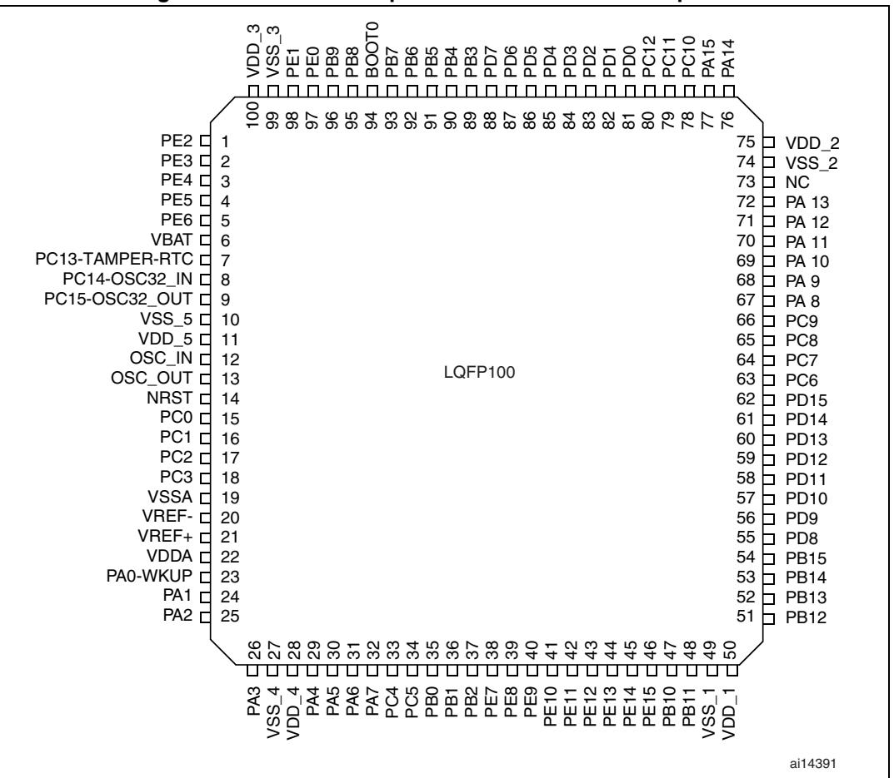

#### **Figure 4. STM32F103xx performance line LQFP100 pinout**

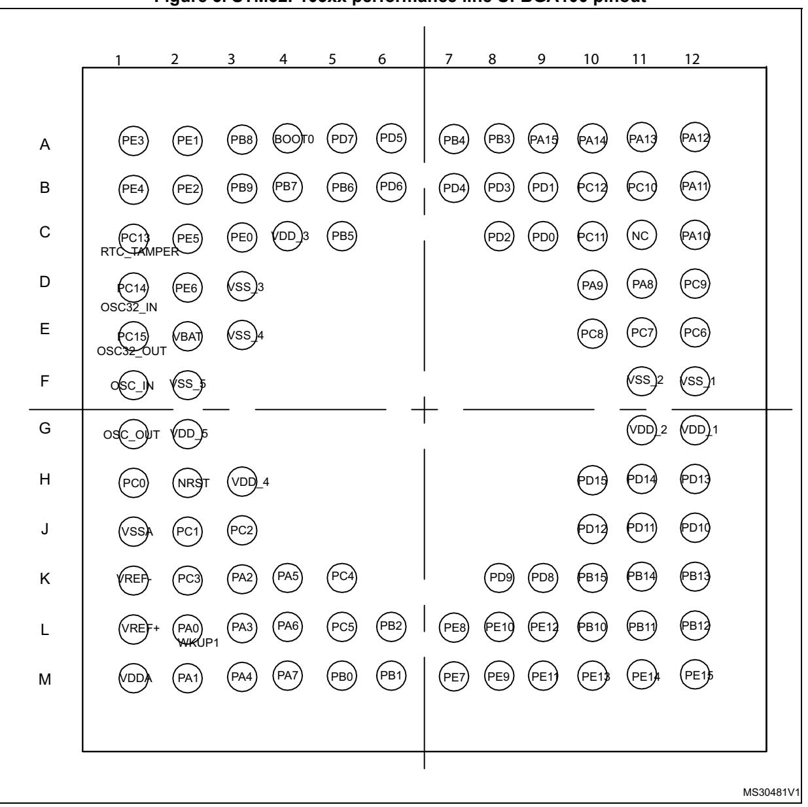

**Figure 5. STM32F103xx performance line UFBGA100 pinout**

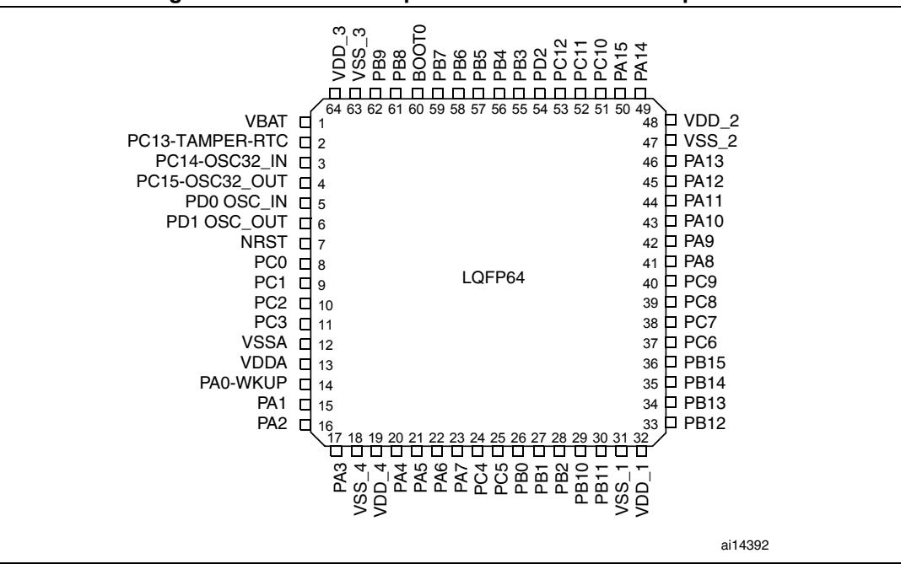

**Figure 6. STM32F103xx performance line LQFP64 pinout**

|   | 1                  | 2                   | 3   | 4     | 5     | 6     | 7    | 8       |
|---|--------------------|---------------------|-----|-------|-------|-------|------|---------|
| A | PC14- OSC32_IN  | PC13- TAMPER-RTC | PB9 | PB4   | PB3   | PA15  | PA14 | PA13    |
| B | PC15- OSC32_OUT | VBAT                | PB8 | BOOT0 | PD2   | PC11  | PC10 | PA12    |
| C | OSC_IN             | VSS_4               | PB7 | PB5   | PC12  | PA10  | PA9  | PA11    |
| D | OSC_OUT            | VDD_4               | PB6 | VSS_3 | VSS_2 | VSS_1 | PA8  | PC9     |
| E | NRST               | PC1                 | PC0 | VDD_3 | VDD_2 | VDD_1 | PC7  | PC8     |
| F | VSSA               | PC2                 | PA2 | PA5   | PB0   | PC6   | PB15 | PB14    |
| G | VREF+              | PA0-WKUP            | PA3 | PA6   | PB1   | PB2   | PB10 | PB13    |
| H | VDDA               | PA1                 | PA4 | PA7   | PC4   | PC5   | PB11 | PB12    |
|   |                    |                     |     |       |       |       |      | AI15494 |

**Figure 7. STM32F103xx performance line TFBGA64 ballout**

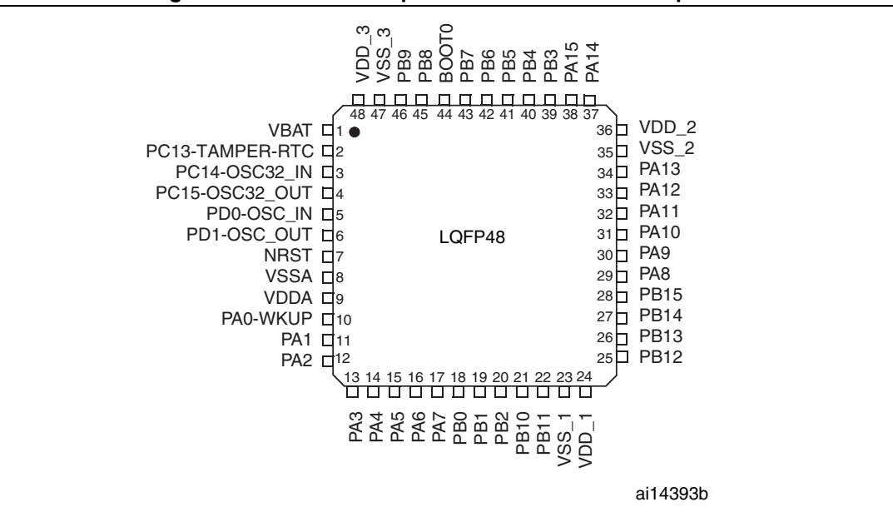

#### **Figure 8. STM32F103xx performance line LQFP48 pinout**

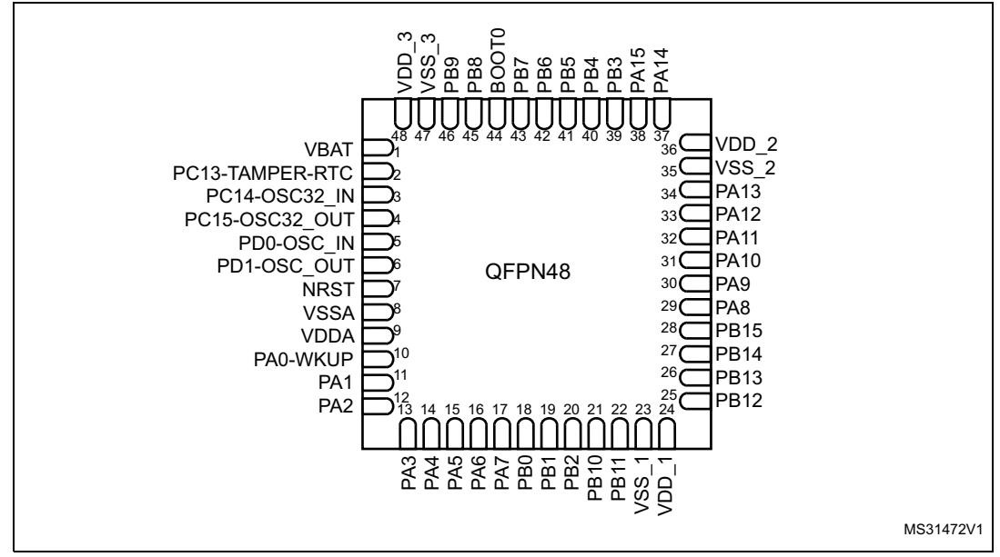

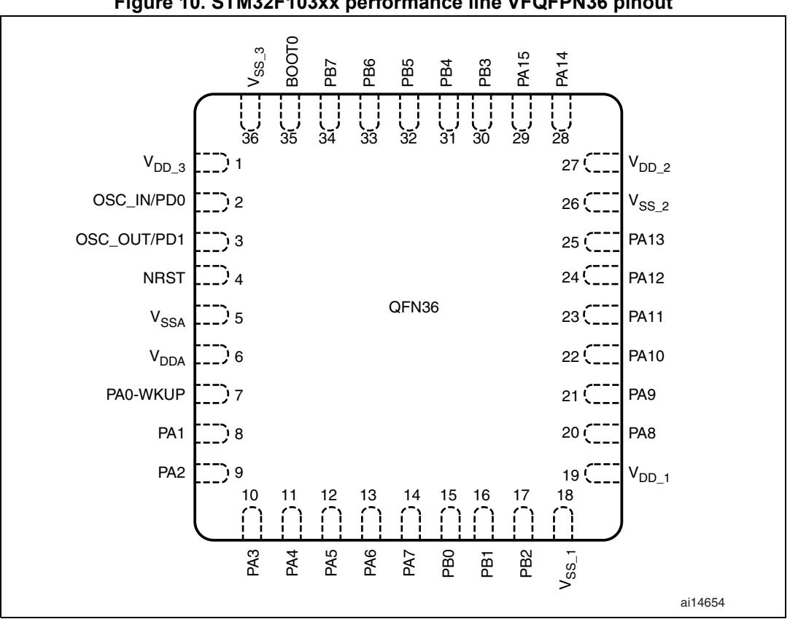

**Figure 10. STM32F103xx performance line VFQFPN36 pinout**

|          |         |                 | Pins    |        |         |          |                       |         |                |                                      | Alternate functions(4) |        |  |
|----------|---------|-----------------|---------|--------|---------|----------|-----------------------|---------|----------------|--------------------------------------|------------------------|--------|--|
| LFBGA100 | UFBG100 | LQFP48/UFQFPN48 | TFBGA64 | LQFP64 | LQFP100 | VFQFPN36 | Pin name              | Type(1) | I / O Level(2) | Main function(3) (after reset) | Default                | Remap  |  |
| A3       | B2      | -               | -       | -      | 1       | -        | PE2                   | I/O FT  |                | PE2                                  | TRACECK                |        |  |
| B3       | A1      | -               | -       | -      | 2       | -        | PE3                   | I/O FT  |                | PE3                                  | TRACED0                |        |  |
| C3       | B1      | -               | -       | -      | 3       | -        | PE4                   | I/O FT  |                | PE4                                  | TRACED1                |        |  |
| D3       | C2      | -               | -       | -      | 4       | -        | PE5                   | I/O FT  |                | PE5                                  | TRACED2                |        |  |
| E3       | D2      | -               | -       | -      | 5       | -        | PE6                   | I/O FT  |                | PE6                                  | TRACED3                |        |  |
| B2       | E2      | 1               | B2      | 1      | 6       | -        | VBAT                  | S       |                | VBAT                                 |                        |        |  |
| A2       | C1      | 2               | A2      | 2      | 7       | -        | PC13-TAMPER RTC(5) | I/O     |                | PC13(6)                              | TAMPER-RTC             |        |  |
| A1       | D1      | 3               | A1      | 3      | 8       | -        | PC14-OSC32_IN(5) I/O  |         |                | PC14(6)                              | OSC32_IN               |        |  |
| B1       | E1      | 4               | B1      | 4      | 9       | -        | PC15- OSC32_OUT(5) | I/O     |                | PC15(6)                              | OSC32_OUT              |        |  |
| C2       | F2      | -               | -       | -      | 10      | -        | VSS_5                 | S       |                | VSS_5                                |                        |        |  |
| D2       | G2      | -               | -       | -      | 11      | -        | VDD_5                 | S       |                | VDD_5                                |                        |        |  |
| C1       | F1      | 5               | C1      | 5      | 12      | 2        | OSC_IN                | I       |                | OSC_IN                               |                        | PD0(7) |  |
| D1       | G1      | 6               | D1      | 6      | 13      | 3        | OSC_OUT               | O       |                | OSC_OUT                              |                        | PD1(7) |  |
| E1       | H2      | 7               | E1      | 7      | 14      | 4        | NRST                  | I/O     |                | NRST                                 |                        |        |  |
| F1       | H1      | -               | E3      | 8      | 15      | -        | PC0                   | I/O     |                | PC0                                  | ADC12_IN10             |        |  |
| F2       | J2      | -               | E2      | 9      | 16      | -        | PC1                   | I/O     |                | PC1                                  | ADC12_IN11             |        |  |
| E2       | J3      | -               | F2      | 10     | 17      | -        | PC2                   | I/O     |                | PC2                                  | ADC12_IN12             |        |  |
| F3       | K2      | -               | -(8)    | 11     | 18      | -        | PC3                   | I/O     |                | PC3                                  | ADC12_IN13             |        |  |
| G1       | J1      | 8               | F1      | 12     | 19      | 5        | VSSA                  | S       |                | VSSA                                 |                        |        |  |
| H1       | K1      | -               | -       | -      | 20      | -        | VREF-                 | S       |                | VREF                                 |                        |        |  |
| J1       | L1      | -               | G1(8)   | -      | 21      | -        | VREF+                 | S       |                | VREF+                                |                        |        |  |
| K1       | M1      | 9               | H1      | 13     | 22      | 6        | VDDA                  | S       |                | VDDA                                 |                        |        |  |

| Table 5. Medium-density STM32F103xx pin definitions |  |  |
|-----------------------------------------------------|--|--|
|-----------------------------------------------------|--|--|

|          |         |                 | Pins    |        |         |          |          |         |                |                                      | Alternate functions(4)                                       |           |
|----------|---------|-----------------|---------|--------|---------|----------|----------|---------|----------------|--------------------------------------|--------------------------------------------------------------|-----------|
| LFBGA100 | UFBG100 | LQFP48/UFQFPN48 | TFBGA64 | LQFP64 | LQFP100 | VFQFPN36 | Pin name | Type(1) | I / O Level(2) | Main function(3) (after reset) | Default                                                      | Remap     |
| G2       | L2      | 10              | G2      | 14     | 23      | 7        | PA0-WKUP | I/O     |                | PA0                                  | WKUP/ USART2_CTS(9)/ ADC12_IN0/ TIM2_CH1_ ETR(9) |           |
| H2       | M2      | 11              | H2      | 15     | 24      | 8        | PA1      | I/O     |                | PA1                                  | USART2_RTS(9)/ ADC12_IN1/ TIM2_CH2(9)                  |           |
| J2       | K3      | 12              | F3      | 16     | 25      | 9        | PA2      | I/O     |                | PA2                                  | USART2_TX(9)/ ADC12_IN2/ TIM2_CH3(9)                   |           |
| K2       | L3      | 13              | G3      | 17     | 26      | 10       | PA3      | I/O     |                | PA3                                  | USART2_RX(9)/ ADC12_IN3/ TIM2_CH4(9)                   |           |
| E4       | E3      | -               | C2      | 18     | 27      | -        | VSS_4    | S       |                | VSS_4                                |                                                              |           |
| F4       | H3      | -               | D2      | 19     | 28      | -        | VDD_4    | S       |                | VDD_4                                |                                                              |           |
| G3       | M3      | 14              | H3      | 20     | 29      | 11       | PA4      | I/O     |                | PA4                                  | SPI1_NSS(9)/ USART2_CK(9)/ ADC12_IN4                   |           |
| H3       | K4      | 15              | F4      | 21     | 30      | 12       | PA5      | I/O     |                | PA5                                  | SPI1_SCK(9)/ ADC12_IN5                                    |           |
| J3       | L4      | 16              | G4      | 22     | 31      | 13       | PA6      | I/O     |                | PA6                                  | SPI1_MISO(9)/ ADC12_IN6/ TIM3_CH1(9)                   | TIM1_BKIN |
| K3       | M4      | 17              | H4      | 23     | 32      | 14       | PA7      | I/O     |                | PA7                                  | SPI1_MOSI(9)/ ADC12_IN7/ TIM3_CH2(9)                   | TIM1_CH1N |
| G4       | K5      | -               | H5      | 24     | 33      |          | PC4      | I/O     |                | PC4                                  | ADC12_IN14                                                   |           |
| H4       | L5      | -               | H6      | 25     | 34      |          | PC5      | I/O     |                | PC5                                  | ADC12_IN15                                                   |           |
| J4       | M5      | 18              | F5      | 26     | 35      | 15       | PB0      | I/O     |                | PB0                                  | ADC12_IN8/ TIM3_CH3(9)                                    | TIM1_CH2N |
| K4       | M6      | 19              | G5      | 27     | 36      | 16       | PB1      | I/O     |                | PB1                                  | ADC12_IN9/ TIM3_CH4(9)                                    | TIM1_CH3N |

**Table 5. Medium-density STM32F103xx pin definitions (continued)**

|          |         |                 | Pins    |        |         |          |          |         |                |                                      | Alternate functions(4)                                    |           |
|----------|---------|-----------------|---------|--------|---------|----------|----------|---------|----------------|--------------------------------------|-----------------------------------------------------------|-----------|
| LFBGA100 | UFBG100 | LQFP48/UFQFPN48 | TFBGA64 | LQFP64 | LQFP100 | VFQFPN36 | Pin name | Type(1) | I / O Level(2) | Main function(3) (after reset) | Default                                                   | Remap     |
| G5       | L6      | 20              | G6      | 28     | 37      | 17       | PB2      | I/O FT  |                | PB2/BOOT1                            |                                                           |           |
| H5       | M7      | -               | -       | -      | 38      | -        | PE7      | I/O FT  |                | PE7                                  |                                                           | TIM1_ETR  |
| J5       | L7      | -               | -       | -      | 39      | -        | PE8      | I/O FT  |                | PE8                                  |                                                           | TIM1_CH1N |
| K5       | M8      | -               | -       | -      | 40      | -        | PE9      | I/O FT  |                | PE9                                  |                                                           | TIM1_CH1  |
| G6       | L8      | -               | -       | -      | 41      | -        | PE10     | I/O FT  |                | PE10                                 |                                                           | TIM1_CH2N |
| H6       | M9      | -               | -       | -      | 42      | -        | PE11     | I/O FT  |                | PE11                                 |                                                           | TIM1_CH2  |
| J6       | L9      | -               | -       | -      | 43      | -        | PE12     |         | I/O FT         | PE12                                 |                                                           | TIM1_CH3N |
| K6       | M10     | -               | -       | -      | 44      | -        | PE13     |         | I/O FT         | PE13                                 |                                                           | TIM1_CH3  |
| G7       | M11     | -               | -       | -      | 45      | -        | PE14     | I/O FT  |                | PE14                                 |                                                           | TIM1_CH4  |
| H7       | M12     | -               | -       | -      | 46      | -        | PE15     |         | I/O FT         | PE15                                 |                                                           | TIM1_BKIN |
| J7       | L10     | 21              | G7      | 29     | 47      | -        | PB10     |         | I/O FT         | PB10                                 | I2C2_SCL/ USART3_TX(9)                                 | TIM2_CH3  |
| K7       | L11     | 22              | H7      | 30     | 48      | -        | PB11     | I/O FT  |                | PB11                                 | I2C2_SDA/ USART3_RX(9)                                 | TIM2_CH4  |
| E7       | F12     | 23              | D6      | 31     | 49      | 18       | VSS_1    | S       |                | VSS_1                                |                                                           |           |
| F7       | G12     | 24              | E6      | 32     | 50      | 19       | VDD_1    | S       |                | VDD_1                                |                                                           |           |
| K8       | L12     | 25              | H8      | 33     | 51      | -        | PB12     |         | I/O FT         | PB12                                 | SPI2_NSS/ I2C2_SMBAl/ USART3_CK(9)/ TIM1_BKIN(9) |           |
| J8       | K12     | 26              | G8      | 34     | 52      | -        | PB13     |         | I/O FT         | PB13                                 | SPI2_SCK/ USART3_CTS(9)/ TIM1_CH1N (9)              |           |
| H8       | K11     | 27              | F8      | 35     | 53      | -        | PB14     |         | I/O FT         | PB14                                 | SPI2_MISO/ USART3_RTS(9) TIM1_CH2N (9)              |           |
| G8       | K10     | 28              | F7      | 36     | 54      | -        | PB15     |         | I/O FT         | PB15                                 | SPI2_MOSI/ TIM1_CH3N(9)                                |           |
| K9       | K9      | -               | -       | -      | 55      | -        | PD8      | I/O FT  |                | PD8                                  |                                                           | USART3_TX |
| J9       | K8      | -               | -       | -      | 56      | -        | PD9      | I/O FT  |                | PD9                                  |                                                           | USART3_RX |

| Table 5. Medium-density STM32F103xx pin definitions (continued) |  |  |  |  |  |  |  |  |  |
|-----------------------------------------------------------------|--|--|--|--|--|--|--|--|--|
|-----------------------------------------------------------------|--|--|--|--|--|--|--|--|--|

|          |         |                 | Pins    |        |         |          |          |         |                |                                      | Alternate functions(4)                            |                          |
|----------|---------|-----------------|---------|--------|---------|----------|----------|---------|----------------|--------------------------------------|---------------------------------------------------|--------------------------|
| LFBGA100 | UFBG100 | LQFP48/UFQFPN48 | TFBGA64 | LQFP64 | LQFP100 | VFQFPN36 | Pin name | Type(1) | I / O Level(2) | Main function(3) (after reset) | Default                                           | Remap                    |
| H9       | J12     | -               | -       | -      | 57      | -        | PD10     |         | I/O FT         | PD10                                 |                                                   | USART3_CK                |
| G9       | J11     | -               | -       | -      | 58      | -        | PD11     |         | I/O FT         | PD11                                 |                                                   | USART3_CTS               |
|          | K10 J10 | -               | -       | -      | 59      | -        | PD12     |         | I/O FT         | PD12                                 |                                                   | TIM4_CH1 / USART3_RTS |
|          | J10 H12 | -               | -       | -      | 60      | -        | PD13     |         | I/O FT         | PD13                                 |                                                   | TIM4_CH2                 |
|          | H10 H11 | -               | -       | -      | 61      | -        | PD14     |         | I/O FT         | PD14                                 |                                                   | TIM4_CH3                 |
|          | G10 H10 | -               | -       | -      | 62      | -        | PD15     |         | I/O FT         | PD15                                 |                                                   | TIM4_CH4                 |
|          | F10 E12 | -               | F6      | 37     | 63      | -        | PC6      |         | I/O FT         | PC6                                  |                                                   | TIM3_CH1                 |
|          | E10 E11 |                 | E7      | 38     | 64      | -        | PC7      |         | I/O FT         | PC7                                  |                                                   | TIM3_CH2                 |
| F9       | E10     |                 | E8      | 39     | 65      | -        | PC8      |         | I/O FT         | PC8                                  |                                                   | TIM3_CH3                 |
| E9       | D12     | -               | D8      | 40     | 66      | -        | PC9      |         | I/O FT         | PC9                                  |                                                   | TIM3_CH4                 |
| D9       | D11     | 29              | D7      | 41     | 67      | 20       | PA8      |         | I/O FT         | PA8                                  | USART1_CK/ TIM1_CH1(9)/ MCO                 |                          |
| C9       | D10     | 30              | C7      | 42     | 68      | 21       | PA9      |         | I/O FT         | PA9                                  | USART1_TX(9)/ TIM1_CH2(9)                      |                          |
|          | D10 C12 | 31              | C6      | 43     | 69      | 22       | PA10     |         | I/O FT         | PA10                                 | USART1_RX(9)/ TIM1_CH3(9)                      |                          |
|          | C10 B12 | 32              | C8      | 44     | 70      | 23       | PA11     |         | I/O FT         | PA11                                 | USART1_CTS/ CANRX(9)/ USBDM/ TIM1_CH4(9) |                          |
|          | B10 A12 | 33              | B8      | 45     | 71      | 24       | PA12     |         | I/O FT         | PA12                                 | USART1_RTS/ CANTX(9) /USBDP TIM1_ETR(9)  |                          |
|          | A10 A11 | 34              | A8      | 46     | 72      | 25       | PA13     |         |                | I/O FT JTMS/SWDIO                    |                                                   | PA13                     |
| F8       | C11     | -               | -       | -      | 73      | -        |          |         |                | Not connected                        |                                                   |                          |
| E6       | F11     | 35              | D5      | 47     | 74      | 26       | VSS_2    | S       |                | VSS_2                                |                                                   |                          |
| F6       | G11     | 36              | E5      | 48     | 75      | 27       | VDD_2    | S       |                | VDD_2                                |                                                   |                          |

**Table 5. Medium-density STM32F103xx pin definitions (continued)**

|          |         |                 | Pins    |        |         |          |          |         |                |                                      | Alternate functions(4)      |                                           |
|----------|---------|-----------------|---------|--------|---------|----------|----------|---------|----------------|--------------------------------------|-----------------------------|-------------------------------------------|
| LFBGA100 | UFBG100 | LQFP48/UFQFPN48 | TFBGA64 | LQFP64 | LQFP100 | VFQFPN36 | Pin name | Type(1) | I / O Level(2) | Main function(3) (after reset) | Default                     | Remap                                     |
| A9       | A10     | 37              | A7      | 49     | 76      | 28       | PA14     |         |                | I/O FT JTCK/SWCLK                    |                             | PA14                                      |
| A8       | A9      | 38              | A6      | 50     | 77      | 29       | PA15     | I/O FT  |                | JTDI                                 |                             | TIM2_CH1_ ETR/ PA15 /SPI1_NSS       |
| B9       | B11     | -               | B7      | 51     | 78      |          | PC10     | I/O FT  |                | PC10                                 |                             | USART3_TX                                 |
| B8       | C10     | -               | B6      | 52     | 79      |          | PC11     | I/O FT  |                | PC11                                 |                             | USART3_RX                                 |
| C8       | B10     | -               | C5      | 53     | 80      |          | PC12     | I/O FT  |                | PC12                                 |                             | USART3_CK                                 |
| -        | C9      | -               | C1      | -      | 81      | 2        | PD0      | I/O FT  |                | PD0                                  |                             | CANRX                                     |
| -        | B9      | -               | D1      | -      | 82      | 3        | PD1      | I/O FT  |                | PD1                                  |                             | CANTX                                     |
| B7       | C8      |                 | B5      | 54     | 83      | -        | PD2      | I/O FT  |                | PD2                                  | TIM3_ETR                    |                                           |
| C7       | B8      | -               | -       | -      | 84      | -        | PD3      | I/O FT  |                | PD3                                  |                             | USART2_CTS                                |
| D7       | B7      | -               | -       | -      | 85      | -        | PD4      | I/O FT  |                | PD4                                  |                             | USART2_RTS                                |
| B6       | A6      | -               | -       | -      | 86      | -        | PD5      | I/O FT  |                | PD5                                  |                             | USART2_TX                                 |
| C6       | B6      | -               | -       | -      | 87      | -        | PD6      | I/O FT  |                | PD6                                  |                             | USART2_RX                                 |
| D6       | A5      | -               | -       | -      | 88      | -        | PD7      | I/O FT  |                | PD7                                  |                             | USART2_CK                                 |
| A7       | A8      | 39              | A5      | 55     | 89      | 30       | PB3      | I/O FT  |                | JTDO                                 |                             | TIM2_CH2 / PB3 TRACESWO SPI1_SCK |
| A6       | A7      | 40              | A4      | 56     | 90      | 31       | PB4      | I/O FT  |                | JNTRST                               |                             | TIM3_CH1/ PB4/ SPI1_MISO            |
| C5       | C5      | 41              | C4      | 57     | 91      | 32       | PB5      | I/O     |                | PB5                                  | I2C1_SMBAl                  | TIM3_CH2 / SPI1_MOSI                   |
| B5       | B5      | 42              | D3      | 58     | 92      | 33       | PB6      | I/O FT  |                | PB6                                  | I2C1_SCL(9)/ TIM4_CH1(9) | USART1_TX                                 |
| A5       | B4      | 43              | C3      | 59     | 93      | 34       | PB7      | I/O FT  |                | PB7                                  | I2C1_SDA(9)/ TIM4_CH2(9) | USART1_RX                                 |
| D5       | A4      | 44              | B4      | 60     | 94      | 35       | BOOT0    | I       |                | BOOT0                                |                             |                                           |

| Table 5. Medium-density STM32F103xx pin definitions (continued) |  |  |
|-----------------------------------------------------------------|--|--|
|                                                                 |  |  |

|          |         |                 | Pins    |        |         |          |          |         |                |                                      | Alternate functions(4) |                     |  |
|----------|---------|-----------------|---------|--------|---------|----------|----------|---------|----------------|--------------------------------------|------------------------|---------------------|--|
| LFBGA100 | UFBG100 | LQFP48/UFQFPN48 | TFBGA64 | LQFP64 | LQFP100 | VFQFPN36 | Pin name | Type(1) | I / O Level(2) | Main function(3) (after reset) | Default                | Remap               |  |
| B4       | A3      | 45              | B3      | 61     | 95      | -        | PB8      | I/O FT  |                | PB8                                  | TIM4_CH3(9)            | I2C1_SCL / CANRX |  |
| A4       | B3      | 46              | A3      | 62     | 96      | -        | PB9      | I/O FT  |                | PB9                                  | TIM4_CH4(9)            | I2C1_SDA/ CANTX  |  |
| D4       | C3      | -               | -       | -      | 97      | -        | PE0      | I/O FT  |                | PE0                                  | TIM4_ETR               |                     |  |
| C4       | A2      | -               | -       | -      | 98      | -        | PE1      | I/O FT  |                | PE1                                  |                        |                     |  |
| E5       | D3      | 47              | D4      | 63     | 99      | 36       | VSS_3    | S       |                | VSS_3                                |                        |                     |  |
| F5       | C4      | 48              | E4      | 64     | 100     | 1        | VDD_3    | S       |                | VDD_3                                |                        |                     |  |

1. I = input, O = output, S = supply.

2. FT = 5 V tolerant.

3. Function availability depends on the chosen device. For devices having reduced peripheral counts, it is always the lower number of peripheral that is included. For example, if a device has only one SPI and two USARTs, they will be called SPI1 and USART1 & USART2, respectively. Refer to *[Table 2 on page 10](#page-9-1)*.

4. If several peripherals share the same I/O pin, to avoid conflict between these alternate functions only one peripheral should be enabled at a time through the peripheral clock enable bit (in the corresponding RCC peripheral clock enable register).

- 5. PC13, PC14 and PC15 are supplied through the power switch. Since the switch only sinks a limited amount of current (3 mA), the use of GPIOs PC13 to PC15 in output mode is limited: the speed should not exceed 2 MHz with a maximum load of 30 pF and these IOs must not be used as a current source (e.g. to drive an LED).
- 6. Main function after the first backup domain power-up. Later on, it depends on the contents of the Backup registers even after reset (because these registers are not reset by the main reset). For details on how to manage these IOs, refer to the Battery backup domain and BKP register description sections in the STM32F10xxx reference manual, available from the STMicroelectronics website: www.st.com.
- 7. The pins number 2 and 3 in the VFQFPN36 package, 5 and 6 in the LQFP48, UFQFP48 and LQFP64 packages, and C1 and C2 in the TFBGA64 package are configured as OSC\_IN/OSC\_OUT after reset, however the functionality of PD0 and PD1 can be remapped by software on these pins. For the LQFP100 package, PD0 and PD1 are available by default, so there is no need for remapping. For more details, refer to the Alternate function I/O and debug configuration section in the STM32F10xxx reference manual.

The use of PD0 and PD1 in output mode is limited as they can only be used at 50 MHz in output mode.

- 8. Unlike in the LQFP64 package, there is no PC3 in the TFBGA64 package. The VREF+ functionality is provided instead.
- 9. This alternate function can be remapped by software to some other port pins (if available on the used package). For more details, refer to the Alternate function I/O and debug configuration section in the STM32F10xxx reference manual, available from the STMicroelectronics website: www.st.com.

# **4 Memory mapping**

The memory map is shown in *[Figure 11](#page-33-1)*.

**Figure 11. Memory map**

34/[105](#page-104-0) DocID13587 Rev 16

# **5 Electrical characteristics**

# **5.1 Parameter conditions**

Unless otherwise specified, all voltages are referenced to VSS.

# **5.1.1 Minimum and maximum values**

Unless otherwise specified the minimum and maximum values are guaranteed in the worst conditions of ambient temperature, supply voltage and frequencies by tests in production on 100% of the devices with an ambient temperature at TA = 25 °C and TA = TAmax (given by the selected temperature range).

Data based on characterization results, design simulation and/or technology characteristics are indicated in the table footnotes and are not tested in production. Based on characterization, the minimum and maximum values refer to sample tests and represent the mean value plus or minus three times the standard deviation (mean±3).

# **5.1.2 Typical values**

Unless otherwise specified, typical data are based on TA = 25 °C, VDD = 3.3 V (for the 2 V VDD 3.6 V voltage range). They are given only as design guidelines and are not tested.

Typical ADC accuracy values are determined by characterization of a batch of samples from a standard diffusion lot over the full temperature range, where 95% of the devices have an error less than or equal to the value indicated (mean±2).

# **5.1.3 Typical curves**

Unless otherwise specified, all typical curves are given only as design guidelines and are not tested.

# **5.1.4 Loading capacitor**

The loading conditions used for pin parameter measurement are shown in *[Figure 12](#page-35-1)*.

# **5.1.5 Pin input voltage**

The input voltage measurement on a pin of the device is described in *[Figure 13](#page-35-2)*.

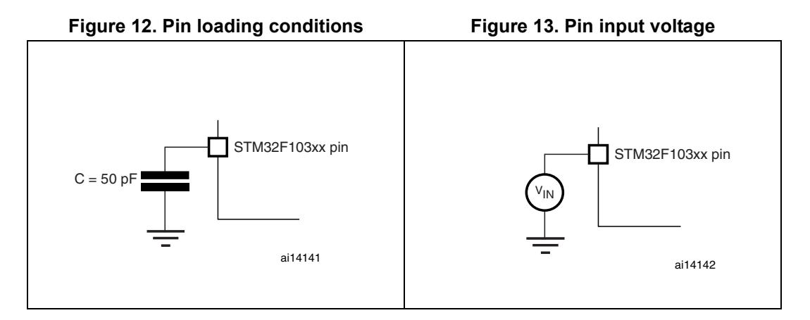

# **5.1.6 Power supply scheme**

#### **Figure 14. Power supply scheme**

**Caution:** In *[Figure 14](#page-35-3)*, the 4.7 µF capacitor must be connected to VDD3.

# **5.1.7 Current consumption measurement**

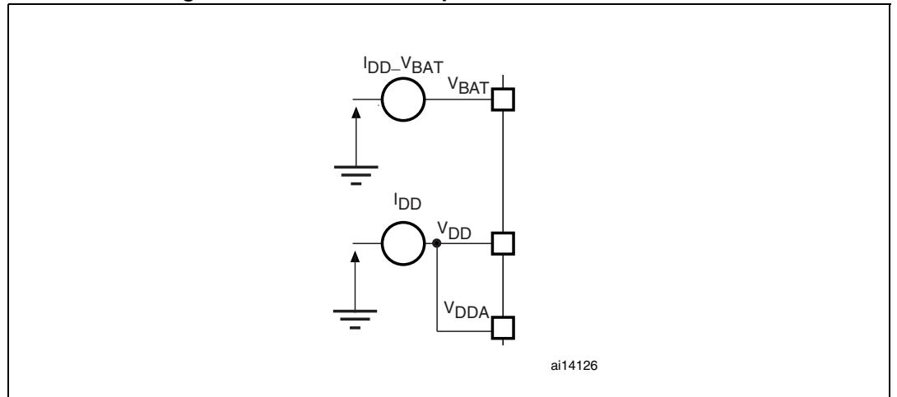

#### **Figure 15. Current consumption measurement scheme**

# **5.2 Absolute maximum ratings**

Stresses above the absolute maximum ratings listed in *[Table 6: Voltage characteristics](#page-36-2)*, *[Table 7: Current characteristics](#page-37-2)*, and *[Table 8: Thermal characteristics](#page-37-3)* may cause permanent damage to the device. These are stress ratings only and functional operation of the device at these conditions is not implied. Exposure to maximum rating conditions for extended periods may affect device reliability.

| Symbol     | Ratings                                                         | Min          | Max                                                                         | Unit |
|------------|-----------------------------------------------------------------|--------------|-----------------------------------------------------------------------------|------|
| VDD VSS  | External main supply voltage (including (1) VDDA and VDD) | –0.3         | 4.0                                                                         |      |
| VIN(2)     | Input voltage on five volt tolerant pin                         | VSS  0.3    | VDD  4.0                                                                   | V    |
|            | Input voltage on any other pin                                  | VSS 0.3 | 4.0                                                                         |      |
| VDDx      | Variations between different VDD power pins                     |              | 50                                                                          |      |
| VSSX VSS | Variations between all the different ground pins             |              | 50                                                                          | mV   |
| VESD(HBM)  | Electrostatic discharge voltage (human body model)           |              | see Section 5.3.11: Absolute maximum ratings (electrical sensitivity) |      |

#### **Table 6. Voltage characteristics**

1. All main power (VDD, VDDA) and ground (VSS, VSSA) pins must always be connected to the external power supply, in the permitted range.

2. VIN maximum must always be respected. Refer to *[Table 7: Current characteristics](#page-37-2)* for the maximum allowed injected current values.

| Symbol       | Ratings                                                     | Max.  | Unit |
|--------------|-------------------------------------------------------------|-------|------|
| IVDD         | Total current into VDD/VDDA power lines (source)(1)         | 150   |      |
| IVSS         | Total current out of VSS ground lines (sink)(1)             | 150   |      |
|              | Output current sunk by any I/O and control pin              | 25    |      |
| IIO          | Output current source by any I/Os and control pin           |  25  | mA   |
|              | Injected current on five volt tolerant pins(3)              | -5/+0 |      |
| IINJ(PIN)(2) | Injected current on any other pin(4)                        | ± 5   |      |
| IINJ(PIN)   | Total injected current (sum of all I/O and control pins)(5) | ± 25  |      |

#### **Table 7. Current characteristics**

1. All main power (VDD, VDDA) and ground (VSS, VSSA) pins must always be connected to the external power supply, in the permitted range.

2. Negative injection disturbs the analog performance of the device. See note *2. on page 77*.

3. Positive injection is not possible on these I/Os. A negative injection is induced by VIN<VSS. IINJ(PIN) must never be exceeded. Refer to *[Table 6: Voltage characteristics](#page-36-2)* for the maximum allowed input voltage values.

4. A positive injection is induced by VIN>VDD while a negative injection is induced by VIN<VSS. IINJ(PIN) must never be exceeded. Refer to *[Table 6: Voltage characteristics](#page-36-2)* for the maximum allowed input voltage values.

5. When several inputs are submitted to a current injection, the maximum IINJ(PIN) is the absolute sum of the positive and negative injected currents (instantaneous values).

| Symbol | Ratings                      | Value       | Unit |
|--------|------------------------------|-------------|------|
| TSTG   | Storage temperature range    | –65 to +150 | °C   |
| TJ     | Maximum junction temperature | 150         | °C   |

# **5.3 Operating conditions**

## **5.3.1 General operating conditions**

#### **Table 9. General operating conditions**

| Symbol | Parameter                                  | Conditions                 | Min | Max | Unit |
|--------|--------------------------------------------|----------------------------|-----|-----|------|
| fHCLK  | Internal AHB clock frequency               |                            | 0   | 72  |      |
| fPCLK1 | Internal APB1 clock frequency              |                            | 0   | 36  | MHz  |
| fPCLK2 | Internal APB2 clock frequency              |                            | 0   | 72  |      |
| VDD    | Standard operating voltage                 |                            | 2   | 3.6 |      |
| (1)    | Analog operating voltage (ADC not used) | Must be the same potential | 2   | 3.6 |      |
| VDDA   | Analog operating voltage (ADC used)     | as VDD(2)                  | 2.4 | 3.6 | V    |
| VBAT   | Backup operating voltage                   |                            | 1.8 | 3.6 |      |

| Symbol | Parameter                                            |                           | Conditions           | Min  | Max         | Unit |
|--------|------------------------------------------------------|---------------------------|----------------------|------|-------------|------|
|        |                                                      | Standard IO               |                      | –0.3 | VDD+ 0.3 |      |
| VIN    | I/O input voltage                                    | FT IO(3)                  | 2 V < VDD  3.6 V | –0.3 | 5.5         | V    |
|        |                                                      |                           | VDD = 2 V            | –0.3 | 5.2         |      |
|        |                                                      | BOOT0                     |                      | 0    | 5.5         |      |
|        |                                                      | LFBGA100                  |                      |      | 454         |      |
|        |                                                      | LQFP100                   |                      |      | 434         |      |
|        |                                                      | UFBGA100                  |                      |      | 339         |      |
| PD     | Power dissipation at TA =                         | TFBGA64                   |                      |      | 308         |      |
|        | 85 °C for suffix 6 or TA = 105 °C for suffix 7(4) | LQFP64                    |                      |      | 444         | mW   |
|        |                                                      | LQFP48                    |                      |      | 363         |      |
|        |                                                      | UFQFPN48                  |                      |      | 624         |      |
|        |                                                      | VFQFPN36                  |                      |      | 1000        |      |
|        | Ambient temperature for 6                            | Maximum power dissipation |                      | –40  | 85          | °C   |
|        | suffix version                                       | Low power dissipation(5)  |                      | –40  | 105         |      |
| TA     | Ambient temperature for 7                            | Maximum power dissipation |                      | –40  | 105         |      |
|        | suffix version                                       | Low power dissipation(5)  |                      | –40  | 125         |      |
|        |                                                      | 6 suffix version          |                      | –40  | 105         |      |
| TJ     | Junction temperature range                           | 7 suffix version          |                      | –40  | 125         |      |

| Table 9. General operating conditions (continued) |  |  |  |  |
|---------------------------------------------------|--|--|--|--|
|---------------------------------------------------|--|--|--|--|

1. When the ADC is used, refer to *[Table 46: ADC characteristics](#page-75-1)*.

2. It is recommended to power VDD and VDDA from the same source. A maximum difference of 300 mV between VDD and VDDA can be tolerated during power-up and operation.

3. To sustain a voltage higher than VDD+0.3 V, the internal pull-up/pull-down resistors must be disabled.

4. If TA is lower, higher PD values are allowed as long as TJ does not exceed TJmax (see *[Table 6.2: Thermal](#page-92-0)  [characteristics on page 93](#page-92-0)*).

5. In low power dissipation state, TA can be extended to this range as long as TJ does not exceed TJmax (see *[Table 6.2: Thermal characteristics on page 93](#page-92-0)*).

## **5.3.2 Operating conditions at power-up / power-down**

Subject to general operating conditions for TA.

| Table 10. Operating conditions at power-up / power-down |
|---------------------------------------------------------|
|---------------------------------------------------------|

| Symbol | Parameter          | Conditions | Min | Max | Unit |  |
|--------|--------------------|------------|-----|-----|------|--|
|        | VDD rise time rate |            | 0   |    | µs/V |  |
| tVDD   | VDD fall time rate |            | 20  |    |      |  |

# **5.3.3 Embedded reset and power control block characteristics**

The parameters given in *[Table 11](#page-39-1)* are derived from tests performed under ambient temperature and VDD supply voltage conditions summarized in *[Table 9](#page-37-4)*.

| Symbol       | Parameter                                        | Conditions                  | Min    | Typ  | Max  | Unit |
|--------------|--------------------------------------------------|-----------------------------|--------|------|------|------|
|              |                                                  | PLS[2:0]=000 (rising edge)  | 2.1    | 2.18 | 2.26 |      |
|              |                                                  | PLS[2:0]=000 (falling edge) | 2      | 2.08 | 2.16 |      |
| VPVD         |                                                  | PLS[2:0]=001 (rising edge)  | 2.19   | 2.28 | 2.37 |      |
|              |                                                  | PLS[2:0]=001 (falling edge) | 2.09   | 2.18 | 2.27 |      |
|              |                                                  | PLS[2:0]=010 (rising edge)  | 2.28   | 2.38 | 2.48 |      |
|              |                                                  | PLS[2:0]=010 (falling edge) | 2.18   | 2.28 | 2.38 |      |
|              |                                                  | PLS[2:0]=011 (rising edge)  | 2.38   | 2.48 | 2.58 |      |
|              | Programmable voltage detector level selection | PLS[2:0]=011 (falling edge) | 2.28   | 2.38 | 2.48 |      |
|              |                                                  | PLS[2:0]=100 (rising edge)  | 2.47   | 2.58 | 2.69 | V    |
|              |                                                  | PLS[2:0]=100 (falling edge) | 2.37   | 2.48 | 2.59 |      |
|              |                                                  | PLS[2:0]=101 (rising edge)  | 2.57   | 2.68 | 2.79 |      |
|              |                                                  | PLS[2:0]=101 (falling edge) | 2.47   | 2.58 | 2.69 |      |
|              |                                                  | PLS[2:0]=110 (rising edge)  | 2.66   | 2.78 | 2.9  |      |
|              |                                                  | PLS[2:0]=110 (falling edge) | 2.56   | 2.68 | 2.8  |      |
|              |                                                  | PLS[2:0]=111 (rising edge)  | 2.76   | 2.88 | 3    |      |
|              |                                                  | PLS[2:0]=111 (falling edge) | 2.66   | 2.78 | 2.9  |      |
| VPVDhyst(2)  | PVD hysteresis                                   |                             |        | 100  |      | mV   |
|              | Power on/power down                              | Falling edge                | 1.8(1) | 1.88 | 1.96 | V    |
| VPOR/PDR     | reset threshold                                  | Rising edge                 | 1.84   | 1.92 | 2.0  |      |
| VPDRhyst(2)  | PDR hysteresis                                   |                             |        | 40   |      | mV   |
| TRSTTEMPO(2) | Reset temporization                              |                             | 1      | 2.5  | 4.5  | ms   |

|  | Table 11. Embedded reset and power control block characteristics |
|--|------------------------------------------------------------------|
|--|------------------------------------------------------------------|

1. The product behavior is guaranteed by design down to the minimum VPOR/PDR value.

2. Guaranteed by design, not tested in production.

# **5.3.4 Embedded reference voltage**

The parameters given in *[Table 12](#page-40-2)* are derived from tests performed under ambient temperature and VDD supply voltage conditions summarized in *[Table 9](#page-37-4)*.

| Symbol        | Parameter                                                           | Conditions            | Min  | Typ  | Max     | Unit   |
|---------------|---------------------------------------------------------------------|-----------------------|------|------|---------|--------|
|               | Internal reference voltage                                          | –40 °C < TA < +105 °C | 1.16 | 1.20 | 1.26    | V      |
| VREFINT       |                                                                     | –40 °C < TA < +85 °C  | 1.16 | 1.20 | 1.24    |        |
| TS_vrefint(1) | ADC sampling time when reading the internal reference voltage |                       |      | 5.1  | 17.1(2) | µs     |
| VRERINT(2)    | Internal reference voltage spread over the temperature range  | VDD = 3 V ±10 mV      |      |      | 10      | mV     |
| TCoeff(2)     | Temperature coefficient                                             |                       |      |      | 100     | ppm/°C |

**Table 12. Embedded internal reference voltage**

1. Shortest sampling time can be determined in the application by multiple iterations.

2. Guaranteed by design, not tested in production.

# **5.3.5 Supply current characteristics**

The current consumption is a function of several parameters and factors such as the operating voltage, ambient temperature, I/O pin loading, device software configuration, operating frequencies, I/O pin switching rate, program location in memory and executed binary code.

The current consumption is measured as described in *[Figure 15: Current consumption](#page-36-3)  [measurement scheme](#page-36-3)*.

All Run-mode current consumption measurements given in this section are performed with a reduced code that gives a consumption equivalent to Dhrystone 2.1 code.

#### **Maximum current consumption**

The MCU is placed under the following conditions:

- All I/O pins are in input mode with a static value at VDD or VSS (no load)
- All peripherals are disabled except when explicitly mentioned
- The Flash memory access time is adjusted to the fHCLK frequency (0 wait state from 0 to 24 MHz, 1 wait state from 24 to 48 MHz and 2 wait states above)
- Prefetch in ON (reminder: this bit must be set before clock setting and bus prescaling)
- When the peripherals are enabled fPCLK1 = fHCLK/2, fPCLK2 = fHCLK

The parameters given in *[Table 13](#page-41-0)*, *[Table 14](#page-41-1)* and *[Table 15](#page-43-0)* are derived from tests performed under ambient temperature and VDD supply voltage conditions summarized in *[Table 9](#page-37-4)*.

| Symbol |                               |                                               | fHCLK  | Max(1)     |             | Unit |  |
|--------|-------------------------------|-----------------------------------------------|--------|------------|-------------|------|--|
|        | Parameter                     | Conditions                                    |        | TA = 85 °C | TA = 105 °C |      |  |
|        |                               | External clock(2), all peripherals enabled | 72 MHz | 50         | 50.3        |      |  |
| IDD    | Supply current in Run mode |                                               | 48 MHz | 36.1       | 36.2        |      |  |
|        |                               |                                               | 36 MHz | 28.6       | 28.7        |      |  |
|        |                               |                                               | 24 MHz | 19.9       | 20.1        |      |  |
|        |                               |                                               | 16 MHz | 14.7       | 14.9        |      |  |
|        |                               |                                               | 8 MHz  | 8.6        | 8.9         |      |  |
|        |                               |                                               | 72 MHz | 32.8       | 32.9        | mA   |  |
|        |                               |                                               | 48 MHz | 24.4       | 24.5        |      |  |
|        |                               | External clock(2), all                        | 36 MHz | 19.8       | 19.9        |      |  |
|        |                               | peripherals disabled                          | 24 MHz | 13.9       | 14.2        |      |  |
|        |                               |                                               | 16 MHz | 10.7       | 11          |      |  |
|        |                               |                                               | 8 MHz  | 6.8        | 7.1         |      |  |

#### **Table 13. Maximum current consumption in Run mode, code with data processing running from Flash**

1. Based on characterization, not tested in production.

2. External clock is 8 MHz and PLL is on when fHCLK > 8 MHz.

#### **Table 14. Maximum current consumption in Run mode, code with data processing running from RAM**

| Symbol |                                  | Conditions                                     | fHCLK  | Max(1)     | Unit        |    |
|--------|----------------------------------|------------------------------------------------|--------|------------|-------------|----|
|        | Parameter                        |                                                |        | TA = 85 °C | TA = 105 °C |    |
| IDD    |                                  | External clock(2), all peripherals enabled  | 72 MHz | 48         | 50          |    |
|        |                                  |                                                | 48 MHz | 31.5       | 32          |    |
|        | Supply current in Run mode |                                                | 36 MHz | 24         | 25.5        |    |
|        |                                  |                                                | 24 MHz | 17.5       | 18          |    |
|        |                                  |                                                | 16 MHz | 12.5       | 13          |    |
|        |                                  |                                                | 8 MHz  | 7.5        | 8           | mA |
|        |                                  | External clock(2), all peripherals disabled | 72 MHz | 29         | 29.5        |    |
|        |                                  |                                                | 48 MHz | 20.5       | 21          |    |
|        |                                  |                                                | 36 MHz | 16         | 16.5        |    |
|        |                                  |                                                | 24 MHz | 11.5       | 12          |    |
|        |                                  |                                                | 16 MHz | 8.5        | 9           |    |
|        |                                  |                                                | 8 MHz  | 5.5        | 6           |    |

1. Based on characterization, tested in production at VDD max, fHCLK max.

2. External clock is 8 MHz and PLL is on when fHCLK > 8 MHz.

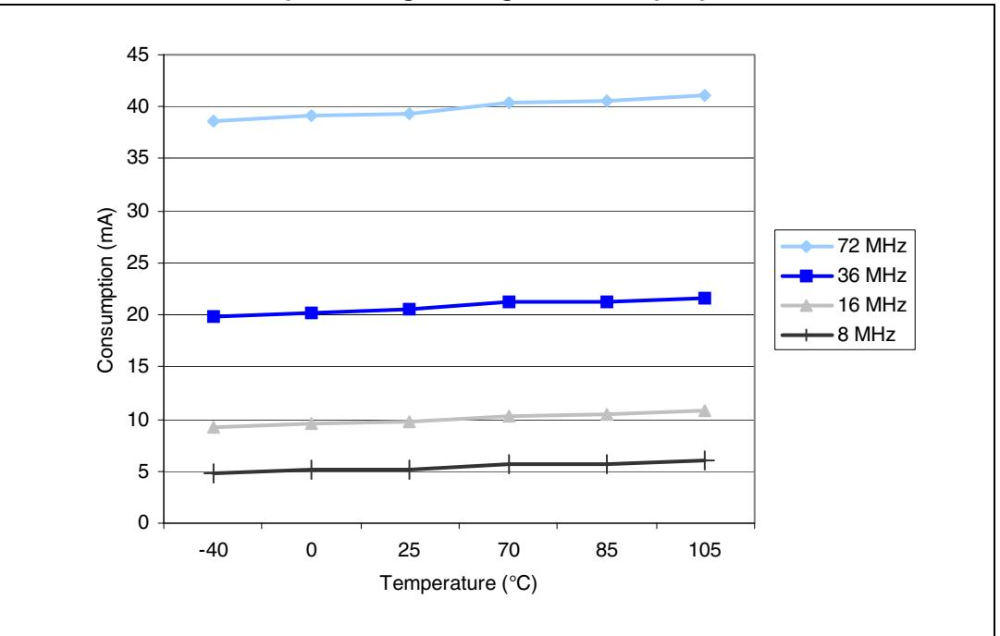

**Figure 16. Typical current consumption in Run mode versus frequency (at 3.6 V) code with data processing running from RAM, peripherals enabled**

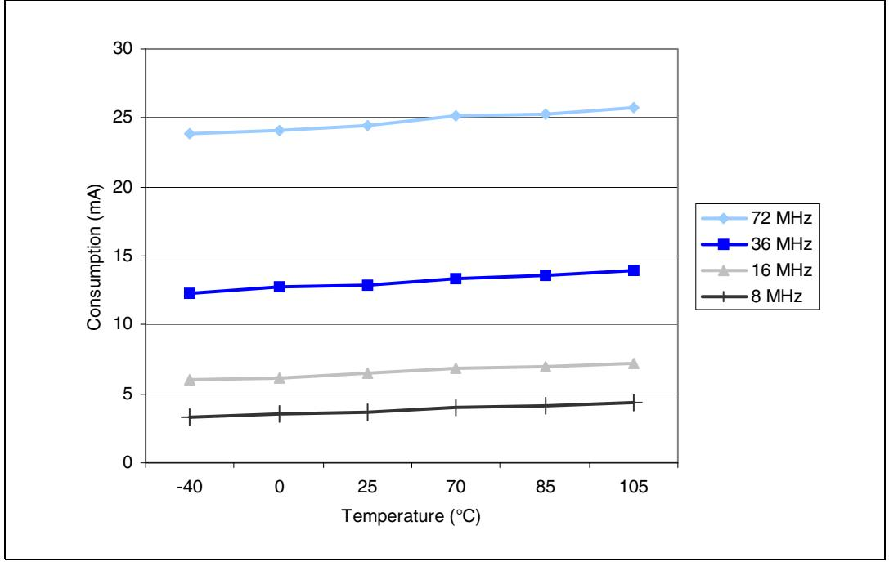

DocID13587 Rev 16 43/[105](#page-104-0)

|        |                                 |                                                | fHCLK  | Max(1)     |             | Unit |  |
|--------|---------------------------------|------------------------------------------------|--------|------------|-------------|------|--|
| Symbol | Parameter                       | Conditions                                     |        | TA = 85 °C | TA = 105 °C |      |  |
|        | Supply current in Sleep mode | External clock(2), all peripherals enabled  | 72 MHz | 30         | 32          |      |  |
| IDD    |                                 |                                                | 48 MHz | 20         | 20.5        |      |  |
|        |                                 |                                                | 36 MHz | 15.5       | 16          |      |  |
|        |                                 |                                                | 24 MHz | 11.5       | 12          |      |  |
|        |                                 |                                                | 16 MHz | 8.5        | 9           |      |  |
|        |                                 |                                                | 8 MHz  | 5.5        | 6           |      |  |
|        |                                 | External clock(2), all peripherals disabled | 72 MHz | 7.5        | 8           | mA   |  |
|        |                                 |                                                | 48 MHz | 6          | 6.5         |      |  |
|        |                                 |                                                | 36 MHz | 5          | 5.5         |      |  |
|        |                                 |                                                | 24 MHz | 4.5        | 5           |      |  |
|        |                                 |                                                | 16 MHz | 4          | 4.5         |      |  |
|        |                                 |                                                | 8 MHz  | 3          | 4           |      |  |

#### **Table 15. Maximum current consumption in Sleep mode, code running from Flash or RAM**

1. Based on characterization, tested in production at VDD max, fHCLK max with peripherals enabled.

2. External clock is 8 MHz and PLL is on when fHCLK > 8 MHz.

|          |                                      |                                                                                                                                                | Typ(1)              |                     |                     | Max           |                |      |
|----------|--------------------------------------|------------------------------------------------------------------------------------------------------------------------------------------------|---------------------|---------------------|---------------------|---------------|----------------|------|
| Symbol   | Parameter                            | Conditions                                                                                                                                     | VDD/VBAT = 2.0 V | VDD/VBAT = 2.4 V | VDD/VBAT = 3.3 V | TA = 85 °C | TA = 105 °C | Unit |
|          | Supply current                       | Regulator in Run mode, low-speed and high-speed internal RC oscillators and high-speed oscillator OFF (no independent watchdog)       | -                   | 23.5                | 24                  | 200           | 370            |      |
| IDD      | in Stop mode                         | Regulator in Low Power mode, low speed and high-speed internal RC oscillators and high-speed oscillator OFF (no independent watchdog) | -                   | 13.5                | 14                  | 180           | 340            |      |
|          | Supply current in Standby mode | Low-speed internal RC oscillator and independent watchdog ON                                                                                | -                   | 2.6                 | 3.4                 | -             | -              | µA   |
|          |                                      | Low-speed internal RC oscillator ON, independent watchdog OFF                                                                               | -                   | 2.4                 | 3.2                 | -             | -              |      |
|          |                                      | Low-speed internal RC oscillator and independent watchdog OFF, low speed oscillator and RTC OFF                                          | -                   | 1.7                 | 2                   | 4             | 5              |      |
| IDD_VBAT | Backup domain supply current   | Low-speed oscillator and RTC ON                                                                                                                | 0.9                 | 1.1                 | 1.4                 | 1.9(2)        | 2.2            |      |

**Table 16. Typical and maximum current consumptions in Stop and Standby modes**

1. Typical values are measured at TA = 25 °C.

2. Based on characterization, not tested in production.

## **Figure 18. Typical current consumption on VBAT with RTC on versus temperature at different VBAT values**

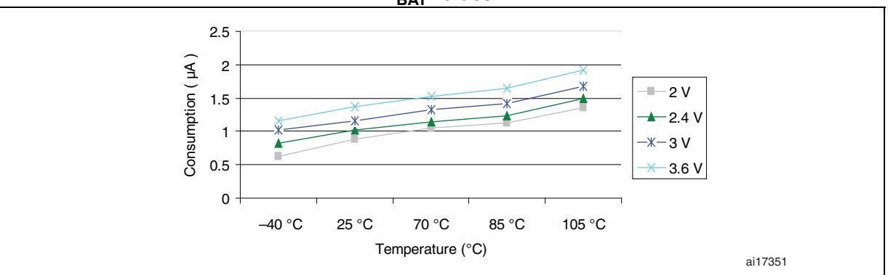

**Figure 19. Typical current consumption in Stop mode with regulator in Run mode versus temperature at VDD = 3.3 V and 3.6 V**

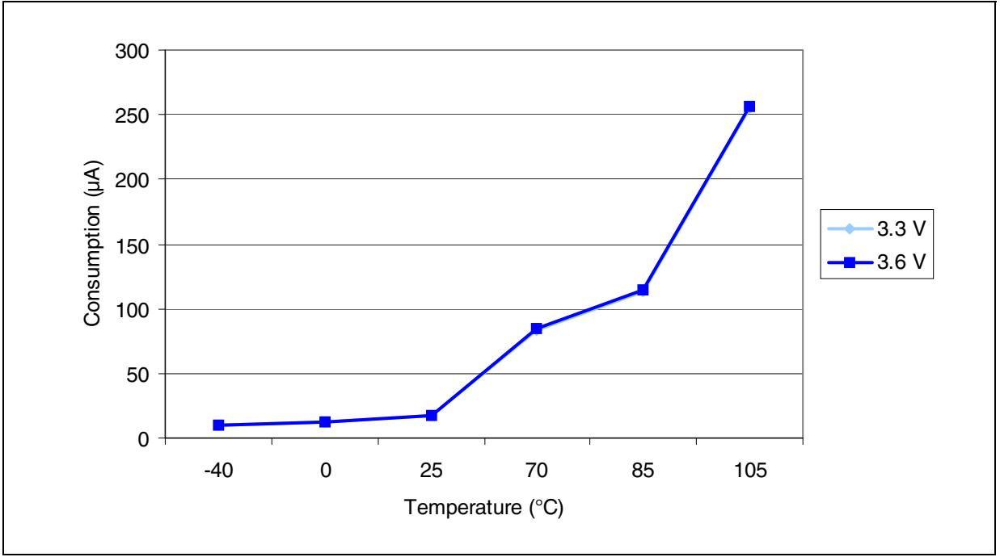

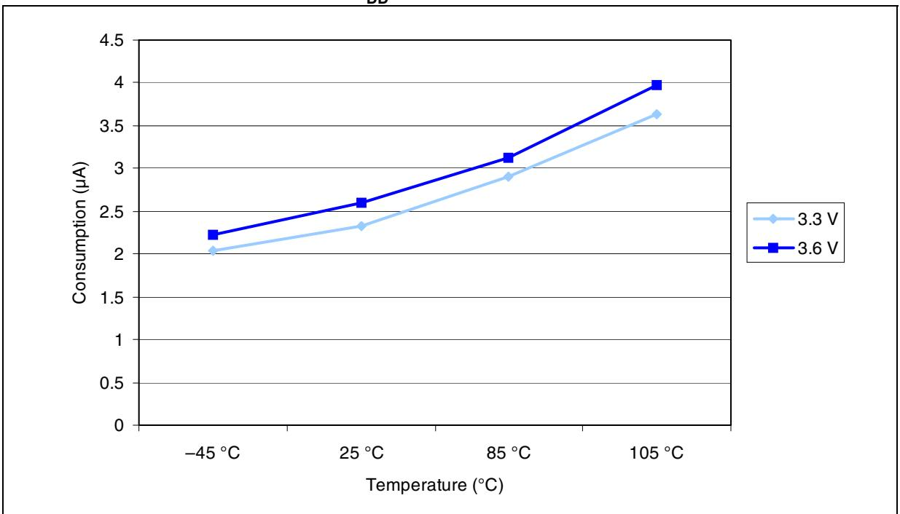

**Figure 21. Typical current consumption in Standby mode versus temperature at VDD = 3.3 V and 3.6 V**

#### **Typical current consumption**

The MCU is placed under the following conditions:

- All I/O pins are in input mode with a static value at VDD or VSS (no load).
- All peripherals are disabled except if it is explicitly mentioned.
- The Flash access time is adjusted to fHCLK frequency (0 wait state from 0 to 24 MHz, 1 wait state from 24 to 48 MHz and 2 wait states above).
- Ambient temperature and VDD supply voltage conditions summarized in *[Table 9](#page-37-4)*.
- Prefetch is ON (Reminder: this bit must be set before clock setting and bus prescaling)
- When the peripherals are enabled fPCLK1 = fHCLK/4, fPCLK2 = fHCLK/2, fADCCLK = fPCLK2/4

|        |                                  | Conditions                      |         |                               | Typ(1)                      | Unit |
|--------|----------------------------------|---------------------------------|---------|-------------------------------|-----------------------------|------|
| Symbol | Parameter                        |                                 | fHCLK   | All peripherals enabled(2) | All peripherals disabled |      |
|        |                                  |                                 | 72 MHz  | 36                            | 27                          |      |
|        |                                  |                                 | 48 MHz  | 24.2                          | 18.6                        |      |
| IDD    |                                  |                                 | 36 MHz  | 19                            | 14.8                        |      |
|        |                                  |                                 | 24 MHz  | 12.9                          | 10.1                        |      |
|        |                                  |                                 | 16 MHz  | 9.3                           | 7.4                         |      |
|        |                                  | External clock(3)               | 8 MHz   | 5.5                           | 4.6                         | mA   |
|        | Supply current in Run mode |                                 | 4 MHz   | 3.3                           | 2.8                         |      |
|        |                                  |                                 | 2 MHz   | 2.2                           | 1.9                         |      |
|        |                                  |                                 | 1 MHz   | 1.6                           | 1.45                        |      |
|        |                                  |                                 | 500 kHz | 1.3                           | 1.25                        |      |
|        |                                  |                                 | 125 kHz | 1.08                          | 1.06                        |      |
|        |                                  |                                 | 64 MHz  | 31.4                          | 23.9                        |      |
|        |                                  |                                 | 48 MHz  | 23.5                          | 17.9                        |      |
|        |                                  |                                 | 36 MHz  | 18.3                          | 14.1                        |      |
|        |                                  | Running on high                 | 24 MHz  | 12.2                          | 9.5                         |      |
|        |                                  | speed internal RC               | 16 MHz  | 8.5                           | 6.8                         |      |
|        |                                  | (HSI), AHB prescaler used to | 8 MHz   | 4.9                           | 4                           | mA   |
|        |                                  | reduce the                      | 4 MHz   | 2.7                           | 2.2                         |      |
|        |                                  | frequency                       | 2 MHz   | 1.6                           | 1.4                         |      |
|        |                                  |                                 | 1 MHz   | 1.02                          | 0.9                         |      |
|        |                                  |                                 | 500 kHz | 0.73                          | 0.67                        |      |
|        |                                  |                                 | 125 kHz | 0.5                           | 0.48                        |      |

**Table 17. Typical current consumption in Run mode, code with data processing running from Flash**

1. Typical values are measures at TA = 25 °C, VDD = 3.3 V.

2. Add an additional power consumption of 0.8 mA per ADC for the analog part. In applications, this consumption occurs only while the ADC is on (ADON bit is set in the ADC\_CR2 register).

3. External clock is 8 MHz and PLL is on when fHCLK > 8 MHz.

|        |                                    | Conditions                           |         |                               | Typ(1)                      | Unit |
|--------|------------------------------------|--------------------------------------|---------|-------------------------------|-----------------------------|------|
| Symbol | Parameter                          |                                      | fHCLK   | All peripherals enabled(2) | All peripherals disabled |      |
| IDD    |                                    |                                      | 72 MHz  | 14.4                          | 5.5                         |      |
|        |                                    |                                      | 48 MHz  | 9.9                           | 3.9                         |      |
|        |                                    |                                      | 36 MHz  | 7.6                           | 3.1                         |      |
|        |                                    |                                      | 24 MHz  | 5.3                           | 2.3                         |      |
|        |                                    |                                      | 16 MHz  | 3.8                           | 1.8                         |      |
|        |                                    | External clock(3)                    | 8 MHz   | 2.1                           | 1.2                         |      |
|        |                                    |                                      | 4 MHz   | 1.6                           | 1.1                         |      |
|        |                                    |                                      | 2 MHz   | 1.3                           | 1                           | mA   |
|        |                                    |                                      | 1 MHz   | 1.11                          | 0.98                        |      |
|        |                                    |                                      | 500 kHz | 1.04                          | 0.96                        |      |
|        | Supply current in Sleep mode |                                      | 125 kHz | 0.98                          | 0.95                        |      |
|        |                                    |                                      | 64 MHz  | 12.3                          | 4.4                         |      |
|        |                                    |                                      | 48 MHz  | 9.3                           | 3.3                         |      |
|        |                                    |                                      | 36 MHz  | 7                             | 2.5                         |      |
|        |                                    |                                      | 24 MHz  | 4.8                           | 1.8                         |      |
|        |                                    | Running on high speed internal RC | 16 MHz  | 3.2                           | 1.2                         |      |
|        |                                    | (HSI), AHB prescaler                 | 8 MHz   | 1.6                           | 0.6                         |      |
|        |                                    | used to reduce the frequency      | 4 MHz   | 1                             | 0.5                         |      |
|        |                                    |                                      | 2 MHz   | 0.72                          | 0.47                        |      |
|        |                                    |                                      | 1 MHz   | 0.56                          | 0.44                        |      |
|        |                                    |                                      | 500 kHz | 0.49                          | 0.42                        |      |
|        |                                    |                                      | 125 kHz | 0.43                          | 0.41                        |      |

**Table 18. Typical current consumption in Sleep mode, code running from Flash or RAM**

1. Typical values are measures at TA = 25 °C, VDD = 3.3 V.

2. Add an additional power consumption of 0.8 mA per ADC for the analog part. In applications, this consumption occurs only while the ADC is on (ADON bit is set in the ADC\_CR2 register).

3. External clock is 8 MHz and PLL is on when fHCLK > 8 MHz.

# **On-chip peripheral current consumption**

The current consumption of the on-chip peripherals is given in *[Table 19](#page-49-0)*. The MCU is placed under the following conditions:

- all I/O pins are in input mode with a static value at VDD or VSS (no load)
- all peripherals are disabled unless otherwise mentioned
- the given value is calculated by measuring the current consumption
  - with all peripherals clocked off
  - with only one peripheral clocked on
- ambient operating temperature and VDD supply voltage conditions summarized in *[Table 6](#page-36-2)*

| Peripheral |         | Typical consumption at 25 °C | Unit |
|------------|---------|------------------------------|------|
|            | TIM2    | 1.2                          |      |
| APB1       | TIM3    | 1.2                          |      |
|            | TIM4    | 0.9                          |      |
|            | SPI2    | 0.2                          |      |
|            | USART2  | 0.35                         |      |
|            | USART3  | 0.35                         | mA   |
|            | I2C1    | 0.39                         |      |
|            | I2C2    | 0.39                         |      |
|            | USB     | 0.65                         |      |
|            | CAN     | 0.72                         |      |
|            | GPIO A  | 0.47                         |      |
|            | GPIO B  | 0.47                         |      |
|            | GPIO C  | 0.47                         |      |
|            | GPIO D  | 0.47                         |      |
|            | GPIO E  | 0.47                         |      |
| APB2       | ADC1(2) | 1.81                         | mA   |
|            | ADC2    | 1.78                         |      |
|            | TIM1    | 1.6                          |      |
|            | SPI1    | 0.43                         |      |
|            | USART1  | 0.85                         |      |

#### **Table 19. Peripheral current consumption(1)**

1. fHCLK = 72 MHz, fAPB1 = fHCLK/2, fAPB2 = fHCLK, default prescaler value for each peripheral.

2. Specific conditions for ADC: fHCLK = 56 MHz, fAPB1 = fHCLK/2, fAPB2 = fHCLK, fADCCLK = fAPB2/4, ADON bit in the ADC\_CR2 register is set to 1.

# **5.3.6 External clock source characteristics**

#### **High-speed external user clock generated from an external source**

The characteristics given in *[Table 20](#page-50-1)* result from tests performed using an high-speed external clock source, and under ambient temperature and supply voltage conditions summarized in *[Table 9](#page-37-4)*.

| Symbol             | Parameter                                  | Conditions            | Min    | Typ | Max    | Unit |
|--------------------|--------------------------------------------|-----------------------|--------|-----|--------|------|
| fHSE_ext           | User external clock source frequency(1) |                       | 1      | 8   | 25     | MHz  |
| VHSEH              | OSC_IN input pin high level voltage        |                       | 0.7VDD | -   | VDD    | V    |
| VHSEL              | OSC_IN input pin low level voltage         |                       | VSS    | -   | 0.3VDD |      |
| tw(HSE) tw(HSE) | OSC_IN high or low time(1)                 |                       | 5      | -   | -      | ns   |
| tr(HSE) tf(HSE) | OSC_IN rise or fall time(1)                |                       | -      | -   | 20     |      |
| Cin(HSE)           | OSC_IN input capacitance(1)                |                       | -      | 5   | -      | pF   |
| DuCy(HSE)          | Duty cycle                                 |                       | 45     | -   | 55     | %    |
| IL                 | OSC_IN Input leakage current               | VSS  VIN  VDD | -      | -   | ±1     | µA   |

**Table 20. High-speed external user clock characteristics**

1. Guaranteed by design, not tested in production.

#### **Low-speed external user clock generated from an external source**

The characteristics given in *[Table 21](#page-50-2)* result from tests performed using an low-speed external clock source, and under ambient temperature and supply voltage conditions summarized in *[Table 9](#page-37-4)*.

| Symbol             | Parameter                                  | Conditions            | Min    | Typ    | Max    | Unit |
|--------------------|--------------------------------------------|-----------------------|--------|--------|--------|------|
| fLSE_ext           | User External clock source frequency(1) |                       |        | 32.768 | 1000   | kHz  |
| VLSEH              | OSC32_IN input pin high level voltage   |                       | 0.7VDD | -      | VDD    |      |
| VLSEL              | OSC32_IN input pin low level voltage    |                       | VSS    | -      | 0.3VDD | V    |
| tw(LSE) tw(LSE) | OSC32_IN high or low time(1)               |                       | 450    | -      | -      |      |
| tr(LSE) tf(LSE) | OSC32_IN rise or fall time(1)              |                       | -      | -      | 50     | ns   |
| Cin(LSE)           | OSC32_IN input capacitance(1)              |                       | -      | 5      | -      | pF   |
| DuCy(LSE)          | Duty cycle                                 |                       | 30     | -      | 70     | %    |
| IL                 | OSC32_IN Input leakage current          | VSS  VIN  VDD | -      | -      | ±1     | µA   |

**Table 21. Low-speed external user clock characteristics**

1. Guaranteed by design, not tested in production.

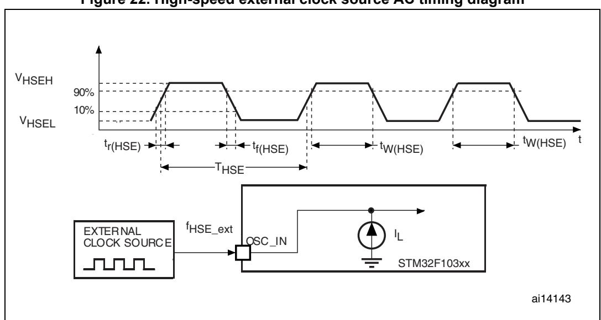

**Figure 22. High-speed external clock source AC timing diagram**

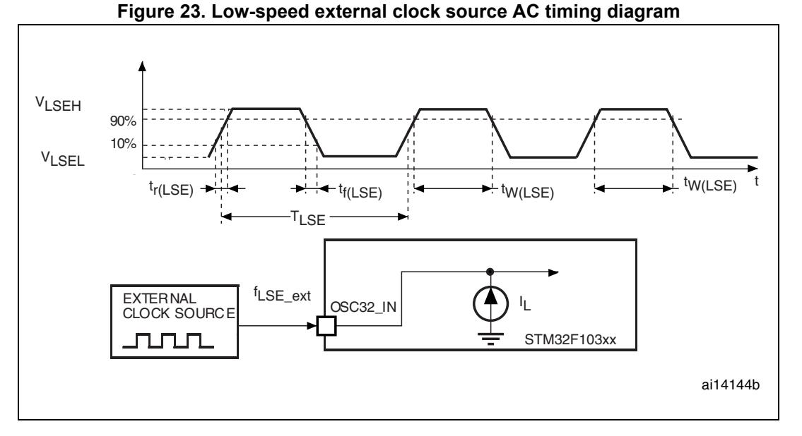

## **High-speed external clock generated from a crystal/ceramic resonator**

The high-speed external (HSE) clock can be supplied with a 4 to 16 MHz crystal/ceramic resonator oscillator. All the information given in this paragraph are based on characterization results obtained with typical external components specified in *[Table 22](#page-52-0)*. In the application, the resonator and the load capacitors have to be placed as close as possible to the oscillator pins in order to minimize output distortion and startup stabilization time. Refer to the crystal resonator manufacturer for more details on the resonator characteristics (frequency, package, accuracy).

| Symbol     | Parameter                                                                                         | Conditions                                   | Min | Typ | Max | Unit |
|------------|---------------------------------------------------------------------------------------------------|----------------------------------------------|-----|-----|-----|------|
| fOSC_IN    | Oscillator frequency                                                                              |                                              | 4   | 8   | 16  | MHz  |
| RF         | Feedback resistor                                                                                 |                                              | -   | 200 | -   | k   |
| C          | Recommended load capacitance versus equivalent serial (3) resistance of the crystal (RS) | RS = 30                                    | -   | 30  | -   | pF   |
| i 2     | HSE driving current                                                                               | VDD = 3.3 V, VIN = VSS with 30 pF load | -   | -   | 1   | mA   |
| gm         | Oscillator transconductance                                                                       | Startup                                      |     | -   | -   | mA/V |
| tSU(HSE(4) | startup time                                                                                      | VDD is stabilized                            | -   | 2   | -   | ms   |

| Table 22. HSE 4-16 MHz oscillator characteristics(1) (2) |  |
|----------------------------------------------------------|--|
|----------------------------------------------------------|--|

1. Resonator characteristics given by the crystal/ceramic resonator manufacturer.

2. Based on characterization, not tested in production.

3. The relatively low value of the RF resistor offers a good protection against issues resulting from use in a humid environment, due to the induced leakage and the bias condition change. However, it is recommended to take this point into account if the MCU is used in tough humidity conditions.

4. tSU(HSE) is the startup time measured from the moment it is enabled (by software) to a stabilized 8 MHz oscillation is reached. This value is measured for a standard crystal resonator and it can vary significantly with the crystal manufacturer

For CL1 and CL2, it is recommended to use high-quality external ceramic capacitors in the 5 pF to 25 pF range (typ.), designed for high-frequency applications, and selected to match the requirements of the crystal or resonator (see *[Figure 24](#page-52-1)*). CL1 and CL2 are usually the same size. The crystal manufacturer typically specifies a load capacitance which is the series combination of CL1 and CL2. PCB and MCU pin capacitance must be included (10 pF can be used as a rough estimate of the combined pin and board capacitance) when sizing CL1 and CL2. Refer to the application note AN2867 "Oscillator design guide for ST microcontrollers" available from the ST website www.st.com.

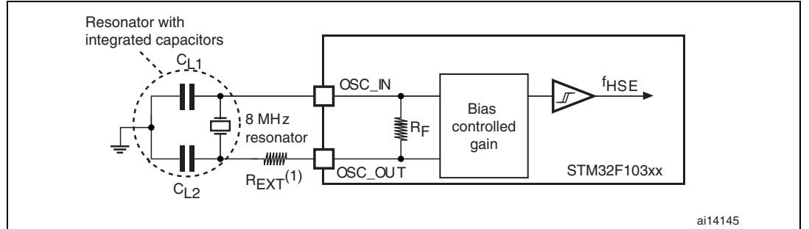

1. REXT value depends on the crystal characteristics.

#### **Low-speed external clock generated from a crystal/ceramic resonator**

The low-speed external (LSE) clock can be supplied with a 32.768 kHz crystal/ceramic resonator oscillator. All the information given in this paragraph are based on characterization results obtained with typical external components specified in *[Table 23](#page-53-0)*. In the application, the resonator and the load capacitors have to be placed as close as possible to the oscillator pins in order to minimize output distortion and startup stabilization time. Refer to the crystal resonator manufacturer for more details on the resonator characteristics (frequency, package, accuracy).

DocID13587 Rev 16 53/[105](#page-104-0)

| Symbol      | Parameter                                                                                  | Conditions               |             | Min | Typ | Max | Unit |
|-------------|--------------------------------------------------------------------------------------------|--------------------------|-------------|-----|-----|-----|------|
| RF          | Feedback resistor                                                                          |                          |             | -   | 5   | -   | M   |
| C           | Recommended load capacitance versus equivalent serial resistance of the crystal (RS) | RS = 30 K               |             | -   | -   | 15  | pF   |
| I2          | LSE driving current                                                                        | VDD = 3.3 V VIN = VSS |             | -   | -   | 1.4 | µA   |
| gm          | Oscillator transconductance                                                                |                          |             | 5   | -   | -   | µA/V |
|             |                                                                                            |                          | TA = 50 °C  | -   | 1.5 | -   |      |
|             |                                                                                            |                          | TA = 25 °C  | -   | 2.5 | -   |      |
|             |                                                                                            |                          | TA = 10 °C  | -   | 4   | -   |      |
|             |                                                                                            | VDD is                   | TA = 0 °C   | -   | 6   | -   |      |
| tSU(LSE)(3) | Startup time                                                                               | stabilized               | TA = -10 °C | -   | 10  | -   | s    |
|             |                                                                                            |                          | TA = -20 °C | -   | 17  | -   |      |
|             |                                                                                            |                          | TA = -30 °C | -   | 32  | -   |      |
|             |                                                                                            |                          | TA = -40 °C | -   | 60  | -   |      |

**Table 23. LSE oscillator characteristics (fLSE = 32.768 kHz)(1) (2)**

1. Based on characterization, not tested in production.

then CL1 = CL2 = 8 pF.

2. Refer to the note and caution paragraphs below the table, and to the application note AN2867 "Oscillator design guide for ST microcontrollers".

3. tSU(LSE) is the startup time measured from the moment it is enabled (by software) to a stabilized 32.768 kHz oscillation is reached. This value is measured for a standard crystal and it can vary significantly with the crystal manufacturer

*Note: For CL1 and CL2 it is recommended to use high-quality ceramic capacitors in the 5 pF to 15 pF range selected to match the requirements of the crystal or resonator. CL1 and CL2, are usually the same size. The crystal manufacturer typically specifies a load capacitance which is the series combination of CL1 and CL2.*

*Load capacitance CL has the following formula: CL =* CL1 *x* CL2 */ (*CL1 *+* CL2*) + Cstray where Cstray is the pin capacitance and board or trace PCB-related capacitance. Typically, it is between 2 pF and 7 pF.*

**Caution:** To avoid exceeding the maximum value of CL1 and CL2 (15 pF) it is strongly recommended to use a resonator with a load capacitance CL 7 pF. Never use a resonator with a load capacitance of 12.5 pF. **Example:** if you choose a resonator with a load capacitance of CL = 6 pF, and Cstray = 2 pF,

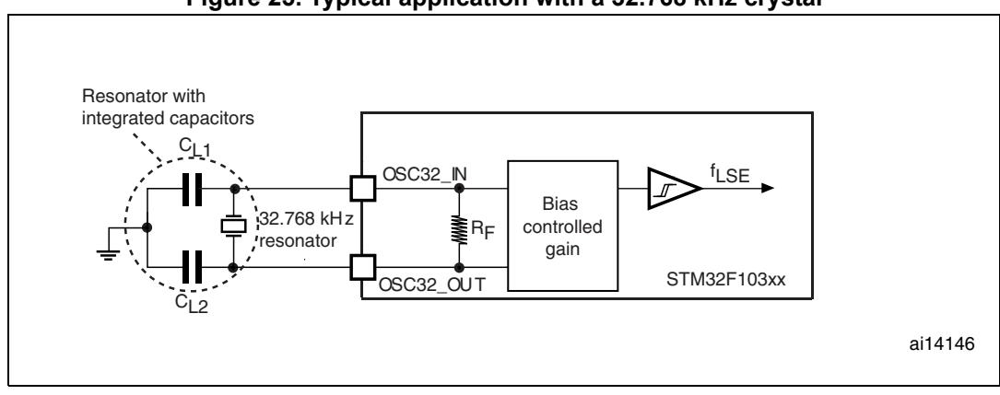

**Figure 25. Typical application with a 32.768 kHz crystal**

# **5.3.7 Internal clock source characteristics**

The parameters given in *[Table 24](#page-54-1)* are derived from tests performed under ambient temperature and VDD supply voltage conditions summarized in *[Table 9](#page-37-4)*.

#### **High-speed internal (HSI) RC oscillator**

| Symbol      | Parameter                           | Conditions           |                              | Min  | Typ | Max  | Unit |  |
|-------------|-------------------------------------|----------------------|------------------------------|------|-----|------|------|--|
| fHSI        | Frequency                           |                      |                              | -    | 8   | -    | MHz  |  |
| DuCy(HSI)   | Duty cycle                          |                      |                              |      | -   | 55   |      |  |
|             |                                     | register(2)          | User-trimmed with the RCC_CR | -    | -   | 1(3) |      |  |
|             | Accuracy of the HSI                 |                      | TA = –40 to 105 °C           | –2   | -   | 2.5  | %    |  |
| ACCHSI      | oscillator                          | Factory              | TA = –10 to 85 °C            | –1.5 | -   | 2.2  |      |  |
|             |                                     | calibrated (4)(5) | TA = 0 to 70 °C              | –1.3 | -   | 2    |      |  |
|             |                                     |                      | TA = 25 °C                   | –1.1 | -   | 1.8  |      |  |
| tsu(HSI)(4) | HSI oscillator startup time      |                      |                              | 1    | -   | 2    | µs   |  |
| IDD(HSI)(4) | HSI oscillator power consumption |                      |                              | -    | 80  | 100  | µA   |  |

**Table 24. HSI oscillator characteristics(1)**

1. VDD = 3.3 V, TA = –40 to 105 °C unless otherwise specified.

2. Refer to application note AN2868 "STM32F10xxx internal RC oscillator (HSI) calibration" available from the ST website www.st.com.

3. Guaranteed by design, not tested in production.

- 4. Based on characterization, not tested in production.
- 5. The actual frequency of HSI oscillator may be impacted by a reflow, but does not drift out of the specified range.

# **Low-speed internal (LSI) RC oscillator**

|  |  | Table 25. LSI oscillator characteristics (1) |  |
|--|--|----------------------------------------------|--|
|--|--|----------------------------------------------|--|

| Symbol      | Parameter                        |    | Typ  | Max | Unit |
|-------------|----------------------------------|----|------|-----|------|
| fLSI(2)     | Frequency                        | 30 | 40   | 60  | kHz  |
| tsu(LSI)(3) | LSI oscillator startup time      | -  | -    | 85  | µs   |
| IDD(LSI)(3) | LSI oscillator power consumption | -  | 0.65 | 1.2 | µA   |

1. VDD = 3 V, TA = –40 to 105 °C unless otherwise specified.

2. Based on characterization, not tested in production.

3. Guaranteed by design, not tested in production.

#### **Wakeup time from low-power mode**

The wakeup times given in *[Table 26](#page-56-2)* is measured on a wakeup phase with a 8-MHz HSI RC oscillator. The clock source used to wake up the device depends from the current operating mode:

- Stop or Standby mode: the clock source is the RC oscillator
- Sleep mode: the clock source is the clock that was set before entering Sleep mode.

All timings are derived from tests performed under ambient temperature and VDD supply voltage conditions summarized in *[Table 9](#page-37-4)*.

| Symbol Parameter |                                                        | Typ | Unit |
|---------------------|--------------------------------------------------------|-----|------|
| tWUSLEEP(1)         | Wakeup from Sleep mode                                 | 1.8 |      |
|                     | Wakeup from Stop mode (regulator in run mode)          | 3.6 |      |
| (1) tWUSTOP      | Wakeup from Stop mode (regulator in low power mode) | 5.4 | µs   |
| tWUSTDBY(1)         | Wakeup from Standby mode                               | 50  |      |

**Table 26. Low-power mode wakeup timings**

1. The wakeup times are measured from the wakeup event to the point in which the user application code reads the first instruction.

# **5.3.8 PLL characteristics**

The parameters given in *[Table 27](#page-56-3)* are derived from tests performed under ambient temperature and VDD supply voltage conditions summarized in *[Table 9](#page-37-4)*.

|          |                             | Value  |     |        |      |
|----------|-----------------------------|--------|-----|--------|------|
| Symbol   | Parameter                   | Min(1) | Typ | Max(1) | Unit |
| fPLL_IN  | PLL input clock(2)          | 1      | 8.0 | 25     | MHz  |
|          | PLL input clock duty cycle  | 40     | -   | 60     | %    |
| fPLL_OUT | PLL multiplier output clock | 16     | -   | 72     | MHz  |
| tLOCK    | PLL lock time               | -      | -   | 200    | µs   |
| Jitter   | Cycle-to-cycle jitter       | -      | -   | 300    | ps   |

**Table 27. PLL characteristics**

1. Based on characterization, not tested in production.

2. Take care of using the appropriate multiplier factors so as to have PLL input clock values compatible with the range defined by fPLL\_OUT.

# **5.3.9 Memory characteristics**

#### **Flash memory**

The characteristics are given at TA = –40 to 105 °C unless otherwise specified.

| Table 28. Flash memory characteristics |
|----------------------------------------|
|----------------------------------------|

| Symbol | Parameter               | Conditions          | Min(1) | Typ  | Max(1) | Unit |
|--------|-------------------------|---------------------|--------|------|--------|------|
| tprog  | 16-bit programming time | TA–40 to +105 °C | 40     | 52.5 | 70     | µs   |
| tERASE | Page (1 KB) erase time  | TA –40 to +105 °C | 20     | -    | 40     | ms   |
| tME    | Mass erase time         | TA –40 to +105 °C | 20     | -    | 40     |      |

| Symbol | Parameter           | Conditions                                                     | Min(1) | Typ | Max(1) | Unit |
|--------|---------------------|----------------------------------------------------------------|--------|-----|--------|------|
| IDD    |                     | Read mode fHCLK = 72 MHz with 2 wait states, VDD = 3.3 V | -      | -   | 20     | mA   |
|        | Supply current      | Write / Erase modes fHCLK = 72 MHz, VDD = 3.3 V             | -      | -   | 5      |      |
|        |                     | Power-down mode / Halt, VDD = 3.0 to 3.6 V                  | -      | -   | 50     | µA   |
| Vprog  | Programming voltage |                                                                | 2      | -   | 3.6    | V    |

**Table 28. Flash memory characteristics (continued)**

1. Guaranteed by design, not tested in production.

| Symbol |                |                                                                                   | Value  |     |     | Unit    |
|--------|----------------|-----------------------------------------------------------------------------------|--------|-----|-----|---------|
|        | Parameter      | Conditions                                                                        | Min(1) | Typ | Max |         |
| NEND   | Endurance      | TA = –40 to +85 °C (6 suffix versions) TA = –40 to +105 °C (7 suffix versions) | 10     | -   | -   | kcycles |
| tRET   |                | 1 kcycle(2) at TA = 85 °C                                                         | 30     | -   | -   |         |
|        | Data retention | (2) at TA = 105 °C 1 kcycle                                                    | 10     | -   | -   | Years   |
|        |                | 10 kcycles(2) at TA = 55 °C                                                       | 20     | -   | -   |         |

## **Table 29. Flash memory endurance and data retention**

1. Based on characterization, not tested in production.

2. Cycling performed over the whole temperature range.

# **5.3.10 EMC characteristics**

Susceptibility tests are performed on a sample basis during device characterization.

## **Functional EMS (electromagnetic susceptibility)**

While a simple application is executed on the device (toggling 2 LEDs through I/O ports). the device is stressed by two electromagnetic events until a failure occurs. The failure is indicated by the LEDs:

- **Electrostatic discharge (ESD)** (positive and negative) is applied to all device pins until a functional disturbance occurs. This test is compliant with the IEC 61000-4-2 standard.
- **FTB**: A Burst of Fast Transient voltage (positive and negative) is applied to VDD and VSS through a 100 pF capacitor, until a functional disturbance occurs. This test is compliant with the IEC 61000-4-4 standard.

A device reset allows normal operations to be resumed.

The test results are given in *[Table 30](#page-58-0)*. They are based on the EMS levels and classes defined in application note AN1709.

#### **Table 30. EMS characteristics**

| Symbol | Parameter                                                                                                                     | Conditions                                                                  | Level/ Class |
|--------|-------------------------------------------------------------------------------------------------------------------------------|-----------------------------------------------------------------------------|-----------------|
| VFESD  | Voltage limits to be applied on any I/O pin to induce a functional disturbance                                             | VDD 3.3 V, TA +25 °C, fHCLK 72 MHz conforms to IEC 61000-4-2    | 2B              |
| VEFTB  | Fast transient voltage burst limits to be applied through 100 pF on VDD and VSS pins to induce a functional disturbance | VDD3.3 V, TA +25 °C, fHCLK 72 MHz conforms to IEC 61000-4-4 | 4A              |

#### **Designing hardened software to avoid noise problems**

EMC characterization and optimization are performed at component level with a typical application environment and simplified MCU software. It should be noted that good EMC performance is highly dependent on the user application and the software in particular.

Therefore it is recommended that the user applies EMC software optimization and prequalification tests in relation with the EMC level requested for his application.

#### **Software recommendations**

The software flowchart must include the management of runaway conditions such as:

- Corrupted program counter
- Unexpected reset
- Critical Data corruption (control registers...)

#### **Prequalification trials**

Most of the common failures (unexpected reset and program counter corruption) can be reproduced by manually forcing a low state on the NRST pin or the Oscillator pins for 1 second.

To complete these trials, ESD stress can be applied directly on the device, over the range of specification values. When unexpected behavior is detected, the software can be hardened to prevent unrecoverable errors occurring (see application note AN1015).

#### **Electromagnetic Interference (EMI)**

The electromagnetic field emitted by the device are monitored while a simple application is executed (toggling 2 LEDs through the I/O ports). This emission test is compliant with IEC 61967-2 standard which specifies the test board and the pin loading.

|  | Symbol | Parameter  | Conditions                                  | Monitored       |          | Max vs. [fHSE/fHCLK] | Unit |
|--|--------|------------|---------------------------------------------|-----------------|----------|----------------------|------|
|  |        |            | frequency band                              | 8/48 MHz        | 8/72 MHz |                      |      |
|  |        |            |                                             | 0.1 to 30 MHz   | 12       | 12                   |      |
|  |        |            | VDD 3.3 V, TA 25 °C, LQFP100 package | 30 to 130 MHz   | 22       | 19                   | dBµV |
|  | SEMI   | Peak level | compliant with IEC 61967-2               | 130 MHz to 1GHz | 23       | 29                   |      |
|  |        |            |                                             | SAE EMI Level   | 4        | 4                    | -    |

| Table 31. EMI characteristics |  |  |  |
|-------------------------------|--|--|--|
|-------------------------------|--|--|--|

# **5.3.11 Absolute maximum ratings (electrical sensitivity)**

Based on three different tests (ESD, LU) using specific measurement methods, the device is stressed in order to determine its performance in terms of electrical sensitivity.

# **Electrostatic discharge (ESD)**

Electrostatic discharges (a positive then a negative pulse separated by 1 second) are applied to the pins of each sample according to each pin combination. The sample size depends on the number of supply pins in the device (3 parts × (n+1) supply pins). This test conforms to the JESD22-A114/C101 standard.

| Symbol    | Ratings                                                     | Conditions                                        | Class | Maximum value(1) | Unit |
|-----------|-------------------------------------------------------------|---------------------------------------------------|-------|------------------|------|
| VESD(HBM) | Electrostatic discharge voltage (human body model)       | TA +25 °C conforming to JESD22-A114       | 2     | 2000             |      |
| VESD(CDM) | Electrostatic discharge voltage (charge device model) | TA +25 °C conforming to ANSI/ESD STM5.3.1 | II    | 500              | V    |

**Table 32. ESD absolute maximum ratings**

1. Based on characterization results, not tested in production.

#### **Static latch-up**

Two complementary static tests are required on six parts to assess the latch-up performance:

- A supply overvoltage is applied to each power supply pin
- A current injection is applied to each input, output and configurable I/O pin

These tests are compliant with EIA/JESD 78A IC latch-up standard.

#### **Table 33. Electrical sensitivities**

| Symbol | Parameter             | Conditions                         | Class      |
|--------|-----------------------|------------------------------------|------------|
| LU     | Static latch-up class | TA +105 °C conforming to JESD78A | II level A |

# **5.3.12 I/O current injection characteristics**

As a general rule, current injection to the I/O pins, due to external voltage below VSS or above VDD (for standard, 3 V-capable I/O pins) should be avoided during normal product operation. However, in order to give an indication of the robustness of the microcontroller in cases when abnormal injection accidentally happens, susceptibility tests are performed on a sample basis during device characterization.

## **Functional susceptibilty to I/O current injection**

While a simple application is executed on the device, the device is stressed by injecting current into the I/O pins programmed in floating input mode. While current is injected into the I/O pin, one at a time, the device is checked for functional failures.

The failure is indicated by an out of range parameter: ADC error above a certain limit (>5 LSB TUE), out of spec current injection on adjacent pins or other functional failure (for example reset, oscillator frequency deviation).

The test results are given in *[Table 34](#page-60-1)*

|                       |                                                            | Functional susceptibility |                       |      |
|-----------------------|------------------------------------------------------------|---------------------------|-----------------------|------|
| Symbol Description |                                                            | Negative injection     | Positive injection | Unit |
|                       | Injected current on OSC_IN32, OSC_OUT32, PA4, PA5, PC13 | -0                        | +0                    |      |
| IINJ                  | Injected current on all FT pins                            | -5                        | +0                    | mA   |
|                       | Injected current on any other pin                          | -5                        | +5                    |      |

#### **Table 34. I/O current injection susceptibility**

# **5.3.13 I/O port characteristics**

# **General input/output characteristics**

Unless otherwise specified, the parameters given in *[Table 35](#page-61-1)* are derived from tests performed under the conditions summarized in *[Table 9](#page-37-4)*. All I/Os are CMOS and TTL compliant.

| Symbol | Parameter                                               | Conditions                                 | Min Typ Max                 |    | Unit                    |    |
|--------|---------------------------------------------------------|--------------------------------------------|-----------------------------------|----|-------------------------|----|
|        |                                                         | Standard IO input low level voltage  | -                                 | -  | 0.28*(VDD-2 V)+0.8 V(1) |    |
| VIL    | Low level input voltage                                 | IO FT(3) input low level voltage        | -                                 | -  | 0.32*(VDD-2V)+0.75 V(1) |    |
|        |                                                         | All I/Os except BOOT0                   | -                                 | -  | 0.35VDD(2)              |    |
|        |                                                         | Standard IO input high level voltage | 0.41*(VDD-2 V)+1.3 V(1) - - |    | V                       |    |
| VIH    | High level input voltage                             | IO FT(3) input high level voltage    | 0.42*(VDD-2 V)+1 V(1)             | -  | -                       |    |
|        |                                                         | All I/Os except BOOT0                   | 0.65VDD(2)                        | -  | -                       |    |
| Vhys   | Standard IO Schmitt trigger voltage hysteresis(4) |                                            | 200                               | -  | -                       | mV |
|        | IO FT Schmitt trigger voltage hysteresis(4)          |                                            | 5% VDD(5)                         | -  | -                       |    |
|        | Input leakage current                                   | VSS  VIN  VDD Standard I/Os   | -                                 | -  | 1                      | µA |
| Ilkg   | (6)                                                     | VIN = 5 V I/O FT                        | -                                 | -  | 3                       |    |
| RPU    | Weak pull-up equivalent resistor(7)                  | VIN VSS                                  | 30                                | 40 | 50                      | k |
| RPD    | Weak pull-down equivalent resistor(7)                | VIN VDD                                  | 30                                | 40 | 50                      |    |
| CIO    | I/O pin capacitance                                     |                                            | -                                 | 5  | -                       | pF |

| Table 35. I/O static characteristics |  |
|--------------------------------------|--|
|--------------------------------------|--|

1. Data based on design simulation.

2. Tested in production.

3. FT = Five-volt tolerant. In order to sustain a voltage higher than VDD+0.3 the internal pull-up/pull-down resistors must be disabled.

4. Hysteresis voltage between Schmitt trigger switching levels. Based on characterization, not tested in production.

5. With a minimum of 100 mV.

6. Leakage could be higher than max. if negative current is injected on adjacent pins.

7. Pull-up and pull-down resistors are designed with a true resistance in series with a switchable PMOS/NMOS. This PMOS/NMOS contribution to the series resistance is minimum (~10% order).

All I/Os are CMOS and TTL compliant (no software configuration required). Their characteristics cover more than the strict CMOS-technology or TTL parameters. The coverage of these requirements is shown in *[Figure 26](#page-63-0)* and *[Figure 27](#page-63-1)* for standard I/Os, and in *[Figure 28](#page-64-0)* and *[Figure 29](#page-64-1)* for 5 V tolerant I/Os.

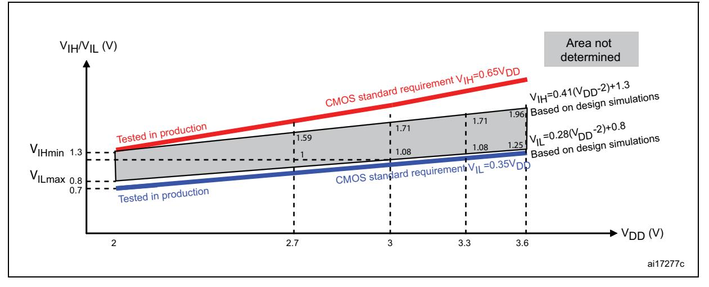

#### **Figure 26. Standard I/O input characteristics - CMOS port**

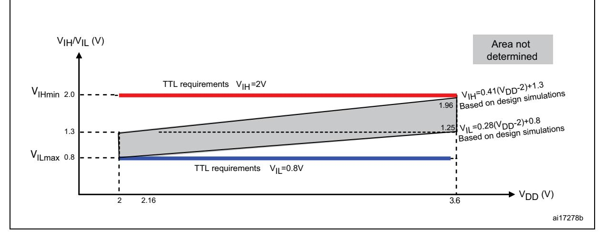

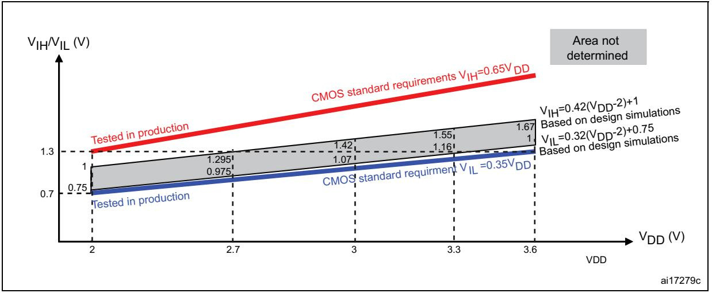

**Figure 28. 5 V tolerant I/O input characteristics - CMOS port**

**Figure 29. 5 V tolerant I/O input characteristics - TTL port**

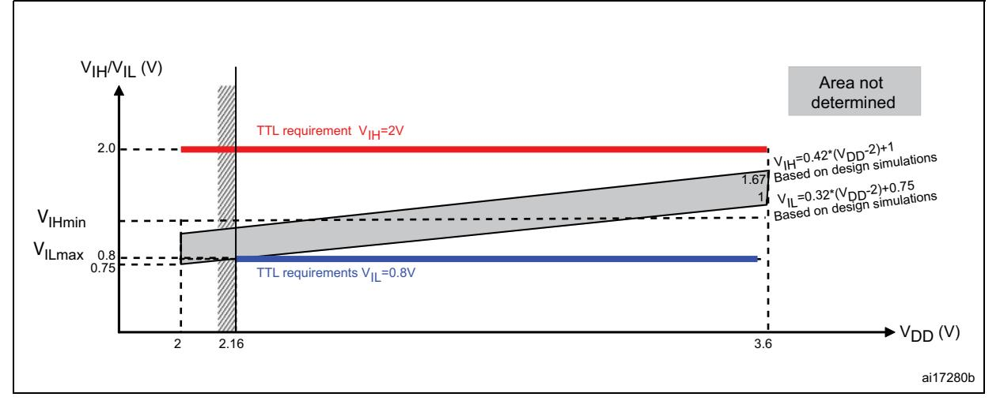

#### **Output driving current**

The GPIOs (general-purpose inputs/outputs) can sink or source up to ±8 mA, and sink or source up to ±20 mA (with a relaxed VOL/VOH) except PC13, PC14 and PC15 which can sink or source up to +/-3mA. When using the GPIOs PC13 to PC15 in output mode, the speed should not exceed 2 MHz with a maximum load of 30 pF.

In the user application, the number of I/O pins which can drive current must be limited to respect the absolute maximum rating specified in *[Section 5.2](#page-36-1)*:

- The sum of the currents sourced by all the I/Os on VDD, plus the maximum Run consumption of the MCU sourced on VDD, cannot exceed the absolute maximum rating IVDD (see *[Table 7](#page-37-2)*).
- The sum of the currents sunk by all the I/Os on VSS plus the maximum Run consumption of the MCU sunk on VSS cannot exceed the absolute maximum rating IVSS (see *[Table 7](#page-37-2)*).

#### **Output voltage levels**

Unless otherwise specified, the parameters given in *[Table 36](#page-65-0)* are derived from tests performed under ambient temperature and VDD supply voltage conditions summarized in *[Table 9](#page-37-4)*. All I/Os are CMOS and TTL compliant.

| Symbol    | Parameter                                                                        | Conditions                         | Min     | Max | Unit |
|-----------|----------------------------------------------------------------------------------|------------------------------------|---------|-----|------|
| VOL(1)    | Output low level voltage for an I/O pin when 8 pins are sunk at same time     | CMOS port(2),                      | -       | 0.4 |      |
| VOH(3)    | Output high level voltage for an I/O pin when 8 pins are sourced at same time | IIO = +8 mA 2.7 V < VDD < 3.6 V | VDD–0.4 | -   |      |
| VOL (1)   | Output low level voltage for an I/O pin when 8 pins are sunk at same time     | TTL port(2)                        | -       | 0.4 |      |
| VOH (3)   | Output high level voltage for an I/O pin when 8 pins are sourced at same time | IIO =+ 8mA 2.7 V < VDD < 3.6 V  | 2.4     | -   | V    |
| VOL(1)(4) | Output low level voltage for an I/O pin when 8 pins are sunk at same time     | IIO = +20 mA                       | -       | 1.3 |      |
| VOH(3)(4) | Output high level voltage for an I/O pin when 8 pins are sourced at same time | 2.7 V < VDD < 3.6 V                | VDD–1.3 | -   |      |
| VOL(1)(4) | Output low level voltage for an I/O pin when 8 pins are sunk at same time     | IIO = +6 mA                        | -       | 0.4 |      |
| VOH(3)(4) | Output high level voltage for an I/O pin when 8 pins are sourced at same time | 2 V < VDD < 2.7 V                  | VDD–0.4 | -   |      |

#### **Table 36. Output voltage characteristics**

1. The IIO current sunk by the device must always respect the absolute maximum rating specified in *[Table 7](#page-37-2)* and the sum of IIO (I/O ports and control pins) must not exceed IVSS.

2. TTL and CMOS outputs are compatible with JEDEC standards JESD36 and JESD52.

3. The IIO current sourced by the device must always respect the absolute maximum rating specified in *[Table 7](#page-37-2)* and the sum of IIO (I/O ports and control pins) must not exceed IVDD.

4. Based on characterization data, not tested in production.

#### **Input/output AC characteristics**

The definition and values of input/output AC characteristics are given in *[Figure 30](#page-67-2)* and *[Table 37](#page-66-0)*, respectively.

Unless otherwise specified, the parameters given in *[Table 37](#page-66-0)* are derived from tests performed under the ambient temperature and VDD supply voltage conditions summarized in *[Table 9](#page-37-4)*.

| MODEx[1:0] bit value(1) | Symbol      | Parameter                                                             | Conditions                       | Min                            | Max    | Unit |
|----------------------------|-------------|-----------------------------------------------------------------------|----------------------------------|--------------------------------|--------|------|
|                            | fmax(IO)out | Maximum frequency(2)                                                  | CL = 50 pF, VDD = 2 V to 3.6 V   | -                              | 2      | MHz  |
| 10                         | tf(IO)out   | Output high to low level fall time                                 |                                  | -                              | 125(3) |      |
|                            | tr(IO)out   | Output low to high level rise time                                 | CL = 50 pF, VDD = 2 V to 3.6 V   |                                | 125(3) | ns   |
|                            | fmax(IO)out | Maximum frequency(2) CL = 50                                          | pF, VDD = 2 V to 3.6 V           | -                              | 10     | MHz  |
| 01                         | tf(IO)out   | Output high to low level fall time                                 |                                  | -                              | 25(3)  |      |
| tr(IO)out                  |             | Output low to high level rise time                                 | CL = 50 pF, VDD = 2 V to 3.6 V   |                                | 25(3)  | ns   |
|                            |             |                                                                       | CL = 30 pF, VDD = 2.7 V to 3.6 V | -                              | 50     |      |
|                            | Fmax(IO)out | Maximum frequency(2)                                                  | CL = 50 pF, VDD = 2.7 V to 3.6 V | -                              | 30     | MHz  |
|                            |             |                                                                       |                                  | CL = 50 pF, VDD = 2 V to 2.7 V | -      | 20   |
|                            |             |                                                                       | CL = 30 pF, VDD = 2.7 V to 3.6 V | -                              | 5(3)   |      |
| 11                         | tf(IO)out   | Output high to low level fall time                                 | CL = 50 pF, VDD = 2.7 V to 3.6 V | -                              | 8(3)   |      |
|                            |             |                                                                       | CL = 50 pF, VDD = 2 V to 2.7 V   | -                              | 12(3)  | ns   |
|                            |             |                                                                       | CL = 30 pF, VDD = 2.7 V to 3.6 V | -                              | 5(3)   |      |
|                            | tr(IO)out   | Output low to high level rise time                                 | CL = 50 pF, VDD = 2.7 V to 3.6 V | -                              | 8(3)   |      |
|                            |             |                                                                       | CL = 50 pF, VDD = 2 V to 2.7 V   | -                              | 12(3)  |      |
| -                          | tEXTIpw     | Pulse width of external signals detected by the EXTI controller |                                  | 10                             | -      | ns   |

**Table 37. I/O AC characteristics(1)**

1. The I/O speed is configured using the MODEx[1:0] bits. Refer to the STM32F10xxx reference manual for a description of GPIO Port configuration register.

2. The maximum frequency is defined in *[Figure 30](#page-67-2)*.

3. Guaranteed by design, not tested in production.

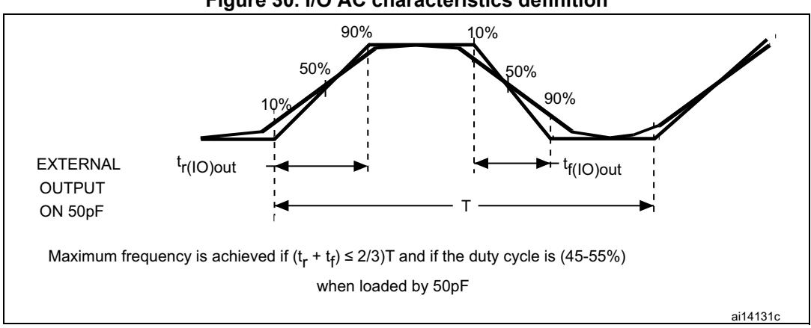

# **5.3.14 NRST pin characteristics**

The NRST pin input driver uses CMOS technology. It is connected to a permanent pull-up resistor, RPU (see *[Table 35](#page-61-1)*).

Unless otherwise specified, the parameters given in *[Table 38](#page-67-1)* are derived from tests performed under the ambient temperature and VDD supply voltage conditions summarized in *[Table 9](#page-37-4)*.

| Symbol       | Parameter                                  | Conditions | Min  | Typ | Max     | Unit |
|--------------|--------------------------------------------|------------|------|-----|---------|------|
| VIL(NRST)(1) | NRST Input low level voltage               |            | –0.5 | -   | 0.8     |      |
| VIH(NRST)(1) | NRST Input high level voltage              |            | 2    | -   | VDD+0.5 | V    |
| Vhys(NRST)   | NRST Schmitt trigger voltage hysteresis |            | -    | 200 | -       | mV   |
| RPU          | Weak pull-up equivalent resistor(2)        | VIN VSS  | 30   | 40  | 50      | k   |
| VF(NRST)(1)  | NRST Input filtered pulse                  |            | -    | -   | 100     | ns   |
| VNF(NRST)(1) | NRST Input not filtered pulse              |            | 300  | -   | -       | ns   |

**Table 38. NRST pin characteristics** 

1. Guaranteed by design, not tested in production.

2. The pull-up is designed with a true resistance in series with a switchable PMOS. This PMOS contribution to the series resistance must be minimum (~10% order).

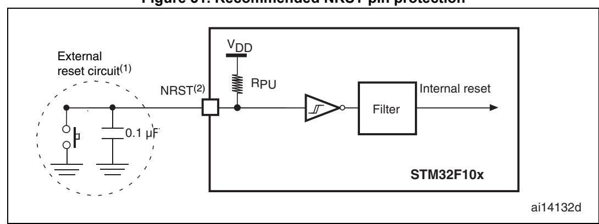

**Figure 31. Recommended NRST pin protection**

- 2. The reset network protects the device against parasitic resets.
- 3. The user must ensure that the level on the NRST pin can go below the VIL(NRST) max level specified in *[Table 38](#page-67-1)*. Otherwise the reset will not be taken into account by the device.

#### **5.3.15 TIM timer characteristics**

The parameters given in *[Table 39](#page-68-1)* are guaranteed by design.

Refer to *[Section 5.3.12: I/O current injection characteristics](#page-60-0)* for details on the input/output alternate function characteristics (output compare, input capture, external clock, PWM output).

| Symbol                                         | Parameter                       | Conditions        |        | Max           | Unit     |
|------------------------------------------------|---------------------------------|-------------------|--------|---------------|----------|
|                                                | Timer resolution time           |                   | 1      | -             | tTIMxCLK |
| tres(TIM)                                      |                                 | fTIMxCLK = 72 MHz | 13.9   | -             | ns       |
|                                                | Timer external clock            |                   | 0      | fTIMxCLK/2    | MHz      |
|                                                | fEXT frequency on CH1 to CH4 |                   | 0      | 36            | MHz      |
| ResTIM                                         | Timer resolution                |                   | -      | 16            | bit      |
|                                                | 16-bit counter clock period     |                   | 1      | 65536         | tTIMxCLK |
| tCOUNTER when internal clock is selected |                                 | fTIMxCLK = 72 MHz | 0.0139 | 910           | µs       |
|                                                |                                 |                   | -      | 65536 × 65536 | tTIMxCLK |
| tMAX_COUNT                                     | Maximum possible count          | fTIMxCLK = 72 MHz | -      | 59.6          | s        |

**Table 39. TIMx(1) characteristics** 

1. TIMx is used as a general term to refer to the TIM1, TIM2, TIM3 and TIM4 timers.

# **5.3.16 Communications interfaces**

#### **I 2 C interface characteristics**

The STM32F103xx performance line I 2 C interface meets the requirements of the standard I 2 C communication protocol with the following restrictions: the I/O pins SDA and SCL are mapped to are not "true" open-drain. When configured as open-drain, the PMOS connected between the I/O pin and VDD is disabled, but is still present.

The I2 C characteristics are described in *[Table 40](#page-69-1)*. Refer also to *[Section 5.3.12: I/O current](#page-60-0)  [injection characteristics](#page-60-0)* for more details on the input/output alternate function characteristics (SDA and SCL).

|                    |                                            |     | Standard mode I2C(1) | Fast mode I2C(1)(2) |        |      |
|--------------------|--------------------------------------------|-----|----------------------|---------------------|--------|------|
| Symbol             | Parameter                                  | Min | Max                  | Min                 | Max    | Unit |
| tw(SCLL)           | SCL clock low time                         | 4.7 | -                    | 1.3                 | -      | µs   |
| tw(SCLH)           | SCL clock high time                        | 4.0 | -                    | 0.6                 |        |      |
| tsu(SDA)           | SDA setup time                             | 250 | -                    | 100                 | -      |      |
| th(SDA)            | SDA data hold time                         | 0   | -                    | 0                   | 900(3) |      |
| tr(SDA) tr(SCL) | SDA and SCL rise time                      | -   | 1000                 | 20 + 0.1Cb          | 300    | ns   |
| tf(SDA) tf(SCL) | SDA and SCL fall time                      | -   | 300                  | -                   | 300    |      |
| th(STA)            | Start condition hold time                  | 4.0 | -                    | 0.6                 | -      |      |
| tsu(STA)           | Repeated Start condition setup time     | 4.7 | -                    | 0.6                 | -      | µs   |
| tsu(STO)           | Stop condition setup time                  | 4.0 | -                    | 0.6                 | -      | s   |
| tw(STO:STA)        | Stop to Start condition time (bus free) | 4.7 | -                    | 1.3                 | -      | s   |
| Cb                 | Capacitive load for each bus line       | -   | 400                  | -                   | 400    | pF   |

|  |  | Table 40. I2C characteristics |
|--|--|-------------------------------|
|--|--|-------------------------------|

1. Guaranteed by design, not tested in production.

2. fPCLK1 must be at least 2 MHz to achieve standard mode I2C frequencies. It must be at least 4 MHz to achieve fast mode I2C frequencies. It must be a multiple of 10 MHz to reach the 400 kHz maximum I2C fast mode clock.

3. The maximum Data hold time has only to be met if the interface does not stretch the low period of SCL signal.

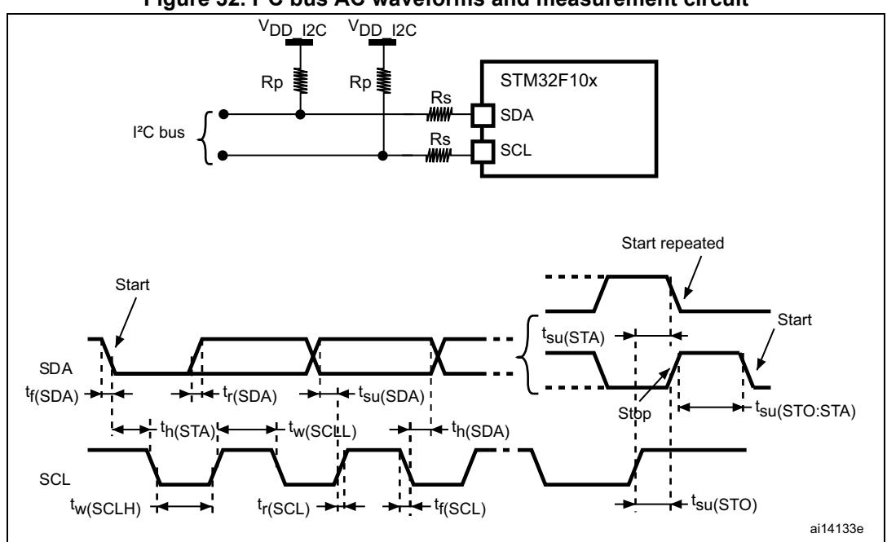

**Figure 32. I2C bus AC waveforms and measurement circuit**

1. Measurement points are done at CMOS levels: 0.3VDD and 0.7VDD.

2. Rs = Series protection resistors, Rp = Pull-up resistors, VDD\_I2C = I2C bus supply.

|            | I2C_CCR value |  |  |
|------------|---------------|--|--|
| fSCL (kHz) | RP = 4.7 k   |  |  |
| 400        | 0x801E        |  |  |
| 300        | 0x8028        |  |  |
| 200        | 0x803C        |  |  |
| 100        | 0x00B4        |  |  |
| 50         | 0x0168        |  |  |
| 20         | 0x0384        |  |  |

# **Table 41. SCL frequency (fPCLK1= 36 MHz.,VDD\_I2C = 3.3 V)(1)(2)**

1. RP = External pull-up resistance, fSCL = I2C speed,

2. For speeds around 200 kHz, the tolerance on the achieved speed is of 5%. For other speed ranges, the tolerance on the achieved speed 2%. These variations depend on the accuracy of the external components used to design the application.

#### **SPI interface characteristics**

Unless otherwise specified, the parameters given in *[Table 42](#page-71-0)* are derived from tests performed under the ambient temperature, fPCLKx frequency and VDD supply voltage conditions summarized in *[Table 9](#page-37-4)*.

Refer to *[Section 5.3.12: I/O current injection characteristics](#page-60-0)* for more details on the input/output alternate function characteristics (NSS, SCK, MOSI, MISO).

| Symbol                     | Parameter                                     | Conditions                                                      | Min    | Max    | Unit |
|----------------------------|-----------------------------------------------|-----------------------------------------------------------------|--------|--------|------|
| fSCK                       |                                               | Master mode                                                     | -      | 18     |      |
| 1/tc(SCK)                  | SPI clock frequency                           | Slave mode                                                      | -      | 18     | MHz  |
| tr(SCK) tf(SCK)         | SPI clock rise and fall time               | Capacitive load: C = 30 pF                                      | -      | 8      | ns   |
|                            | DuCy(SCK) SPI slave input clock duty cycle | Slave mode                                                      | 30     | 70     | %    |
| tsu(NSS)(1)                | NSS setup time                                | Slave mode                                                      | 4tPCLK | -      |      |
| th(NSS)(1)                 | NSS hold time                                 | Slave mode                                                      | 2tPCLK | -      |      |
| tw(SCKH)(1) tw(SCKL)(1) |                                               | SCK high and low time Master mode, fPCLK = 36 MHz, presc = 4 | 50     | 60     |      |
| tsu(MI) (1)                | Data input setup time                         | Master mode                                                     | 5      | -      |      |
| tsu(SI)(1)                 |                                               | Slave mode                                                      | 5      | -      |      |
| th(MI) (1)                 | Data input hold time                          | Master mode                                                     | 5      | -      |      |
| th(SI)(1)                  |                                               | Slave mode                                                      | 4      | -      | ns   |
| ta(SO)(1)(2)               | Data output access time                    | Slave mode, fPCLK = 20 MHz                                      | 0      | 3tPCLK |      |
| tdis(SO)(1)(3)             | Data output disable time                   | Slave mode                                                      | 2      | 10     |      |
| tv(SO) (1)                 | Data output valid time                        | Slave mode (after enable edge)                                  |        | 25     |      |
| tv(MO)(1)                  | Data output valid time                        | Master mode (after enable edge)                                 |        | 5      |      |
| th(SO)(1)                  | Data output hold time                         | Slave mode (after enable edge)                                  | 15     | -      |      |
| th(MO)(1)                  |                                               | Master mode (after enable edge)                                 | 2      | -      |      |

|  |  | Table 42. SPI characteristics |
|--|--|-------------------------------|
|--|--|-------------------------------|

1. Based on characterization, not tested in production.

2. Min time is for the minimum time to drive the output and the max time is for the maximum time to validate the data.

3. Min time is for the minimum time to invalidate the output and the max time is for the maximum time to put the data in Hi-Z

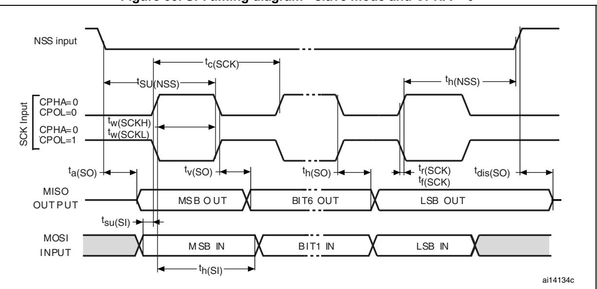

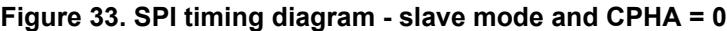

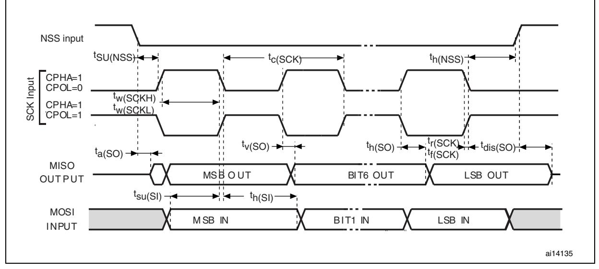

1. Measurement points are done at CMOS levels: 0.3VDD and 0.7VDD.

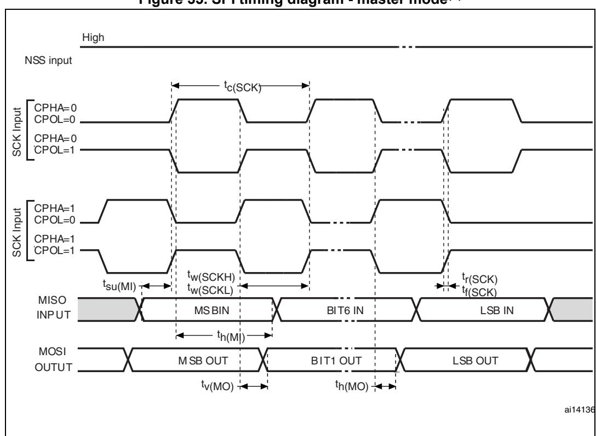

**Figure 35. SPI timing diagram - master mode(1)**

1. Measurement points are done at CMOS levels: 0.3VDD and 0.7VDD.

## **USB characteristics**

The USB interface is USB-IF certified (Full Speed).

#### **Table 43. USB startup time**

| Symbol      | Parameter                    | Max | Unit |
|-------------|------------------------------|-----|------|
| tSTARTUP(1) | USB transceiver startup time | 1   | µs   |

1. Guaranteed by design, not tested in production.

| Symbol        | Parameter                       | Conditions               | Min.(1) | Max.(1) | Unit |  |
|---------------|---------------------------------|--------------------------|---------|---------|------|--|
|               | Input levels                    |                          |         |         |      |  |
| VDD           | USB operating voltage(2)        |                          | 3.0(3)  | 3.6     | V    |  |
| VDI(4)        | Differential input sensitivity  | I(USBDP, USBDM)          | 0.2     | -       |      |  |
| (4) VCM    | Differential common mode range  | Includes VDI range       | 0.8     | 2.5     | V    |  |
| VSE(4)        | Single ended receiver threshold |                          | 1.3     | 2.0     |      |  |
| Output levels |                                 |                          |         |         |      |  |
| VOL           | Static output level low         | RL of 1.5 k to 3.6 V(5) | -       | 0.3     | V    |  |
| VOH           | Static output level high        | RL of 15 k to VSS(5)    | 2.8     | 3.6     |      |  |

**Table 44. USB DC electrical characteristics**

1. All the voltages are measured from the local ground potential.

2. To be compliant with the USB 2.0 full-speed electrical specification, the USBDP (D+) pin should be pulled up with a 1.5 k resistor to a 3.0-to-3.6 V voltage range.

3. The STM32F103xx USB functionality is ensured down to 2.7 V but not the full USB electrical characteristics which are degraded in the 2.7-to-3.0 V VDD voltage range.

4. Guaranteed by design, not tested in production.

5. RL is the load connected on the USB drivers

#### **Figure 36. USB timings: definition of data signal rise and fall time**

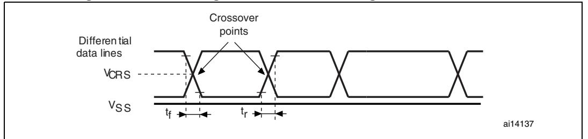

|  |  |  |  | Table 45. USB: Full-speed electrical characteristics(1) |
|--|--|--|--|---------------------------------------------------------|
|--|--|--|--|---------------------------------------------------------|

| Symbol                 | Parameter                       | Conditions | Min | Max | Unit |  |  |
|------------------------|---------------------------------|------------|-----|-----|------|--|--|
| Driver characteristics |                                 |            |     |     |      |  |  |
| tr                     | Rise time(2)                    | CL = 50 pF | 4   | 20  | ns   |  |  |
| tf                     | Fall time(2)                    | CL = 50 pF | 4   | 20  | ns   |  |  |
| trfm                   | Rise/ fall time matching        | tr/tf      | 90  | 110 | %    |  |  |
| VCRS                   | Output signal crossover voltage |            | 1.3 | 2.0 | V    |  |  |

1. Guaranteed by design, not tested in production.

2. Measured from 10% to 90% of the data signal. For more detailed informations, please refer to USB Specification - Chapter 7 (version 2.0).

# **5.3.17 CAN (controller area network) interface**

Refer to *[Section 5.3.12: I/O current injection characteristics](#page-60-0)* for more details on the input/output alternate function characteristics (CAN\_TX and CAN\_RX).

# **5.3.18 12-bit ADC characteristics**

Unless otherwise specified, the parameters given in *[Table 46](#page-75-1)* are derived from tests performed under the ambient temperature, fPCLK2 frequency and VDDA supply voltage conditions summarized in *[Table 9](#page-37-4)*.

*Note: It is recommended to perform a calibration after each power-up.*

| Symbol    | Parameter                                          | Conditions                                 | Min                                                               | Typ    | Max    | Unit   |
|-----------|----------------------------------------------------|--------------------------------------------|-------------------------------------------------------------------|--------|--------|--------|
| VDDA      | Power supply                                       |                                            | 2.4                                                               | -      | 3.6    | V      |
| VREF+     | Positive reference voltage                         |                                            | 2.4                                                               | -      | VDDA   | V      |
| IVREF     | Current on the VREF input pin                      |                                            |                                                                   | 160(1) | 220(1) | µA     |
| fADC      | ADC clock frequency                                |                                            | 0.6                                                               | -      | 14     | MHz    |
| (2) fS | Sampling rate                                      |                                            | 0.05                                                              | -      | 1      | MHz    |
|           |                                                    | fADC = 14 MHz                              | -                                                                 | -      | 823    | kHz    |
| fTRIG(2)  | External trigger frequency                         |                                            | -                                                                 | -      | 17     | 1/fADC |
| VAIN(3)   | Conversion voltage range                           |                                            | 0 (VSSA or VREF tied to ground)                                | -      | VREF+  | V      |
| RAIN(2)   | External input impedance                           | See Equation 1 and Table 47 for details | -                                                                 | -      | 50     | k     |
| RADC(2)   | Sampling switch resistance                         |                                            | -                                                                 | -      | 1      | k     |
| CADC(2)   | Internal sample and hold capacitor              |                                            | -                                                                 | -      | 8      | pF     |
|           |                                                    | fADC = 14 MHz                              | 5.9                                                               |        | µs     |        |
| tCAL(2)   | Calibration time                                   |                                            | 83                                                                |        | 1/fADC |        |
|           | Injection trigger conversion                       | fADC = 14 MHz                              | -                                                                 | -      | 0.214  | µs     |
| tlat(2)   | latency                                            |                                            | -                                                                 | -      | 3(4)   | 1/fADC |
|           | Regular trigger conversion                         | fADC = 14 MHz                              | -                                                                 | -      | 0.143  | µs     |
| tlatr(2)  | latency                                            |                                            | -                                                                 | -      | 2(4)   | 1/fADC |
| (2)       | Sampling time                                      | fADC = 14 MHz                              | 0.107                                                             | -      | 17.1   | µs     |
| tS        |                                                    |                                            | 1.5                                                               | -      | 239.5  | 1/fADC |
| tSTAB(2)  | Power-up time                                      |                                            | 0                                                                 | 0      | 1      | µs     |
|           |                                                    | fADC = 14 MHz                              | 1                                                                 | -      | 18     | µs     |
| tCONV(2)  | Total conversion time (including sampling time) |                                            | 14 to 252 (tS for sampling +12.5 for successive approximation) |        |        | 1/fADC |

#### **Table 46. ADC characteristics**

1. Based on characterization, not tested in production.

2. Guaranteed by design, not tested in production.

3. In devices delivered in VFQFPN and LQFP packages, VREF+ is internally connected to VDDA and VREF- is internally connected to VSSA. Devices that come in the TFBGA64 package have a VREF+ pin but no VREF- pin (VREF- is internally connected to VSSA), see *[Table 5](#page-27-0)* and *[Figure 7](#page-24-0)*.

4. For external triggers, a delay of 1/fPCLK2 must be added to the latency specified in *[Table 46](#page-75-1)*.

76/[105](#page-104-0) DocID13587 Rev 16

#### **Equation 1: RAIN max formula:**

$$
R_{\text{AIN}} < \frac{T_{\text{S}}}{f_{\text{ADC}} \times C_{\text{ADC}} \times \ln(2^{N+2})} - R_{\text{ADC}}
$$

The formula above (*Equation 1*) is used to determine the maximum external impedance allowed for an error below 1/4 of LSB. Here N = 12 (from 12-bit resolution).

| Ts (cycles) | tS (µs) | RAIN max (k) |
|-------------|---------|---------------|
| 1.5         | 0.11    | 0.4           |
| 7.5         | 0.54    | 5.9           |
| 13.5        | 0.96    | 11.4          |
| 28.5        | 2.04    | 25.2          |
| 41.5        | 2.96    | 37.2          |
| 55.5        | 3.96    | 50            |
| 71.5        | 5.11    | NA            |
| 239.5       | 17.1    | NA            |

| Table 47. RAIN max for fADC = 14 MHz(1) |  |
|-----------------------------------------|--|
|-----------------------------------------|--|

1. Based on characterization, not tested in production.

|  |  |  | Table 48. ADC accuracy - limited test conditions(1) (2) |
|--|--|--|---------------------------------------------------------|
|--|--|--|---------------------------------------------------------|

| Symbol | Parameter                    | Test conditions                                                                 | Typ  | Max(3) | Unit |
|--------|------------------------------|---------------------------------------------------------------------------------|------|--------|------|
| ET     | Total unadjusted error       | fPCLK2 = 56 MHz,                                                                | ±1.3 | ±2     |      |
| EO     | Offset error                 | fADC = 14 MHz, RAIN < 10 k,                                                    | ±1   | ±1.5   |      |
| EG     | Gain error                   | VDDA = 3 V to 3.6 V TA = 25 °C Measurements made after ADC calibration | ±0.5 | ±1.5   | LSB  |
| ED     | Differential linearity error |                                                                                 | ±0.7 | ±1     |      |
| EL     | Integral linearity error     |                                                                                 | ±0.8 | ±1.5   |      |

1. ADC DC accuracy values are measured after internal calibration.

2. ADC Accuracy vs. Negative Injection Current: Injecting a negative current on any analog input pins should be avoided as this significantly reduces the accuracy of the conversion being performed on another analog input. It is recommended to add a Schottky diode (pin to ground) to analog pins which may potentially inject negative currents.

Any positive injection current within the limits specified for IINJ(PIN) and IINJ(PIN) in *[Section 5.3.12](#page-60-0)* does not affect the ADC accuracy.

3. Based on characterization, not tested in production.

| Symbol | Parameter                    | Test conditions                                                                                                         | Typ  | Max(4) | Unit |  |
|--------|------------------------------|-------------------------------------------------------------------------------------------------------------------------|------|--------|------|--|
| ET     | Total unadjusted error       |                                                                                                                         | ±2   | ±5     |      |  |
| EO     | Offset error                 | fPCLK2 = 56 MHz, fADC = 14 MHz, RAIN < 10 k, VDDA = 2.4 V to 3.6 V Measurements made after ADC calibration | ±1.5 | ±2.5   |      |  |
| EG     | Gain error                   |                                                                                                                         | ±1.5 | ±3     | LSB  |  |
| ED     | Differential linearity error |                                                                                                                         | ±1   | ±2     |      |  |
| EL     | Integral linearity error     |                                                                                                                         | ±1.5 | ±3     |      |  |

**Table 49. ADC accuracy(1) (2) (3)**

1. ADC DC accuracy values are measured after internal calibration.

2. Better performance could be achieved in restricted VDD, frequency and temperature ranges.

3. ADC Accuracy vs. Negative Injection Current: Injecting negative current on any of the standard (nonrobust) analog input pins should be avoided as this significantly reduces the accuracy of the conversion being performed on another analog input. It is recommended to add a Schottky diode (pin to ground) to standard analog pins which may potentially inject negative current. Any positive injection current within the limits specified for IINJ(PIN) and IINJ(PIN) in *[Section 5.3.12](#page-60-0)* does not affect the ADC accuracy.

4. Based on characterization, not tested in production.

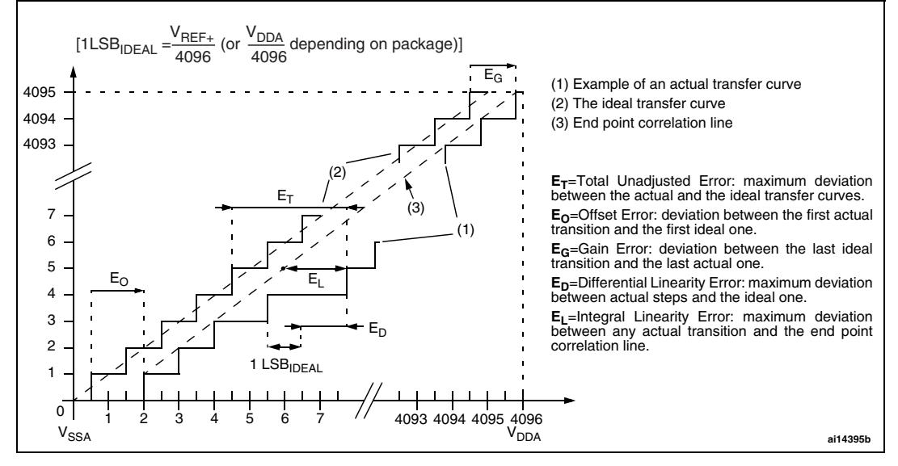

**Figure 38. Typical connection diagram using the ADC**

1. Refer to *[Table 46](#page-75-1)* for the values of RAIN, RADC and CADC.

2. Cparasitic represents the capacitance of the PCB (dependent on soldering and PCB layout quality) plus the pad capacitance (roughly 7 pF). A high Cparasitic value will downgrade conversion accuracy. To remedy this, fADC should be reduced.

#### **General PCB design guidelines**

Power supply decoupling should be performed as shown in *[Figure 39](#page-78-1)* or *[Figure 40](#page-79-2)*, depending on whether VREF+ is connected to VDDA or not. The 10 nF capacitors should be ceramic (good quality). They should be placed them as close as possible to the chip.

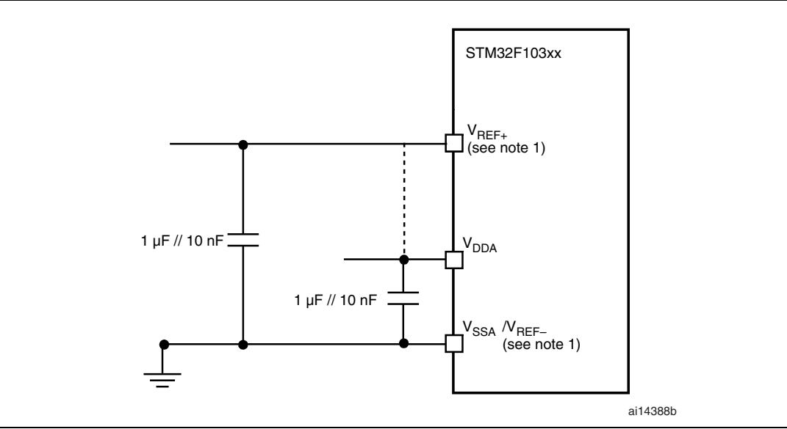

1. VREF+ and VREF– inputs are available only on 100-pin packages.

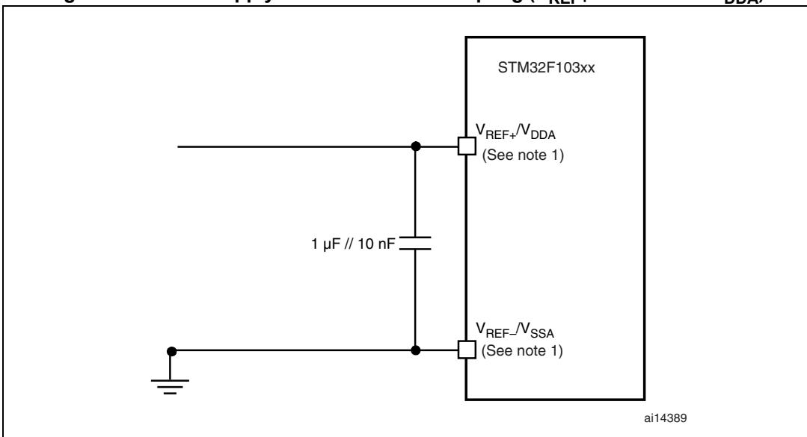

**Figure 40. Power supply and reference decoupling (VREF+ connected to VDDA)**

1. VREF+ and VREF– inputs are available only on 100-pin packages.

# **5.3.19 Temperature sensor characteristics**

#### **Table 50. TS characteristics**

| Symbol        | Parameter                                         | Min  | Typ  | Max  | Unit  |
|---------------|---------------------------------------------------|------|------|------|-------|
| (1) TL     | VSENSE linearity with temperature                 | -    | 1   | 2   | °C    |
| Avg_Slope(1)  | Average slope                                     | 4.0  | 4.3  | 4.6  | mV/°C |
| V25(1)        | Voltage at 25 °C                                  | 1.34 | 1.43 | 1.52 | V     |
| tSTART(2)     | Startup time                                      | 4    | -    | 10   | µs    |
| TS_temp(3)(2) | ADC sampling time when reading the temperature | -    | -    | 17.1 | µs    |

1. Based on characterization, not tested in production.

2. Guaranteed by design, not tested in production.

3. Shortest sampling time can be determined in the application by multiple iterations.

# **6 Package characteristics**

# **6.1 Package mechanical data**

In order to meet environmental requirements, ST offers these devices in different grades of ECOPACK® packages, depending on their level of environmental compliance. ECOPACK® specifications, grade definitions and product status are available at: *www.st.com*. ECOPACK® is an ST trademark.

**Figure 41. VFQFPN36 6 x 6 mm, 0.5 mm pitch, package outline(1)**

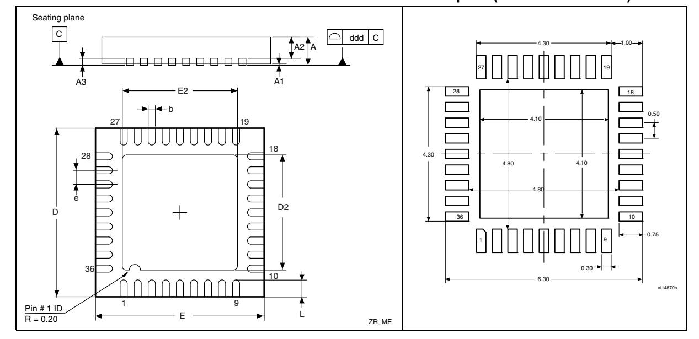

1. Drawing is not to scale.

2. All leads/pads should also be soldered to the PCB to improve the lead solder joint life.

| Symbol | millimeters |       |       | inches(1) |        |        |
|--------|-------------|-------|-------|-----------|--------|--------|
|        | Min         | Typ   | Max   | Min       | Typ    | Max    |
| A      | 0.800       | 0.900 | 1.000 | 0.0315    | 0.0354 | 0.0394 |
| A1     | -           | 0.020 | 0.050 | -         | 0.0008 | 0.0020 |
| A2     | -           | 0.650 | 1.000 | -         | 0.0256 | 0.0394 |
| A3     | -           | 0.250 | -     | -         | 0.0098 | -      |
| b      | 0.180       | 0.230 | 0.300 | 0.0071    | 0.0091 | 0.0118 |
| D      | 5.875       | 6.000 | 6.125 | 0.2313    | 0.2362 | 0.2411 |
| D2     | 1.750       | 3.700 | 4.250 | 0.0689    | 0.1457 | 0.1673 |
| E      | 5.875       | 6.000 | 6.125 | 0.2313    | 0.2362 | 0.2411 |
| E2     | 1.750       | 3.700 | 4.250 | 0.0689    | 0.1457 | 0.1673 |
| e      | 0.450       | 0.500 | 0.550 | 0.0177    | 0.0197 | 0.0217 |
| L      | 0.350       | 0.550 | 0.750 | 0.0138    | 0.0217 | 0.0295 |
| ddd    |             | 0.080 |       |           | 0.0031 |        |

#### **Table 51. VFQFPN36 6 x 6 mm, 0.5 mm pitch, package mechanical data**

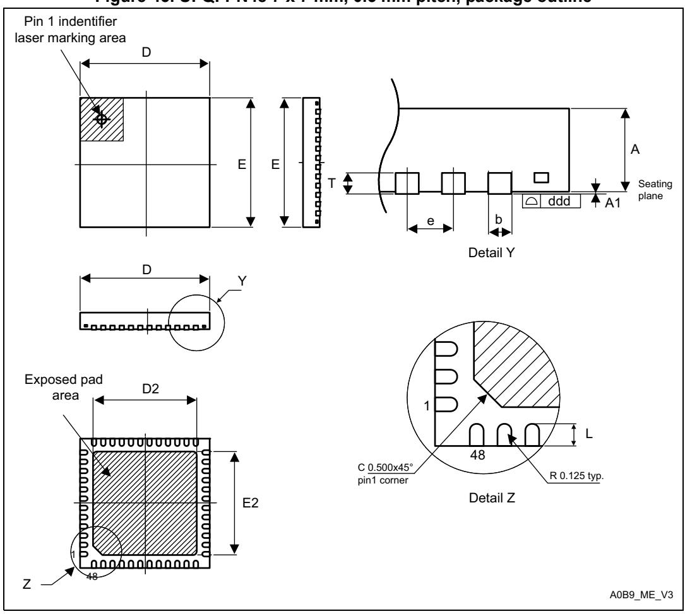

**Figure 43. UFQFPN48 7 x 7 mm, 0.5 mm pitch, package outline**

- 1. Drawing is not to scale.
- 2. There is an exposed die pad on the underside of the QFPN package, this pad is not internally connected to the VSS or VDD power pads. It is recommended to connect it to VSS.
- 3. All leads/pads should also be soldered to the PCB to improve the lead solder joint life.

|        |       | millimeters |       | inches(1) |        |        |
|--------|-------|-------------|-------|-----------|--------|--------|
| Symbol | Min   | Typ         | Max   | Min       | Typ    | Max    |
| A      | 0.500 | 0.550       | 0.600 | 0.0197    | 0.0217 | 0.0236 |
| A1     | 0.000 | 0.020       | 0.050 | 0.0000    | 0.0008 | 0.0020 |
| D      | 6.900 | 7.000       | 7.100 | 0.2717    | 0.2756 | 0.2795 |
| E      | 6.900 | 7.000       | 7.100 | 0.2717    | 0.2756 | 0.2795 |
| D2     | 5.500 | 5.600       | 5.700 | 0.2165    | 0.2205 | 0.2244 |
| E2     | 5.500 | 5.600       | 5.700 | 0.2165    | 0.2205 | 0.2244 |
| L      | 0.300 | 0.400       | 0.500 | 0.0118    | 0.0157 | 0.0197 |
| T      | -     | 0.152       | -     | -         | 0.0060 | -      |

|        |       | millimeters |       | inches(1) |        |        |  |  |
|--------|-------|-------------|-------|-----------|--------|--------|--|--|
| Symbol | Min   | Typ         | Max   | Min       | Typ    | Max    |  |  |
| b      | 0.200 | 0.250       | 0.300 | 0.0079    | 0.0098 | 0.0118 |  |  |
| e      | -     | 0.500       | -     | -         | 0.0197 | -      |  |  |
| ddd    |       | 0.080       |       |           | 0.0031 |        |  |  |

**Table 52. UFQFPN48 7 x 7 mm, 0.5 mm pitch, package mechanical data (continued)**

1. Values in inches are converted from mm and rounded to 4 decimal digits.

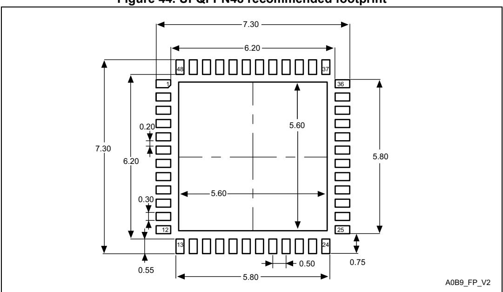

#### **Figure 44. UFQFPN48 recommended footprint**

**Figure 45. LFBGA100 - 10 x 10 mm low profile fine pitch ball grid array package outline**

1. Drawing is not to scale.

|                     | millimeters |        |        | inches(1) |        |        |
|---------------------|-------------|--------|--------|-----------|--------|--------|
| Symbol              | Min         | Typ    | Max    | Min       | Typ    | Max    |
| A                   |             |        | 1.700  |           |        | 0.0669 |
| A1                  | 0.270       |        |        | 0.0106    |        |        |
| A2                  |             | 0.300  |        |           | 0.0118 |        |
| A4                  |             |        | 0.800  |           |        | 0.0315 |
| b                   | 0.450       | 0.500  | 0.550  | 0.0177    | 0.0197 | 0.0217 |
| D                   | 9.850       | 10.000 | 10.150 | 0.3878    | 0.3937 | 0.3996 |
| D1                  |             | 7.200  |        |           | 0.2835 |        |
| E                   | 9.850       | 10.000 | 10.150 | 0.3878    | 0.3937 | 0.3996 |
| E1                  |             | 7.200  |        |           | 0.2835 |        |
| e                   |             | 0.800  |        |           | 0.0315 |        |
| F                   |             | 1.400  |        |           | 0.0551 |        |
| ddd                 |             |        | 0.120  |           |        | 0.0047 |
| eee                 |             |        | 0.150  |           |        | 0.0059 |
| fff                 |             |        | 0.080  |           |        | 0.0031 |
| N (number of balls) |             |        |        | 100       |        |        |

**Table 53. LFBGA100 - 10 x 10 mm low profile fine pitch ball grid array package mechanical data**

1. Values in inches are converted from mm and rounded to 4 decimal digits.

#### **Figure 46. Recommended PCB design rules (0.80/0.75 mm pitch BGA)**

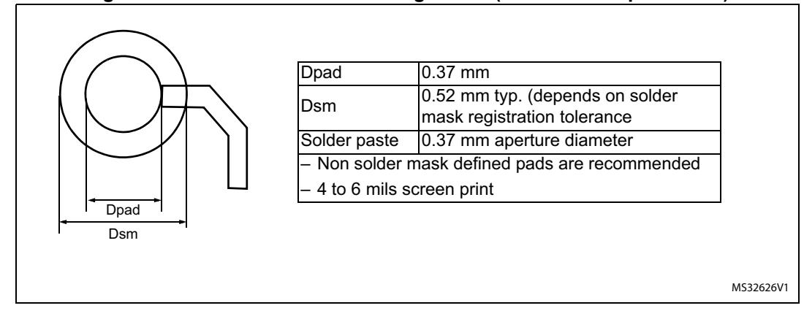

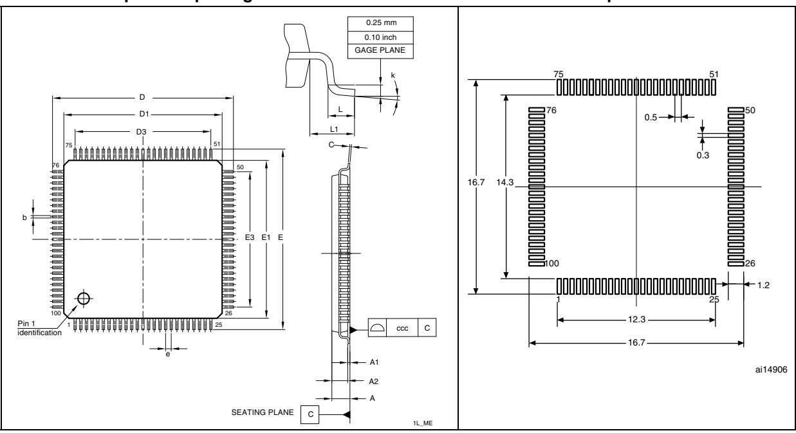

#### **Figure 47. LQFP100, 14 x 14 mm 100-pin low-profile quad flat package outline(1)**

#### **Figure 48. LQFP100 recommended footprint(1)(2)**

1. Drawing is not to scale.

2. Dimensions are in millimeters.

#### **Table 54. LQPF100, 14 x 14 mm 100-pin low-profile quad flat package mechanical data**

|        |      | millimeters |      |        | inches(1) |        |  |
|--------|------|-------------|------|--------|-----------|--------|--|
| Symbol | Min  | Typ         | Max  | Min    | Typ       | Max    |  |
| A      |      |             | 1.6  |        |           | 0.063  |  |
| A1     | 0.05 |             | 0.15 | 0.002  |           | 0.0059 |  |
| A2     | 1.35 | 1.4         | 1.45 | 0.0531 | 0.0551    | 0.0571 |  |
| b      | 0.17 | 0.22        | 0.27 | 0.0067 | 0.0087    | 0.0106 |  |
| c      | 0.09 |             | 0.2  | 0.0035 |           | 0.0079 |  |
| D      | 15.8 | 16          | 16.2 | 0.622  | 0.6299    | 0.6378 |  |
| D1     | 13.8 | 14          | 14.2 | 0.5433 | 0.5512    | 0.5591 |  |
| D3     |      | 12          |      |        | 0.4724    |        |  |
| E      | 15.8 | 16          | 16.2 | 0.622  | 0.6299    | 0.6378 |  |
| E1     | 13.8 | 14          | 14.2 | 0.5433 | 0.5512    | 0.5591 |  |
| E3     |      | 12          |      |        | 0.4724    |        |  |
| e      |      | 0.5         |      |        | 0.0197    |        |  |
| L      | 0.45 | 0.6         | 0.75 | 0.0177 | 0.0236    | 0.0295 |  |
| L1     |      | 1           |      |        | 0.0394    |        |  |
| k      | 0.0° | 3.5°        | 7.0° | 0.0°   | 3.5°      | 7.0°   |  |
| ccc    |      | 0.08        |      |        | 0.0031    |        |  |

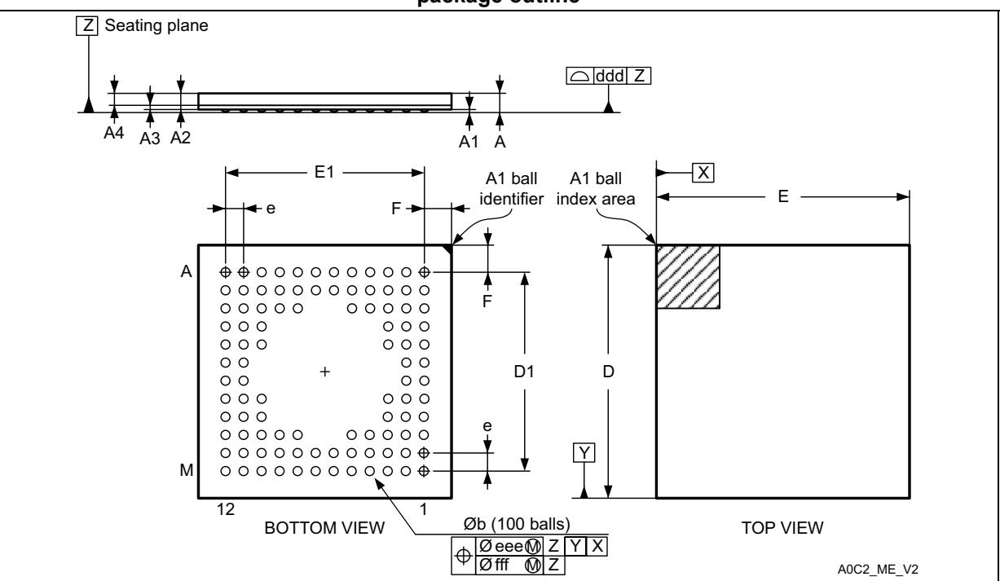

**Figure 49. UFBGA100 - ultra fine pitch ball grid array, 7 x 7 mm, 0.50 mm pitch, package outline**

1. Drawing is not to scale.

#### **Table 55. UFBGA100 - ultra fine pitch ball grid array, 7 x 7 mm, 0.50 mm pitch, package mechanical data**

|        |       | millimeters |       |        | inches(1) |        |  |
|--------|-------|-------------|-------|--------|-----------|--------|--|
| Symbol | Min   | Typ         | Max   | Min    | Typ       | Max    |  |
| A      | 0.460 | 0.530       | 0.600 | 0.0181 | 0.0209    | 0.0236 |  |
| A1     | 0.050 | 0.080       | 0.110 | 0.0020 | 0.0031    | 0.0043 |  |
| A2     | 0.400 | 0.450       | 0.500 | 0.0157 | 0.0177    | 0.0197 |  |
| A3     | 0.080 | 0.130       | 0.180 | 0.0031 | 0.0051    | 0.0071 |  |
| A4     | 0.270 | 0.320       | 0.370 | 0.0106 | 0.0126    | 0.0146 |  |
| b      | 0.200 | 0.250       | 0.300 | 0.0079 | 0.0098    | 0.0118 |  |
| D      | 6.950 | 7.000       | 7.050 | 0.2736 | 0.2756    | 0.2776 |  |
| D1     | 5.450 | 5.500       | 5.550 | 0.2146 | 0.2165    | 0.2185 |  |
| E      | 6.950 | 7.000       | 7.050 | 0.2736 | 0.2756    | 0.2776 |  |
| E1     | 5.450 | 5.500       | 5.550 | 0.2146 | 0.2165    | 0.2185 |  |
| e      |       | 0.500       |       |        | 0.0197    |        |  |
| F      | 0.700 | 0.750       | 0.800 | 0.0276 | 0.0295    | 0.0315 |  |
| ddd    |       |             | 0.100 |        |           | 0.0039 |  |
| eee    |       |             | 0.150 |        |           | 0.0059 |  |
| fff    |       |             | 0.050 |        |           | 0.0020 |  |

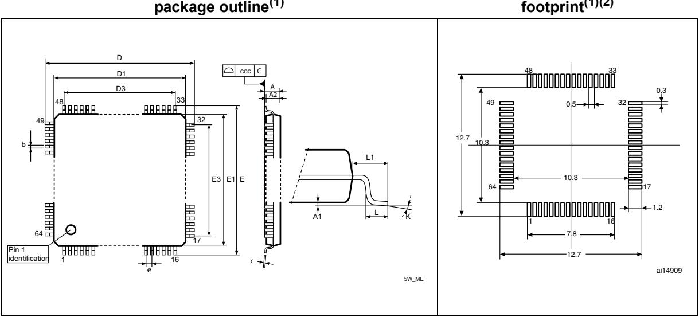

#### **Figure 50. LQFP64, 10 x 10 mm, 64-pin low-profile quad flat package outline(1) Figure 51. LQFP64 recommended footprint(1)(2)**

1. Drawing is not to scale.

2. Dimensions are in millimeters.

#### **Table 56. LQFP64, 10 x 10 mm, 64-pin low-profile quad flat package mechanical data**

|        |      | millimeters |      | inches(1)      |        |        |  |  |  |
|--------|------|-------------|------|----------------|--------|--------|--|--|--|
| Symbol | Min  | Typ         | Max  | Min            | Typ    | Max    |  |  |  |
| A      | -    | -           | 1.60 | -              | -      | 0.0630 |  |  |  |
| A1     | 0.05 | -           | 0.15 | 0.0020         | -      | 0.0059 |  |  |  |
| A2     | 1.35 | 1.40        | 1.45 | 0.0531         | 0.0551 | 0.0571 |  |  |  |
| b      | 0.17 | 0.22        | 0.27 | 0.0067         | 0.0087 | 0.0106 |  |  |  |
| c      | 0.09 | -           | 0.20 | 0.0035         | -      | 0.0079 |  |  |  |
| D      | -    | 12.00       | -    | -              | 0.4724 | -      |  |  |  |
| D1     | -    | 10.00       | -    | -              | 0.3937 | -      |  |  |  |
| E      | -    | 12.00       | -    | -              | 0.4724 | -      |  |  |  |
| E1     | -    | 10.00       | -    | -              | 0.3937 | -      |  |  |  |
| e      | -    | 0.50        | -    | -              | 0.0197 | -      |  |  |  |
|       | 0°   | 3.5°        | 7°   | 0°             | 3.5°   | 7°     |  |  |  |
| L      | 0.45 | 0.60        | 0.75 | 0.0177         | 0.0236 | 0.0295 |  |  |  |
| L1     | -    | 1.00        | -    | -              | 0.0394 | -      |  |  |  |
| N      |      |             |      | Number of pins |        |        |  |  |  |
|        | 64   |             |      |                |        |        |  |  |  |

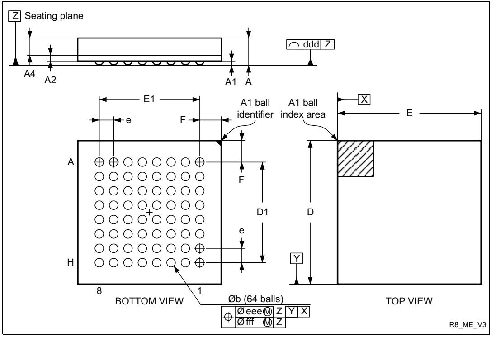

**Figure 52. TFBGA64 - 8 x 8 active ball array, 5 x 5 mm, 0.5 mm pitch, package outline**

1. Drawing is not to scale.

|        | millimeters |       |       | inches(1) |        |        |
|--------|-------------|-------|-------|-----------|--------|--------|
| Symbol | Min         | Typ   | Max   | Min       | Typ    | Max    |
| A      | -           | -     | 1.200 | -         | -      | 0.0472 |
| A1     | 0.150       | -     | -     | 0.0059    | -      | -      |
| A2     | -           | 0.200 | -     | -         | 0.0079 | -      |
| A4     | -           | -     | 0.600 | -         | -      | 0.0236 |
| b      | 0.250       | 0.300 | 0.350 | 0.0098    | 0.0118 | 0.0138 |
| D      | 4.850       | 5.000 | 5.150 | 0.1909    | 0.1969 | 0.2028 |
| D1     | -           | 3.500 | -     | -         | 0.1378 | -      |
| E      | 4.850       | 5.000 | 5.150 | 0.1909    | 0.1969 | 0.2028 |
| E1     | -           | 3.500 | -     | -         | 0.1378 | -      |
| e      | -           | 0.500 | -     | -         | 0.0197 | -      |
| F      | -           | 0.750 | -     | -         | 0.0295 | -      |
| ddd    | -           | -     | 0.080 | -         | -      | 0.0031 |
| eee    | -           | -     | 0.150 | -         | -      | 0.0059 |
| fff    | -           | -     | 0.050 | -         | -      | 0.0020 |

| Table 57. TFBGA64 - 8 x 8 active ball array, 5 x 5 mm, 0.5 mm pitch, package |
|------------------------------------------------------------------------------|
| mechanical data                                                              |

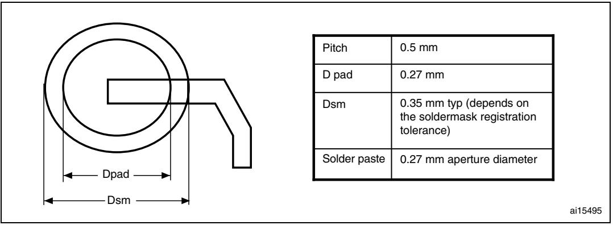

1. Non solder mask defined (NSMD) pads are recommended

2. 4 to 6 mils solder paste screen printing process

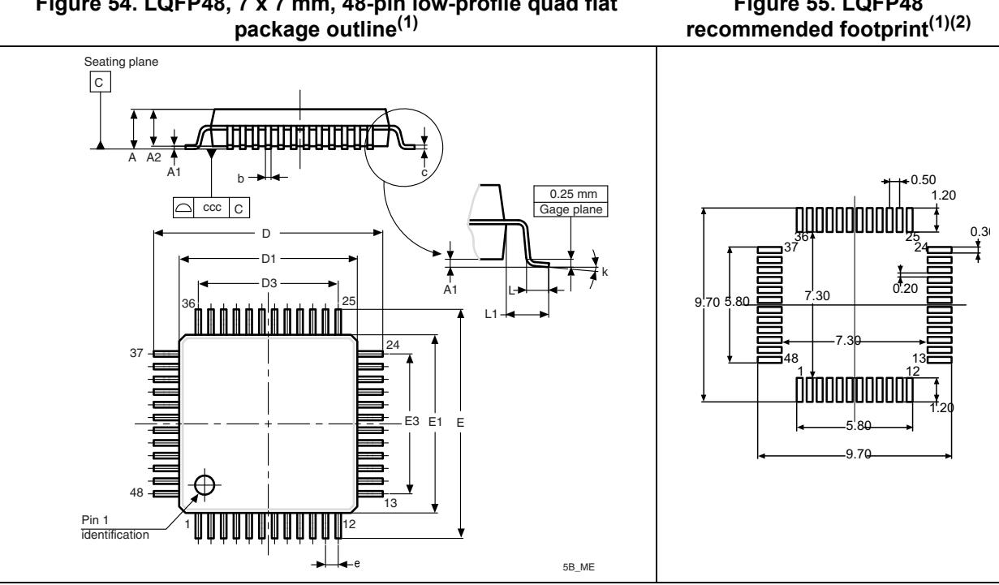

**Figure 54. LQFP48, 7 x 7 mm, 48-pin low-profile quad flat** 

**Figure 55. LQFP48** 

1. Drawing is not to scale.

2. Dimensions are in millimeters.

#### **Table 58. LQFP48, 7 x 7 mm, 48-pin low-profile quad flat package mechanical data**

|        | millimeters |       |       | inches(1) |        |        |
|--------|-------------|-------|-------|-----------|--------|--------|
| Symbol | Min         | Typ   | Max   | Min       | Typ    | Max    |
| A      | -           | -     | 1.600 | -         | -      | 0.0630 |
| A1     | 0.050       | -     | 0.150 | 0.0020    | -      | 0.0059 |
| A2     | 1.350       | 1.400 | 1.450 | 0.0531    | 0.0551 | 0.0571 |
| b      | 0.170       | 0.220 | 0.270 | 0.0067    | 0.0087 | 0.0106 |
| c      | 0.090       | -     | 0.200 | 0.0035    | -      | 0.0079 |
| D      | 8.800       | 9.000 | 9.200 | 0.3465    | 0.3543 | 0.3622 |
| D1     | 6.800       | 7.000 | 7.200 | 0.2677    | 0.2756 | 0.2835 |
| D3     | -           | 5.500 | -     | -         | 0.2165 | -      |
| E      | 8.800       | 9.000 | 9.200 | 0.3465    | 0.3543 | 0.3622 |
| E1     | 6.800       | 7.000 | 7.200 | 0.2677    | 0.2756 | 0.2835 |
| E3     | -           | 5.500 | -     | -         | 0.2165 | -      |
| e      | -           | 0.500 | -     | -         | 0.0197 | -      |
| L      | 0.450       | 0.600 | 0.750 | 0.0177    | 0.0236 | 0.0295 |
| L1     | -           | 1.000 | -     | -         | 0.0394 | -      |
| k      | 0°          | 3.5°  | 7°    | 0°        | 3.5°   | 7°     |
| ccc    |             | 0.080 |       |           | 0.0031 |        |

# **6.2 Thermal characteristics**

The maximum chip junction temperature (TJmax) must never exceed the values given in *[Table 9: General operating conditions on page 38](#page-37-4)*.

The maximum chip-junction temperature, TJ max, in degrees Celsius, may be calculated using the following equation:

$$
T_J
$$
 max =  $T_A$  max + ( $P_D$  max ×  $\Theta_{JA}$ )

Where:

- TA max is the maximum ambient temperature in C,
- JA is the package junction-to-ambient thermal resistance, in C/W,
- PD max is the sum of PINT max and PI/O max (PD max = PINT max + PI/Omax),
- PINT max is the product of IDD and VDD, expressed in Watts. This is the maximum chip internal power.

PI/O max represents the maximum power dissipation on output pins where:

PI/O max = (VOL × IOL) + ((VDD – VOH) × IOH),

taking into account the actual VOL / IOL and VOH / IOH of the I/Os at low and high level in the application.

| Symbol | Parameter                                                                   | Value | Unit |
|--------|-----------------------------------------------------------------------------|-------|------|
|        | Thermal resistance junction-ambient LFBGA100 - 10 × 10 mm / 0.8 mm pitch | 44    |      |
|        | Thermal resistance junction-ambient LQFP100 - 14 × 14 mm / 0.5 mm pitch  | 46    |      |
|        | Thermal resistance junction-ambient UFBGA100 - 7 × 7 mm /0.5 mm pitch    | 59    |      |
|        | Thermal resistance junction-ambient LQFP64 - 10 × 10 mm / 0.5 mm pitch   | 45    | °C/W |
| JA    | Thermal resistance junction-ambient TFBGA64 - 5 × 5 mm / 0.5 mm pitch    | 65    |      |
|        | Thermal resistance junction-ambient LQFP48 - 7 x 7 mm / 0.5 mm pitch     | 55    |      |
|        | Thermal resistance junction-ambient UFQFPN 48 - 7 × 7 mm / 0.5 mm pitch  | 32    |      |
|        | Thermal resistance junction-ambient VFQFPN 36 - 6 × 6 mm / 0.5 mm pitch  | 18    |      |

**Table 59. Package thermal characteristics**

## **6.2.1 Reference document**

JESD51-2 Integrated Circuits Thermal Test Method Environment Conditions - Natural Convection (Still Air). Available from www.jedec.org.

# **6.2.2 Selecting the product temperature range**

When ordering the microcontroller, the temperature range is specified in the ordering information scheme shown in *[Table 60: Ordering information scheme](#page-95-1)*.

Each temperature range suffix corresponds to a specific guaranteed ambient temperature at maximum dissipation and, to a specific maximum junction temperature.

As applications do not commonly use the STM32F103xx at maximum dissipation, it is useful to calculate the exact power consumption and junction temperature to determine which temperature range will be best suited to the application.

The following examples show how to calculate the temperature range needed for a given application.

#### **Example 1: High-performance application**

Assuming the following application conditions:

Maximum ambient temperature TAmax = 82 °C (measured according to JESD51-2), IDDmax = 50 mA, VDD = 3.5 V, maximum 20 I/Os used at the same time in output at low level with IOL = 8 mA, VOL= 0.4 V and maximum 8 I/Os used at the same time in output at low level with IOL = 20 mA, VOL= 1.3 V

PINTmax = 50 mA × 3.5 V= 175 mW

PIOmax = 20 × 8 mA × 0.4 V + 8 × 20 mA × 1.3 V = 272 mW

This gives: PINTmax = 175 mW and PIOmax = 272 mW:

$$
P_{Dmax} = 175 + 272 = 447
$$
 mW

Thus: PDmax = 447 mW

Using the values obtained in *[Table 59](#page-92-2)* TJmax is calculated as follows:

– For LQFP100, 46 °C/W

TJmax = 82 °C + (46 °C/W × 447 mW) = 82 °C + 20.6 °C = 102.6 °C

This is within the range of the suffix 6 version parts (–40 < TJ < 105 °C).

In this case, parts must be ordered at least with the temperature range suffix 6 (see *[Table 60: Ordering information scheme](#page-95-1)*).

#### **Example 2: High-temperature application**

Using the same rules, it is possible to address applications that run at high ambient temperatures with a low dissipation, as long as junction temperature TJ remains within the specified range.

Assuming the following application conditions:

Maximum ambient temperature TAmax = 115 °C (measured according to JESD51-2), IDDmax = 20 mA, VDD = 3.5 V, maximum 20 I/Os used at the same time in output at low level with IOL = 8 mA, VOL= 0.4 V PINTmax = 20 mA × 3.5 V= 70 mW PIOmax = 20 × 8 mA × 0.4 V = 64 mW This gives: PINTmax = 70 mW and PIOmax = 64 mW: PDmax = 70 + 64 = 134 mW Thus: PDmax = 134 mW

Using the values obtained in *[Table 59](#page-92-2)* TJmax is calculated as follows:

- For LQFP100, 46 °C/W
- TJmax = 115 °C + (46 °C/W × 134 mW) = 115 °C + 6.2 °C = 121.2 °C

This is within the range of the suffix 7 version parts (–40 < TJ < 125 °C).

In this case, parts must be ordered at least with the temperature range suffix 7 (see *[Table 60: Ordering information scheme](#page-95-1)*).

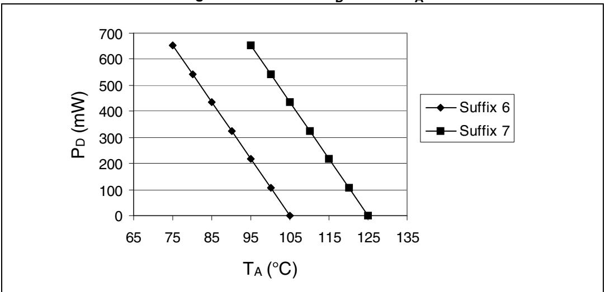

# **7 Ordering information scheme**

#### **Table 60. Ordering information scheme**

| Example:                                         | STM32 F 103 C 8 T 7 xxx |
|--------------------------------------------------|----------------------------------------|
| Device family                                    |                                        |
| STM32 = ARM-based 32-bit microcontroller         |                                        |
| Product type                                     |                                        |
| F = general-purpose                              |                                        |
| Device subfamily                                 |                                        |
| 103 = performance line                           |                                        |
| Pin count                                        |                                        |
| T = 36 pins                                      |                                        |
| C = 48 pins                                      |                                        |
| R = 64 pins                                      |                                        |
| V = 100 pins                                     |                                        |
| Flash memory size(1)                             |                                        |
| 8 = 64 Kbytes of Flash memory                    |                                        |
| B = 128 Kbytes of Flash memory                   |                                        |
| Package                                          |                                        |
| H = BGA                                          |                                        |
| I = UFBGA                                        |                                        |
| T = LQFP                                         |                                        |
| U = VFQFPN or UFQFPN                             |                                        |
| Temperature range                                |                                        |
| 6 = Industrial temperature range, –40 to 85 °C.  |                                        |
| 7 = Industrial temperature range, –40 to 105 °C. |                                        |
| Options                                          |                                        |

xxx = programmed parts

TR = tape and real

1. Although STM32F103x6 devices are not described in this datasheet, orderable part numbers that do not show the A internal code after temperature range code 6 or 7 should be referred to this datasheet for the electrical characteristics. The low-density datasheet only covers STM32F103x6 devices that feature the A code.

For a list of available options (speed, package, etc.) or for further information on any aspect of this device, please contact your nearest ST sales office.

# **8 Revision history**

| Date        | Revision | Changes                                                                                                                                                                                                                                                                                                                                                                                                                                                                                                                                                                                                                                                                                                                                                                                                                                                                                                                                                                                                                                                                                                                                                                                                                                                                                                                                                                                                                                                                                                                                                                                                                                                                                                                                               |
|-------------|----------|-------------------------------------------------------------------------------------------------------------------------------------------------------------------------------------------------------------------------------------------------------------------------------------------------------------------------------------------------------------------------------------------------------------------------------------------------------------------------------------------------------------------------------------------------------------------------------------------------------------------------------------------------------------------------------------------------------------------------------------------------------------------------------------------------------------------------------------------------------------------------------------------------------------------------------------------------------------------------------------------------------------------------------------------------------------------------------------------------------------------------------------------------------------------------------------------------------------------------------------------------------------------------------------------------------------------------------------------------------------------------------------------------------------------------------------------------------------------------------------------------------------------------------------------------------------------------------------------------------------------------------------------------------------------------------------------------------------------------------------------------------|
| 01-jun-2007 | 1        | Initial release.                                                                                                                                                                                                                                                                                                                                                                                                                                                                                                                                                                                                                                                                                                                                                                                                                                                                                                                                                                                                                                                                                                                                                                                                                                                                                                                                                                                                                                                                                                                                                                                                                                                                                                                                      |
| 20-Jul-2007 | 2        | Flash memory size modified in Note 9, Note 5, Note 7, Note 7 and BGA100 pins added to Table 5: Medium-density STM32F103xx pin definitions. Figure 3: STM32F103xx performance line LFBGA100 ballout added. THSE changed to TLSE in Figure 23: Low-speed external clock source AC timing diagram. VBAT ranged modified in Power supply schemes. tSU(LSE) changed to tSU(HSE) in Table 22: HSE 4-16 MHz oscillator characteristics. IDD(HSI) max value added to Table 24: HSI oscillator characteristics. Sample size modified and machine model removed in Electrostatic discharge (ESD). Number of parts modified and standard reference updated in Static latch-up. 25 °C and 85 °C conditions removed and class name modified in Table 33: Electrical sensitivities. RPU and RPD min and max values added to Table 35: I/O static characteristics. RPU min and max values added to Table 38: NRST pin characteristics. Figure 32: I2C bus AC waveforms and measurement circuit and Figure 31: Recommended NRST pin protection corrected. Notes removed below Table 9, Table 38, Table 44. IDD typical values changed in Table 11: Maximum current consumption in Run and Sleep modes. Table 39: TIMx characteristics modified. tSTAB, VREF+ value, tlat and fTRIG added to Table 46: ADC characteristics. In Table 29: Flash memory endurance and data retention, typical endurance and data retention for TA = 85 °C added, data retention for TA = 25 °C removed. VBG changed to VREFINT in Table 12: Embedded internal reference voltage. Document title changed. Controller area network (CAN) section modified. Figure 14: Power supply scheme modified. |
|             |          | Features on page 1 list optimized. Small text changes.                                                                                                                                                                                                                                                                                                                                                                                                                                                                                                                                                                                                                                                                                                                                                                                                                                                                                                                                                                                                                                                                                                                                                                                                                                                                                                                                                                                                                                                                                                                                                                                                                                                                                                |

|  | Table 61. Document revision history |  |
|--|-------------------------------------|--|
|--|-------------------------------------|--|

| Date        | Revision | Changes                                                                                                                                                                                                                                                                                                                                                                                                                                                                                                                                                                                                                                                                                                                                                                                                                                                                                                                                                                                                                                                                                                                                                                                                                                                                                                                                                                                                                                                                                                                                                                                                                                                                                                                                                                                                                                                                                                                                                                                                                                                                                                                                                                                                                                                                                                                                                                                                                                                                                                                                                                                                                                                                                                                                                                                                                                                                                                                                                                                                                                                                                                                                              |
|-------------|----------|------------------------------------------------------------------------------------------------------------------------------------------------------------------------------------------------------------------------------------------------------------------------------------------------------------------------------------------------------------------------------------------------------------------------------------------------------------------------------------------------------------------------------------------------------------------------------------------------------------------------------------------------------------------------------------------------------------------------------------------------------------------------------------------------------------------------------------------------------------------------------------------------------------------------------------------------------------------------------------------------------------------------------------------------------------------------------------------------------------------------------------------------------------------------------------------------------------------------------------------------------------------------------------------------------------------------------------------------------------------------------------------------------------------------------------------------------------------------------------------------------------------------------------------------------------------------------------------------------------------------------------------------------------------------------------------------------------------------------------------------------------------------------------------------------------------------------------------------------------------------------------------------------------------------------------------------------------------------------------------------------------------------------------------------------------------------------------------------------------------------------------------------------------------------------------------------------------------------------------------------------------------------------------------------------------------------------------------------------------------------------------------------------------------------------------------------------------------------------------------------------------------------------------------------------------------------------------------------------------------------------------------------------------------------------------------------------------------------------------------------------------------------------------------------------------------------------------------------------------------------------------------------------------------------------------------------------------------------------------------------------------------------------------------------------------------------------------------------------------------------------------------------------|
| 18-Oct-2007 | 3        | STM32F103CBT6, STM32F103T6 and STM32F103T8 root part numbers added (see Table 2: STM32F103xx medium-density device features and peripheral counts) VFQFPN36 package added (see Section 6: Package characteristics). All packages are ECOPACK® compliant. Package mechanical data inch values are calculated from mm and rounded to 4 decimal digits (see Section 6: Package characteristics). Table 5: Medium-density STM32F103xx pin definitions updated and clarified. Table 26: Low-power mode wakeup timings updated. TA min corrected in Table 12: Embedded internal reference voltage. Note 2 added below Table 22: HSE 4-16 MHz oscillator characteristics. VESD(CDM) value added to Table 32: ESD absolute maximum ratings. Note 4 added and VOH parameter description modified in Table 36: Output voltage characteristics. Note 1 modified under Table 37: I/O AC characteristics. Equation 1 and Table 47: RAIN max for fADC = 14 MHz added to Section 5.3.18: 12-bit ADC characteristics. VAIN, tS max, tCONV, VREF+ min and tlat max modified, notes modified and tlatr added in Table 46: ADC characteristics. Figure 37: ADC accuracy characteristics updated. Note 1 modified below Figure 38: Typical connection diagram using the ADC. Electrostatic discharge (ESD) on page 60 modified. Number of TIM4 channels modified in Figure 1: STM32F103xx performance line block diagram. Maximum current consumption Table 13, Table 14 and Table 15 updated. Vhysmodified in Table 35: I/O static characteristics. Table 49: ADC accuracy updated. tVDD modified in Table 10: Operating conditions at power-up / power-down. VFESD value added in Table 30: EMS characteristics. Values corrected, note 2 modified and note 3 removed in Table 26: Low power mode wakeup timings. Table 16: Typical and maximum current consumptions in Stop and Standby modes: Typical values added for VDD/VBAT = 2.4 V, Note 2 modified, Note 2 added. Table 21: Typical current consumption in Standby mode added. On-chip peripheral current consumption on page 50 added. ACCHSI values updated in Table 24: HSI oscillator characteristics. Vprog added to Table 28: Flash memory characteristics. Upper option byte address modified in Figure 11: Memory map. Typical fLSI value added in Table 25: LSI oscillator characteristics and internal RC value corrected from 32 to 40 kHz in entire document. TS_temp added to Table 50: TS characteristics. NEND modified in Table 29: Flash memory endurance and data retention. TS_vrefint added to Table 12: Embedded internal reference voltage. Handling of unused pins specified in General input/output characteristics on page 62. All I/Os are CMOS and TTL compliant. Figure 39: Power supply and reference decoupling (VREF+ not connected to VDDA) modified. tJITTER and fVCO removed from Table 27: PLL characteristics. Appendix A: Important notes on page 81 added. Added Figure 16, Figure 17, Figure 19 and Figure 21. |

**Table 61. Document revision history (continued)**

| Date        | Revision | Changes                                                                                                                                                                                                                                                                                                                                                                                                                                                                                                                                                                                                                                                                                                                                                                                                                                                                                                                                                                                                                                                                                                                                                                                                                                                                                                                                                                                                                                                                                                                                                                                                                                                                                                                                                                                                                                                                                                                                                                                                                                                                                                                                                                                                                                                                                                                                                                                                                                                                                                                                                                                                                                                                                                                                                                                                                                                                                                                                                                                                                                                                                                                                                                                                                              |
|-------------|----------|--------------------------------------------------------------------------------------------------------------------------------------------------------------------------------------------------------------------------------------------------------------------------------------------------------------------------------------------------------------------------------------------------------------------------------------------------------------------------------------------------------------------------------------------------------------------------------------------------------------------------------------------------------------------------------------------------------------------------------------------------------------------------------------------------------------------------------------------------------------------------------------------------------------------------------------------------------------------------------------------------------------------------------------------------------------------------------------------------------------------------------------------------------------------------------------------------------------------------------------------------------------------------------------------------------------------------------------------------------------------------------------------------------------------------------------------------------------------------------------------------------------------------------------------------------------------------------------------------------------------------------------------------------------------------------------------------------------------------------------------------------------------------------------------------------------------------------------------------------------------------------------------------------------------------------------------------------------------------------------------------------------------------------------------------------------------------------------------------------------------------------------------------------------------------------------------------------------------------------------------------------------------------------------------------------------------------------------------------------------------------------------------------------------------------------------------------------------------------------------------------------------------------------------------------------------------------------------------------------------------------------------------------------------------------------------------------------------------------------------------------------------------------------------------------------------------------------------------------------------------------------------------------------------------------------------------------------------------------------------------------------------------------------------------------------------------------------------------------------------------------------------------------------------------------------------------------------------------------------------|
| 22-Nov-2007 | 4        | Document status promoted from preliminary data to datasheet. The STM32F103xx is USB certified. Small text changes. Power supply schemes on page 15 modified. Number of communication peripherals corrected for STM32F103Tx and number of GPIOs corrected for LQFP package in Table 2: STM32F103xx medium-density device features and peripheral counts. Main function and default alternate function modified for PC14 and PC15 in, Note 6 added and Remap column added in Table 5: Medium-density STM32F103xx pin definitions. VDD–VSS ratings and Note 1 modified in Table 6: Voltage characteristics, Note 1 modified in Table 7: Current characteristics. Note 1 and Note 2 added in Table 11: Embedded reset and power control block characteristics. IDD value at 72 MHz with peripherals enabled modified in Table 14: Maximum current consumption in Run mode, code with data processing running from RAM. IDD value at 72 MHz with peripherals enabled modified in Table 15: Maximum current consumption in Sleep mode, code running from Flash or RAM on page 44. IDD_VBAT typical value at 2.4 V modified and IDD_VBAT maximum values added in Table 16: Typical and maximum current consumptions in Stop and Standby modes. Note added in Table 17 on page 48 and Table 18 on page 49. ADC1 and ADC2 consumption and notes modified in Table 19: Peripheral current consumption. tSU(HSE) and tSU(LSE) conditions modified in Table 22 and Table 23, respectively. Maximum values removed from Table 26: Low-power mode wakeup timings. tRET conditions modified in Table 29: Flash memory endurance and data retention. Figure 14: Power supply scheme corrected. Figure 20: Typical current consumption in Stop mode with regulator in Low-power mode versus temperature at VDD = 3.3 V and 3.6 V added. Note removed below Figure 33: SPI timing diagram - slave mode and CPHA = 0. Note added below Figure 34: SPI timing diagram - slave mode and CPHA = 1(1). Details on unused pins removed from General input/output characteristics on page 62. Table 42: SPI characteristics updated. Table 43: USB startup time added. VAIN, tlat and tlatr modified, note added and Ilkg removed in Table 46: ADC characteristics. Test conditions modified and note added in Table 49: ADC accuracy. Note added below Table 47 and Table 50. Inch values corrected in Table 54: LQPF100, 14 x 14 mm 100-pin low profile quad flat package mechanical data, Table 56: LQFP64, 10 x 10 mm, 64-pin low-profile quad flat package mechanical data and Table 58: LQFP48, 7 x 7 mm, 48-pin low-profile quad flat package mechanical data. JAvalue for VFQFPN36 package added in Table 59: Package thermal characteristics Order codes replaced by Section 7: Ordering information scheme. MCU 's operating conditions modified in Typical current consumption on page 47. Avg_Slope and V25 modified in Table 50: TS characteristics. I2C interface characteristics on page 70 modified. Impedance size specified in A.4: Voltage glitch on ADC input 0 on page 81. |

|  |  | Table 61. Document revision history (continued) |
|--|--|-------------------------------------------------|
|  |  |                                                 |

| Date        | Revision | Changes                                                                                                                                       |
|-------------|----------|-----------------------------------------------------------------------------------------------------------------------------------------------|
|             |          | Figure 2: Clock tree on page 12 added.                                                                                                        |
|             |          | Maximum TJ value given in Table 8: Thermal characteristics on page 38.                                                                        |
|             |          | CRC feature added (see CRC (cyclic redundancy check) calculation unit on page 9 and Figure 11: Memory map on page 34 for address).         |
|             |          | IDD modified in Table 16: Typical and maximum current consumptions in Stop and Standby modes.                                              |
|             |          | ACCHSI modified in Table 24: HSI oscillator characteristics on page 55, note 2 removed.                                                    |
|             |          | PD, TA and TJ added, tprog values modified and tprog description clarified in Table 28: Flash memory characteristics on page 57.           |
|             |          | tRET modified in Table 29: Flash memory endurance and data retention.                                                                         |
| 14-Mar-2008 | 5        | VNF(NRST) unit corrected in Table 38: NRST pin characteristics on page 68.                                                                 |
|             |          | Table 42: SPI characteristics on page 72 modified.                                                                                            |
|             |          | IVREF added to Table 46: ADC characteristics on page 76.                                                                                      |
|             |          | Table 48: ADC accuracy - limited test conditions added. Table 49: ADC accuracy modified.                                                   |
|             |          | LQFP100 package specifications updated (see Section 6: Package characteristics on page 81).                                                |
|             |          | Recommended LQFP100, LQFP 64, LQFP48 and VFQFPN36 footprints added (see Figure 48, Figure 51, Figure 55 and Figure 42).                    |
|             |          | Section 6.2: Thermal characteristics on page 93 modified, Section 6.2.1 and Section 6.2.2 added.                                           |
|             |          | Appendix A: Important notes on page 81 removed.                                                                                               |
|             |          | Small text changes. Figure 11: Memory map clarified.                                                                                          |
|             |          | In Table 29: Flash memory endurance and data retention:                                                                                       |
|             |          | – NEND tested over the whole temperature range                                                                                                |
| 21-Mar-2008 | 6        | – cycling conditions specified for tRET                                                                                                       |
|             |          | – tRET min modified at TA = 55 °C                                                                                                             |
|             |          | V25, Avg_Slope and TL modified in Table 50: TS characteristics. CRC feature removed.                                                       |
|             |          | CRC feature added back. Small text changes. Section 1: Introduction modified. Section 2.2: Full compatibility throughout the family added. |
|             |          | IDD at TA max = 105 °C added to Table 16: Typical and maximum current consumptions in Stop and Standby modes on page 45.                   |
|             |          | IDD_VBAT removed from Table 21: Typical current consumption in Standby mode on page 47.                                                    |
| 22-May-2008 | 7        | Values added to Table 41: SCL frequency (fPCLK1= 36 MHz.,VDD_I2C = 3.3 V) on page 71.                                                      |
|             |          | Figure 33: SPI timing diagram - slave mode and CPHA = 0 on page 73 modified. Equation 1 corrected.                                         |
|             |          | tRET at TA = 105 °C modified in Table 29: Flash memory endurance and data retention on page 58.                                            |
|             |          | VUSB added to Table 44: USB DC electrical characteristics on page 75. Figure 56: LQFP100 PD max vs. TA on page 95 modified.                |
|             |          | Axx option added to Table 60: Ordering information scheme on page 96.                                                                         |

|  | Table 61. Document revision history (continued) |  |  |  |
|--|-------------------------------------------------|--|--|--|
|--|-------------------------------------------------|--|--|--|

| Date        | Revision | Changes                                                                                                                                                                                                                                                                                                                                                                                                                                                                                                                                                                                                                                                                                                                                                                                                                                                                                                                                                                                                                                                                                                                                                                                                                                                                                                                                                                                            |  |
|-------------|----------|----------------------------------------------------------------------------------------------------------------------------------------------------------------------------------------------------------------------------------------------------------------------------------------------------------------------------------------------------------------------------------------------------------------------------------------------------------------------------------------------------------------------------------------------------------------------------------------------------------------------------------------------------------------------------------------------------------------------------------------------------------------------------------------------------------------------------------------------------------------------------------------------------------------------------------------------------------------------------------------------------------------------------------------------------------------------------------------------------------------------------------------------------------------------------------------------------------------------------------------------------------------------------------------------------------------------------------------------------------------------------------------------------|--|
| 21-Jul-2008 | 8        | Power supply supervisor updated and VDDA added to Table 9: General operating conditions. Capacitance modified in Figure 14: Power supply scheme on page 36. Table notes revised in Section 5: Electrical characteristics. Table 16: Typical and maximum current consumptions in Stop and Standby modes modified. Data added to Table 16: Typical and maximum current consumptions in Stop and Standby modes and Table 21: Typical current consumption in Standby mode removed. fHSE_ext modified in Table 20: High-speed external user clock characteristics on page 51. fPLL_IN modified in Table 27: PLL characteristics on page 57. Minimum SDA and SCL fall time value for Fast mode removed from Table 40: I2C characteristics on page 70, note 1 modified. th(NSS) modified in Table 42: SPI characteristics on page 72 and Figure 33: SPI timing diagram - slave mode and CPHA = 0 on page 73. CADC modified in Table 46: ADC characteristics on page 76 and Figure 38: Typical connection diagram using the ADC modified. Typical TS_temp value removed from Table 50: TS characteristics on page 80. LQFP48 package specifications updated (see Table 58 and Table 55), Section 6: Package characteristics revised. Axx option removed from Table 60: Ordering information scheme on page 96. Small text changes. |  |
| 22-Sep-2008 | 9        | STM32F103x6 part numbers removed (see Table 60: Ordering information scheme). Small text changes. General-purpose timers (TIMx) and Advanced-control timer (TIM1) on page 18 updated. Notes updated in Table 5: Medium-density STM32F103xx pin definitions on page 28. Note 2 modified below Table 6: Voltage characteristics on page 37,  VDDx  min and  VDDx  min removed. Measurement conditions specified in Section 5.3.5: Supply current characteristics on page 41. IDD in standby mode at 85 °C modified in Table 16: Typical and maximum current consumptions in Stop and Standby modes on page 45. General input/output characteristics on page 62 modified. fHCLK conditions modified in Table 30: EMS characteristics on page 59. JA and pitch value modified for LFBGA100 package in Table 59: Package thermal characteristics. Small text changes.                                                                                                                                                                                                                                                                                                                                                                                                                                                                                |  |

**Table 61. Document revision history (continued)**

| Date        | Revision | Changes                                                                                                                                                                                                                                                                                                                                                                                                                                                                                                                                                                                                                                                                                                                                                                                                                                                                                                                                                                                                                                                                                                                                                                                                                                                                                                                                                                                                   |
|-------------|----------|-----------------------------------------------------------------------------------------------------------------------------------------------------------------------------------------------------------------------------------------------------------------------------------------------------------------------------------------------------------------------------------------------------------------------------------------------------------------------------------------------------------------------------------------------------------------------------------------------------------------------------------------------------------------------------------------------------------------------------------------------------------------------------------------------------------------------------------------------------------------------------------------------------------------------------------------------------------------------------------------------------------------------------------------------------------------------------------------------------------------------------------------------------------------------------------------------------------------------------------------------------------------------------------------------------------------------------------------------------------------------------------------------------------|
| 23-Apr-2009 | 10       | I/O information clarified on page 1. Figure 3: STM32F103xx performance line LFBGA100 ballout modified. Figure 11: Memory map modified. Table 4: Timer feature comparison added. PB4, PB13, PB14, PB15, PB3/TRACESWO moved from Default column to Remap column in Table 5: Medium-density STM32F103xx pin definitions. PD for LFBGA100 corrected in Table 9: General operating conditions. Note modified in Table 13: Maximum current consumption in Run mode, code with data processing running from Flash and Table 15: Maximum current consumption in Sleep mode, code running from Flash or RAM. Table 20: High-speed external user clock characteristics and Table 21: Low-speed external user clock characteristics modified. Figure 20 shows a typical curve (title modified). ACCHSI max values modified in Table 24: HSI oscillator characteristics. TFBGA64 package added (see Table 57 and Table 52). Small text changes.                                                                                                                                                                                                                                                                                                                                                                                                                       |
| 22-Sep-2009 | 11       | Note 5 updated and Note 4 added in Table 5: Medium-density STM32F103xx pin definitions. VRERINT and TCoeff added to Table 12: Embedded internal reference voltage. IDD_VBAT value added to Table 16: Typical and maximum current consumptions in Stop and Standby modes. Figure 18: Typical current consumption on VBAT with RTC on versus temperature at different VBAT values added. fHSE_ext min modified in Table 20: High-speed external user clock characteristics. CL1 and CL2 replaced by C in Table 22: HSE 4-16 MHz oscillator characteristics and Table 23: LSE oscillator characteristics (fLSE = 32.768 kHz), notes modified and moved below the tables. Table 24: HSI oscillator characteristics modified. Conditions removed from Table 26: Low-power mode wakeup timings. Note 1 modified below Figure 24: Typical application with an 8 MHz crystal. IEC 1000 standard updated to IEC 61000 and SAE J1752/3 updated to IEC 61967-2 in Section 5.3.10: EMC characteristics on page 58. Jitter added to Table 27: PLL characteristics. Table 42: SPI characteristics modified. CADC and RAIN parameters modified in Table 46: ADC characteristics. RAIN max values modified in Table 47: RAIN max for fADC = 14 MHz. Figure 45: LFBGA100 - 10 x 10 mm low profile fine pitch ball grid array package outline updated. |
| 03-Jun-2010 | 12       | Added STM32F103TB devices. Added VFQFPN48 package. Updated note 2 below Table 40: I2C characteristics Updated Figure 32: I2C bus AC waveforms and measurement circuit Updated Figure 31: Recommended NRST pin protection Updated Section 5.3.12: I/O current injection characteristics                                                                                                                                                                                                                                                                                                                                                                                                                                                                                                                                                                                                                                                                                                                                                                                                                                                                                                                                                                                                                                                                                                     |

| Date        | Revision | Changes                                                                                                                                                                                                                                                                                                                                                                                                                                     |
|-------------|----------|---------------------------------------------------------------------------------------------------------------------------------------------------------------------------------------------------------------------------------------------------------------------------------------------------------------------------------------------------------------------------------------------------------------------------------------------|
| 19-Apr-2011 | 13       | Updated footnotes below Table 6: Voltage characteristics on page 37 and Table 7: Current characteristics on page 38 Updated tw min in Table 20: High-speed external user clock characteristics on page 51 Updated startup time in Table 23: LSE oscillator characteristics (fLSE = 32.768 kHz) on page 54 Added Section 5.3.12: I/O current injection characteristics Updated Section 5.3.13: I/O port characteristics |
| 07-Dec-2012 | 14       | Added UFBGA100 7 x 7 mm. Updated Figure 50: LQFP64, 10 x 10 mm, 64-pin low-profile quad flat package outline to add pin 1 identification.                                                                                                                                                                                                                                                                                             |

|  | Table 61. Document revision history (continued) |  |  |
|--|-------------------------------------------------|--|--|
|--|-------------------------------------------------|--|--|

| Date        | Revision | Changes                                                                                                                                                                                                                                                                                                                                                                                                                                                                                                                                                                                                                                                                                                                                                                                                                                                                                                                                                                                                                                                                                                                                                                                                                                                                                                                                                                                                                                                                                                                                                                                                                                                                                                                                                                                                                                                                                                                                                                                                                                                                                                                                                                                                                                                                                                                                                                                                                                        |
|-------------|----------|------------------------------------------------------------------------------------------------------------------------------------------------------------------------------------------------------------------------------------------------------------------------------------------------------------------------------------------------------------------------------------------------------------------------------------------------------------------------------------------------------------------------------------------------------------------------------------------------------------------------------------------------------------------------------------------------------------------------------------------------------------------------------------------------------------------------------------------------------------------------------------------------------------------------------------------------------------------------------------------------------------------------------------------------------------------------------------------------------------------------------------------------------------------------------------------------------------------------------------------------------------------------------------------------------------------------------------------------------------------------------------------------------------------------------------------------------------------------------------------------------------------------------------------------------------------------------------------------------------------------------------------------------------------------------------------------------------------------------------------------------------------------------------------------------------------------------------------------------------------------------------------------------------------------------------------------------------------------------------------------------------------------------------------------------------------------------------------------------------------------------------------------------------------------------------------------------------------------------------------------------------------------------------------------------------------------------------------------------------------------------------------------------------------------------------------------|
| 14-May-2013 | 15       | Replaced VQFN48 package with UQFN48 in cover page packages, Table 2: STM32F103xx medium-density device features and peripheral counts, Figure 9: STM32F103xx performance line UFQFPN48 pinout, Table 2: STM32F103xx medium-density device features and peripheral counts, Table 55: UFBGA100 - ultra fine pitch ball grid array, 7 x 7 mm, 0.50 mm pitch, package mechanical data, Table 60: Ordering information scheme and updated Table 59: Package thermal characteristics Added footnote for TFBGA ADC channels in Table 2: STM32F103xx medium-density device features and peripheral counts Updated 'All GPIOs are high current' in Section 2.3.21: GPIOs (general-purpose inputs/outputs) Updated Table 5: Medium-density STM32F103xx pin definitions Corrected Sigma letter in Section 5.1.1: Minimum and maximum values Removed the first sentence in Section 5.3.16: Communications interfaces Added 'VIN' in Table 9: General operating conditions Updated first sentence in Output driving current Added note 5. in Table 24: HSI oscillator characteristics Updated 'VIL' and 'VIH' in Table 35: I/O static characteristics Added notes to Figure 26: Standard I/O input characteristics - CMOS port, Figure 27: Standard I/O input characteristics - TTL port, Figure 28: 5 V tolerant I/O input characteristics - CMOS port and Figure 29: 5 V tolerant I/O input characteristics - TTL port Updated Figure 32: I2C bus AC waveforms and measurement circuit Updated note 2. and 3.,removed note "the device must internally" in Table 40: I2C characteristics Updated title of Table 41: SCL frequency (fPCLK1= 36 MHz.,VDD_I2C = 3.3 V) Updated note 2. in Table 49: ADC accuracy Updated Figure 49: UFBGA100 - ultra fine pitch ball grid array, 7 x 7 mm, 0.50 mm pitch, package outline and Table 55: UFBGA100 - ultra fine pitch ball grid array, 7 x 7 mm, 0.50 mm pitch, package mechanical data Updated Figure 45: LFBGA100 - 10 x 10 mm low profile fine pitch ball grid array package outline and Table 53: LFBGA100 - 10 x 10 mm low profile fine pitch ball grid array package mechanical data Updated Figure 52: TFBGA64 - 8 x 8 active ball array, 5 x 5 mm, 0.5 mm pitch, package outline and Table 57: TFBGA64 - 8 x 8 active ball array, 5 x 5 mm, 0.5 mm pitch, package mechanical data |
| 05-Aug-2013 | 16       | Updated the reference for 'VESD(CDM)' in Table 32: ESD absolute maximum ratings Corrected 'tf(IO)out' in Figure 30: I/O AC characteristics definition Updated Table 52: UFQFPN48 7 x 7 mm, 0.5 mm pitch, package mechanical data                                                                                                                                                                                                                                                                                                                                                                                                                                                                                                                                                                                                                                                                                                                                                                                                                                                                                                                                                                                                                                                                                                                                                                                                                                                                                                                                                                                                                                                                                                                                                                                                                                                                                                                                                                                                                                                                                                                                                                                                                                                                                                                                                                                                   |

#### **Please Read Carefully:**

Information in this document is provided solely in connection with ST products. STMicroelectronics NV and its subsidiaries ("ST") reserve the right to make changes, corrections, modifications or improvements, to this document, and the products and services described herein at any time, without notice.

All ST products are sold pursuant to ST's terms and conditions of sale.

Purchasers are solely responsible for the choice, selection and use of the ST products and services described herein, and ST assumes no liability whatsoever relating to the choice, selection or use of the ST products and services described herein.

No license, express or implied, by estoppel or otherwise, to any intellectual property rights is granted under this document. If any part of this document refers to any third party products or services it shall not be deemed a license grant by ST for the use of such third party products or services, or any intellectual property contained therein or considered as a warranty covering the use in any manner whatsoever of such third party products or services or any intellectual property contained therein.

**UNLESS OTHERWISE SET FORTH IN ST'S TERMS AND CONDITIONS OF SALE ST DISCLAIMS ANY EXPRESS OR IMPLIED WARRANTY WITH RESPECT TO THE USE AND/OR SALE OF ST PRODUCTS INCLUDING WITHOUT LIMITATION IMPLIED WARRANTIES OF MERCHANTABILITY, FITNESS FOR A PARTICULAR PURPOSE (AND THEIR EQUIVALENTS UNDER THE LAWS OF ANY JURISDICTION), OR INFRINGEMENT OF ANY PATENT, COPYRIGHT OR OTHER INTELLECTUAL PROPERTY RIGHT.**

**ST PRODUCTS ARE NOT AUTHORIZED FOR USE IN WEAPONS. NOR ARE ST PRODUCTS DESIGNED OR AUTHORIZED FOR USE IN: (A) SAFETY CRITICAL APPLICATIONS SUCH AS LIFE SUPPORTING, ACTIVE IMPLANTED DEVICES OR SYSTEMS WITH PRODUCT FUNCTIONAL SAFETY REQUIREMENTS; (B) AERONAUTIC APPLICATIONS; (C) AUTOMOTIVE APPLICATIONS OR ENVIRONMENTS, AND/OR (D) AEROSPACE APPLICATIONS OR ENVIRONMENTS. WHERE ST PRODUCTS ARE NOT DESIGNED FOR SUCH USE, THE PURCHASER SHALL USE PRODUCTS AT PURCHASER'S SOLE RISK, EVEN IF ST HAS BEEN INFORMED IN WRITING OF SUCH USAGE, UNLESS A PRODUCT IS EXPRESSLY DESIGNATED BY ST AS BEING INTENDED FOR "AUTOMOTIVE, AUTOMOTIVE SAFETY OR MEDICAL" INDUSTRY DOMAINS ACCORDING TO ST PRODUCT DESIGN SPECIFICATIONS. PRODUCTS FORMALLY ESCC, QML OR JAN QUALIFIED ARE DEEMED SUITABLE FOR USE IN AEROSPACE BY THE CORRESPONDING GOVERNMENTAL AGENCY.**

Resale of ST products with provisions different from the statements and/or technical features set forth in this document shall immediately void any warranty granted by ST for the ST product or service described herein and shall not create or extend in any manner whatsoever, any liability of ST.

ST and the ST logo are trademarks or registered trademarks of ST in various countries.

Information in this document supersedes and replaces all information previously supplied.

The ST logo is a registered trademark of STMicroelectronics. All other names are the property of their respective owners.

© 2013 STMicroelectronics - All rights reserved

STMicroelectronics group of companies

Australia - Belgium - Brazil - Canada - China - Czech Republic - Finland - France - Germany - Hong Kong - India - Israel - Italy - Japan - Malaysia - Malta - Morocco - Philippines - Singapore - Spain - Sweden - Switzerland - United Kingdom - United States of America

**www.st.com**

DocID13587 Rev 16 105/105